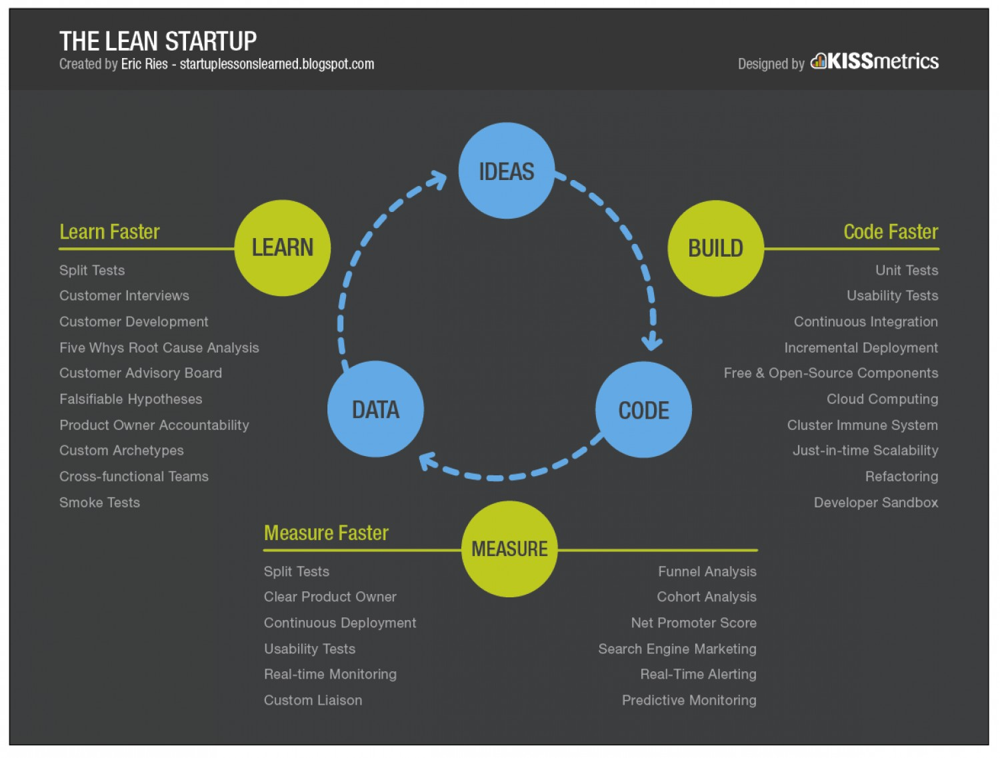

# Бизнес аналитик

[TODO](https://practicum.yandex.ru/blog/professiya-biznes-analitika/)

## Бизнес Процесс

Последовательность действий направленных на __преобразование информационно-материальных потоков__ с целью

- __увеличения их ценности для клиента__
- или процесс __создания добавленной стоимости__ продукта
- или услуг удовлетворяющих __потребностям клиента__.

трех характеристиках бизнес-процесса:

- Стоимость - она стремится к минимальной величине
- Длительность - она стремится к максимальной скорости реализации бизнес-процесса
- Степень удовлетворённости клиента (качество продукта)

## Metrics Driven Development, Lean Startup

- Customer journey mapping клиентский путь
  - [mermaid](https://mermaid-js.github.io/mermaid/#/./user-journey)
- В основе концепции lean startup лежит цикл обратной связи __создать-оценить-научиться__. Важнейшая задача и суть управления стартапом — стремиться сокращать время цикла обратной связи.
- Бизнес метрики, посчитать как сейчас, что будет
- Мнение заказчика по гипотезам-проблемам с ценностью
- Критерии успеха бизнес инициативы Goal Question Metric model
- Продуктовые метрики качества
- Непрерывная добыча данных
- Каждая задача должна быть оценена в деньгах бизнесом: гипотеза ценности и гипотеза роста
- Разрабатывайте полноценную версию фичи после подтверждения ее эффективности через MVP
