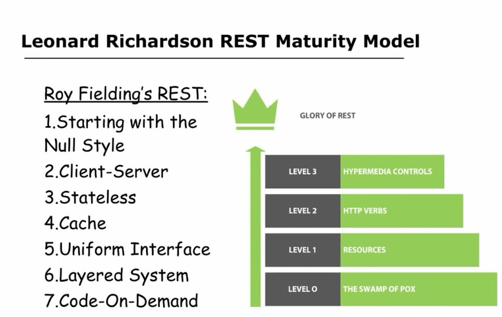

# REST API

- [REST API](#rest-api)
  - [Зачем](#зачем)
  - [Термины](#термины)
  - [Patterns](#patterns)
    - [HTTP методы](#http-методы)
    - [RESTful принципы](#restful-принципы)
    - [Пагинация](#пагинация)
  - [CheckList](#checklist)

REST API — это архитектурный подход, который устанавливает ограничения для API: как они должны быть устроены и какие функции поддерживать.

## Зачем

- Производительность
- Масштабируемость
- Гибкость к изменениям
- Отказоустойчивость
- Простота поддержки

[6 принципов REST](https://habr.com/ru/post/590679/):

- Клиент-серверная архитектура
- Stateless
- Кэширование
- Единообразие интерфейса hateos
- Layered system
- Code on demand

## Термины

- Ресурс
  - HTTP Method
  - [URI\URL Ресурса](https://teletype.in/@loginovpavel/rest-api) - Универсальный указатель ресурса, который может указывать на любой объект в сети.
    - URL — это подмножество URI (Uniform Resource Identifier), которое используется для идентификации ресурсов по их местоположению. 
    - URI — более общее понятие, которое может включать в себя не только URL, но и [другие типы идентификаторов](https://telegra.ph/CHem-otlichaetsya-URL-ot-Endpoint-URL-vs-Endpoint-V-chem-raznica-07-16)
    - пример: <https://api.example1.com/users/123> <https://api.example2.com/users/123>
  - [Endpoint API](https://tquality.ru/blog/kak-pisat-endpointy/) - Конкретный URL, определяющий точку взаимодействия с API и функциональность, которую он предоставляет.
    - пример: /users/123
- Headers
- Body
- [HTTP Status](api-http-status.md)
- [HATEOS](https://docs.microsoft.com/ru-ru/azure/architecture/best-practices/api-design#use-hateoas-to-enable-navigation-to-related-resources)

## Patterns

- [Подходы к проектированию](api.design.md)
- TODO
  - [Patterns REST API](https://microservice-api-patterns.org/)
- [Security](../arch/ability/security.api.md#rest)
- АвтоДокументация [OpenApi](openapi.md)
- [Версионность](api.md#versioning)
- [Сортировка](https://gist.github.com/fomvasss/c1221b2464be94870f7f823c74520665)
- [Пагинация](#пагинация)  
- [Фильтрация](https://www.moesif.com/blog/technical/api-design/REST-API-Design-Filtering-Sorting-and-Pagination/)
- [HTTP методы](#http-методы)
- Эффективное использование [кодов ответов HTTP](api-http-status.md)
- [Идемпотентность](../arch/pattern/integration/idempotent.md)
- Стандартизировать дополнительные машиночитаемые данные в ответе, предпочтительно в форме заголовков HTTP (потому что чтение заголовков не требует вычитывания и разбора всего тела ответа, так что промежуточные прокси и гейтвеи смогут понять семантику ошибки без дополнительных расходов; а так же их можно логировать.
- Файлы
  - [Download](../arch/pattern/integration/pattern.downloadfile.md)
  - [Upload](../arch/pattern/integration/pattern.uploadfile.md)

### HTTP методы

[HTTP методы](https://learn.microsoft.com/ru-ru/azure/architecture/best-practices/api-design#define-api-operations-in-terms-of-http-methods)

- POST - Создает, PUT - Создает или заменяет, PATCH - Частичное изменяет, не входит в стандарт HTTP (не рекомендуется использовать)
- GET
  - Передача [массива в GET](https://stackoverflow.com/questions/11944410/passing-array-in-get-for-a-rest-call):
    - ?users=id1,id2
    - ?arr[]=1&arr[]=2&arr[]=3&arr[]=4
    - ?users=[id1,id2]
    - ?users=id1&users=id2
- DELETE
- [Методы, JSON, URI](https://habr.com/ru/post/447322/)
- [SRP паттерн](../arch/pattern/patterns.md)

### RESTful принципы

- [MS Guide](https://github.com/Microsoft/api-guidelines/blob/master/Guidelines.md)
- [IBM](https://www.ibm.com/docs/ru/zos-connect/zosconnect/3.0?topic=apis-designing-restful)
- [CISCO](https://github.com/CiscoDevNet/api-design-guide)
- Пример
  - [Яндекс.Касса](https://yookassa.ru/developers/using-api/interaction-format)
  - [sort, filter, paging plainquire](https://github.com/plainquire/plainquire)

### Пагинация

- Цели [Пагинация](https://github.com/Microsoft/api-guidelines/blob/master/Guidelines.md#98-pagination)
  - уменьшает объем ненужных данных, передаваемых клиенту
  - сокращает объем ненужных вычислений на серверах приложений
- [Offset Pagination](https://www.moesif.com/blog/technical/api-design/REST-API-Design-Filtering-Sorting-and-Pagination/#offset-pagination) (limit, offset)
- Seek Pagination
- [HATEOS](https://developer.atlassian.com/server/confluence/pagination-in-the-rest-api/)
- [Patterns](https://microservice-api-patterns.org/patterns/quality/dataTransferParsimony/Pagination#sec:Pagination:Variants)
  - Page-Based Pagination
  - Offset-Based Pagination
  - Cursor-Based Pagination (also known as Token-Based Pagination)
  - Time-Based Pagination
- Размер страницы
  - Provide a __[default page size](https://codedamn.com/news/backend/rest-api-pagination-handling-large-data-sets)__ and allow clients to specify their desired page size __within reasonable limits__
  - RESTful API, которые возвращают коллекции, __МОГУТ возвращать [частичные наборы](https://github.com/Microsoft/api-guidelines/blob/master/Guidelines.md#98-pagination)__. Пользователи этих сервисов __ДОЛЖНЫ ожидать частичные результирующие наборы__ и корректно просматривать страницы, чтобы получить весь набор.

## CheckList

- [43 Things To Think About When Designing, Testing, and Releasing your API](https://mathieu.fenniak.net/the-api-checklist/)
