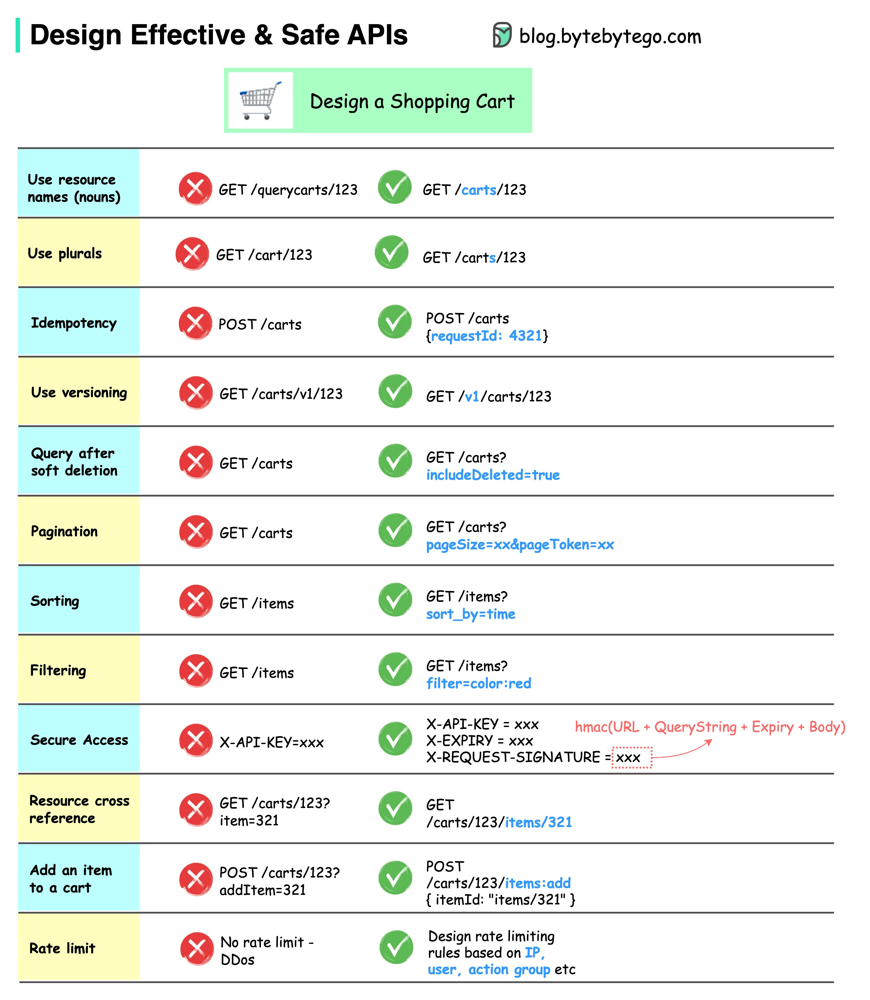

# REST API

- [REST API](#rest-api)
  - [Зачем](#зачем)
  - [Термины](#термины)
  - [Patterns](#patterns)
  - [CheckList](#checklist)

REST API — это архитектурный подход, который устанавливает ограничения для API: как они должны быть устроены и какие функции поддерживать.

## Зачем

- Производительность
- Масштабируемость
- Гибкость к изменениям
- Отказоустойчивость
- Простота поддержки

[6 принципов REST](https://habr.com/ru/post/590679/):

- Клиент-серверная архитектура
- Stateless
- Кэширование
- Единообразие интерфейса hateos
- Layered system
- Code on demand

## Термины

- Ресурс
- URL
- Headers
- [HTTP Status](api-http-status.md)
- [HATEOS](https://docs.microsoft.com/ru-ru/azure/architecture/best-practices/api-design#use-hateoas-to-enable-navigation-to-related-resources)

## Patterns

- [Подходы к проектированию](api.design.md)
- TODO
  - [Patterns REST API](https://microservice-api-patterns.org/)
  - [MS Guide](https://github.com/Microsoft/api-guidelines/blob/master/Guidelines.md)
  - [IBM](https://www.ibm.com/docs/ru/zos-connect/zosconnect/3.0?topic=apis-designing-restful)
  - [CISCO](https://github.com/CiscoDevNet/api-design-guide)
- Security
  - [REST Best Practice - TLS, OAuth, OIDC SSO](https://stackoverflow.blog/2021/10/06/best-practices-for-authentication-and-authorization-for-rest-apis/?utm_campaign=APISecurity%20newsletter&utm_medium=email&_hsmi=204867978&_hsenc=p2ANqtz-94r6UDHzZG48tgtd0Sz6OiZicy6tTBQysQKtk0WzhZXlXrXBucIld80QE3Gll1Le1lxnwNhNqu-pySFps1AsqeR8MQrg&utm_content=204868574&utm_source=hs_email)
- АвтоДокументация [OpenApi](openapi.md)
- [Версионность](https://learn.microsoft.com/ru-ru/azure/architecture/best-practices/api-design#versioning-a-restful-web-api)
  - Версия вашего приложения
- [Сортировка](https://gist.github.com/fomvasss/c1221b2464be94870f7f823c74520665)
- [Пагинация](https://github.com/Microsoft/api-guidelines/blob/master/Guidelines.md#98-pagination)
  - [Offset Pagination](https://www.moesif.com/blog/technical/api-design/REST-API-Design-Filtering-Sorting-and-Pagination/#offset-pagination)
  - Seek Pagination
  - [HATEOS](https://developer.atlassian.com/server/confluence/pagination-in-the-rest-api/)
- [Фильтрация](https://www.moesif.com/blog/technical/api-design/REST-API-Design-Filtering-Sorting-and-Pagination/)
- Использование SSL
- [HTTP методы](https://learn.microsoft.com/ru-ru/azure/architecture/best-practices/api-design#define-api-operations-in-terms-of-http-methods)
  - [Методы, JSON, URI](https://habr.com/ru/post/447322/)
  - [SRP паттерн](../arch/patterns.md)
- Эффективное использование [кодов ответов HTTP](api-http-status.md)
- [Идемпотентность](../arch/pattern/idempotent.md)
- RESTful
  - [Пример Яндекс.Касса](https://yookassa.ru/developers/using-api/interaction-format)
- Стандартизировать дополнительные машиночитаемые данные в ответе, предпочтительно в форме заголовков HTTP (потому что чтение заголовков не требует вычитывания и разбора всего тела ответа, так что промежуточные прокси и гейтвеи смогут понять семантику ошибки без дополнительных расходов; а так же их можно логировать.
- [Валидация входных данных](https://github.com/Sairyss/backend-best-practices)
- Файлы
  - [Download](../arch/pattern/pattern.downloadfile.md)
  - [Upload](../arch/pattern/pattern.uploadfile.md)

## CheckList

- [43 Things To Think About When Designing, Testing, and Releasing your API](https://mathieu.fenniak.net/the-api-checklist/)
