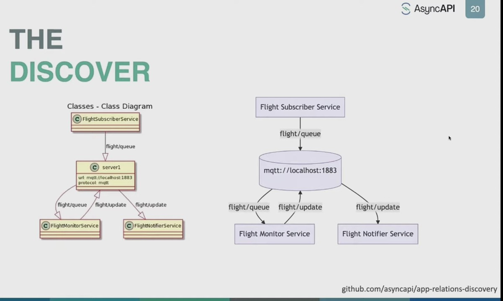
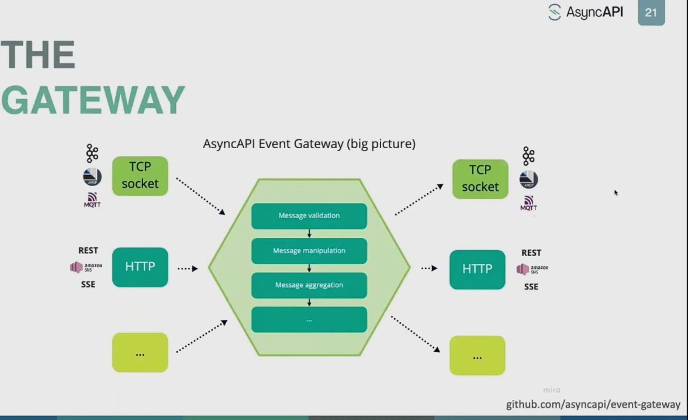
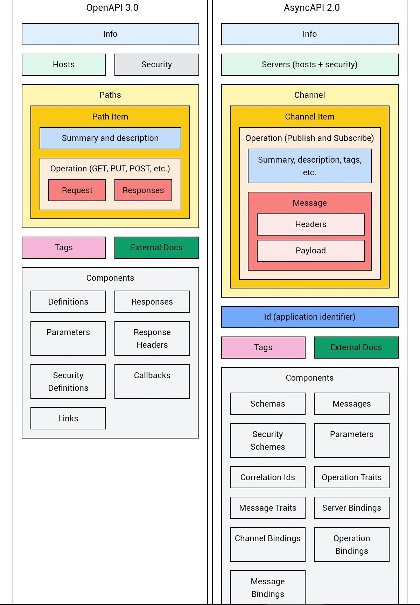

# AsyncAPI

## Зачем

- Design Contract First
  - [Bundle](https://github.com/asyncapi/bundler)
- [Discovery](https://github.com/SolaceLabs/event-discovery-agent) 
- Gateway 
- CLI
- Export
  - HTML 2 PDF
  - Markdown
  - [Outputs a map of the system architecture in plantuml](https://github.com/asyncapi/cupid)
- [Generate code](https://github.com/asyncapi/generator)
  - [RMQ](https://github.com/asyncapi/dotnet-rabbitmq-template)
- [Генерация моделей по AsyncApi формату](https://github.com/asyncapi/modelina)
  - [My test](https://github.com/daemon110282/api)
- [Auto AsyncAPI Docs](https://www.asyncapi.com/docs/tools)
  - [Neuroglia](https://github.com/neuroglia-io/AsyncApi)
    - не поддерживает вложенные объекты в сообщении
  - [Saunter](https://github.com/tehmantra/saunter)

- TODO move\merge to\from https://github.com/daemon110282/api

