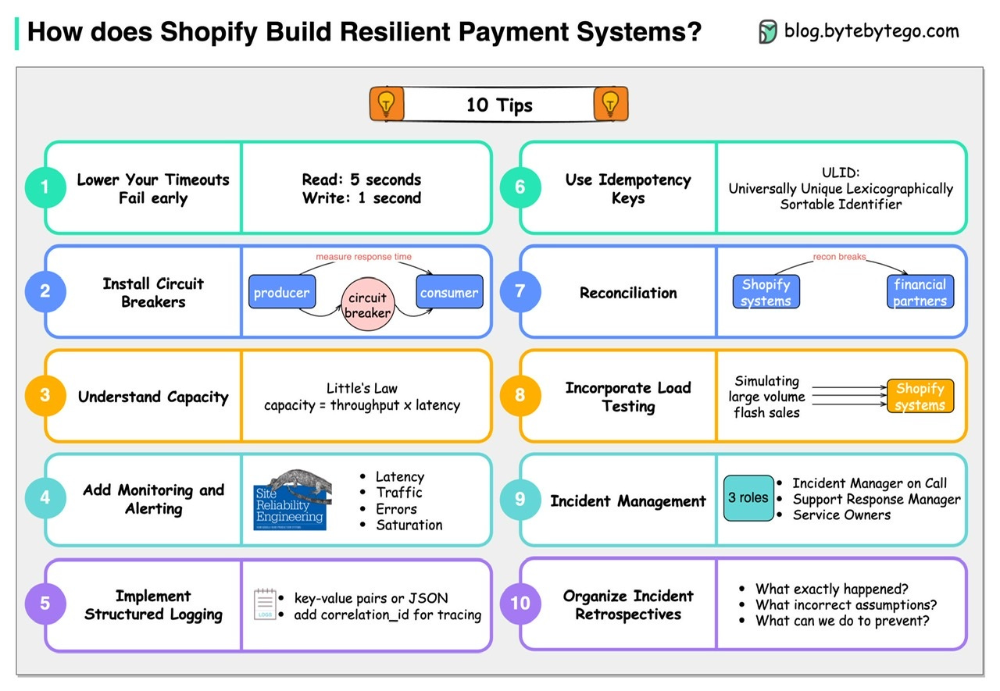

# Resilience to failure Изоляция сбоев

- [Resilience to failure Изоляция сбоев](#resilience-to-failure-изоляция-сбоев)
	- [Зачем](#зачем)
	- [Паттерны](#паттерны)
	- [Метрики](#метрики)
	- [TODO](#todo)

## Зачем

Повысить [отказоустойчивость и надеженость](reliability.md) ИС.

## Паттерны

- 
- [Chaos Engineering](../pattern/resilience/chaos.eng.md)

## Метрики

- [Метрики](resilience.metric.md)

## TODO

- https://tellmeabout.tech/create-reliable-systems-is-the-game-worth-the-candle-50cfb7714167
- https://www.youtube.com/watch?v=8GlwkWxf3hk&t=6866s