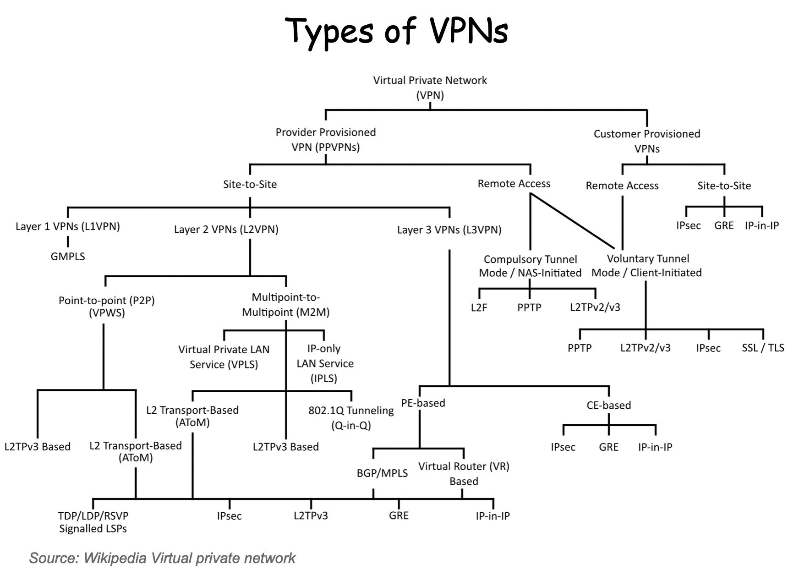

# Security

- [Security](#security)
  - [Крипто Защита Информации (СКЗИ)](#крипто-защита-информации-скзи)
  - [Криптоалгоритмы](#криптоалгоритмы)
  - [API](#api)
  - [Шифрование канала связи (трафика) mTLS, VPN туннель](#шифрование-канала-связи-трафика-mtls-vpn-туннель)
    - [Криптоалгоритмы](#криптоалгоритмы-1)
  - [Технологии](#технологии)
  - [Примеры требований](#примеры-требований)

TODO

- АСП
- Аутентификация HTTPS [SSL\TLS\MTLS](../../technology/protocols.integration/tls.md)
- PCI DSS
- k8s
  - TLS – cert-manager
  - Key Managment, Key Vault
    - HashiCorp Vault 
    - альтернативы [CyberArk, AWS](https://datafloq.com/read/5-compelling-alternatives-hashicorp-vault/)
- [Zero Trust](https://t.me/ru_arc/136)

## Крипто Защита Информации (СКЗИ)

- [На сетевом уровне (OSI L1-L3)](https://systempb.ru/company/our-articles/vysokie-skorosti-sovremennykh-tsod-kak-vozmozhnosti-stanovyatsya-ogranicheniyami-i-chto-s-etim-delat/)
  - 

## Криптоалгоритмы

- подписание - состоит из операции хэширования и шифрования
  - ГОСТ Р 34.10 2012, 2001
- шифрование
  - ГОСТ 2015, 2012, 2001
  - RSA
  - трафика
    - ГОСТ 28147-89
    - ГОСТ Р 34.10-2012
    - алгоритм «Кузнечик» в соответствии с ГОСТ Р 34.12-2015
- хэширования
  - ГОСТ Р 31.11
  - SHA
- имитозащита - защита целостности сообщения

## Подписание ЭЦП

- __Электронная подпись (ЭЦП)__ содержит номер, сгенерированный и зашифрованный при помощи криптографического программного обеспечения.
- Три [вида электронной подписи](https://astral.ru/articles/elektronnaya-podpis/6106/):
  - Простая электронная подпись
  - Усиленная неквалифицированная электронная подпись (УНЭП)
  - Усиленная квалифицированная электронная подпись (УКЭП)
- [Форматы ЭЦП](https://astral.ru/articles/elektronnaya-podpis/6106/)
  - Присоединённая 
    - содержится в самом документе
    - чтобы прочитать документ потребуется ПО
  - Отсоединённая
    - содержится в отдельном файле .sig
    - чтобы прочитать документ НЕ потребуется ПО, не изменяет подписываемый документ
    - [Как создать программно в КриптоПро](https://www.cryptopro.ru/forum2/default.aspx?g=posts&t=18608)
    - в формате 
      - [pkcs 7](https://astral.ru/articles/elektronnaya-podpis/6106/) через Приложение __cryptcp__ для КриптоПро CSP
        - в кодировке __DER__ или __BASE64__
      - [Base64String]()
  - Интегрированная

## API

- [API Security Audit](https://docs.42crunch.com/latest/content/concepts/api_contract_security_audit.htm)
- [OWASP](https://42crunch.com/owasp-api-security-top-10/)
- [check api tools](https://platform.42crunch.com/)
- [tools for check api sec](https://github.com/arainho/awesome-api-security)

## Шифрование канала связи (трафика) mTLS, VPN туннель

Технологии и протоколы шифрования и имитозащиты передаваемого трафика:

- [SSL\TLS VPN](https://www.pvsm.ru/vpn/32300)  
- [Site-to-Site](https://docs.selectel.ru/servers-and-infrastructure/firewalls/fortigate/vpn-site-to-site/#:~:text=VPN%20типа%20Site-to-site%20—%20VPN-соединение%2C,сетями%20удалённых%20филиалов%20или%20отделов) (point-to-point) VPN на основе 
  - GRE 
  - IPSec
- Стандарт IPSec VPN (RFC2401-2412)
  - может работать [в двух режимах](https://habr.com/ru/articles/170895/): туннельном и транспортном
  - включает протоколы
    - ESP (Encapsulating Security Payload – безопасная инкапсуляция полезной нагрузки)
    - AH (Authentication Header – заголовок аутентификации)
    - IKE (Internet Key Exchange protocol – протокол обмена ключами) 
  - [host to net](https://habr.com/ru/articles/504484/)
  - net to net
  - transport mode
- OpenVPN
- PPTP (Point-to-Point Tunneling Protocol)
- DTLS

### Криптоалгоритмы

- Криптоалгоритмы [ГОСТ Р 34.10-2012, ГОСТ 34.10-18](https://qsetup.ru/gost-vpn-chto-eto/) 256 бит
  - необходимо использовать __сертифицированные ФСБ РФ СКЗИ__
  - Open Source
    - на основе __криптобиблиотеки OpenSSL__ - __полноценная криптографическая библиотека с открытым исходным кодом__, широко известна из-за расширения SSL/TLS, используемого в веб-протоколе HTTPS. Поддерживает почти все низкоуровневые алгоритмы хеширования, шифрования и электронной подписи, а также реализует большинство популярных криптографических стандартов, в том числе позволяет создавать ключи RSA, DH, DSA, сертификаты X.509, подписывать их, формировать CSR и CRT, шифровать данные и тестировать SSL/TLS соединения
      - Proxy nginx
        - 2022 nginx 1.23.2 + openssl 3.0.5 + gost engine 3.0.1 + TLSv1.2 [docker образ](https://github.com/vheathen/docker-nginx-openssl3-gost)
        - 2018 [docker образ](https://habr.com/ru/articles/353534/) [GIT](https://github.com/rnixik/docker-openssl-gost)
          - Библиотека OpenSSL 1.1.0g 
          - [gost-engine](https://github.com/gost-engine/engine) - reference implementation of the Russian [ГОСТ крипоалгоритмы](https://github.com/gost-engine/engine/blob/master/README.prov.md) for OpenSSL
      - [stunnel](https://habr.com/ru/companies/aktiv-company/articles/477650/) - программа, на которую можно переложить всю логику [шифрования трафика](https://www.stunnel.org/docs.html) между сервером и клиентом
        - stunnel:port openssl-gost-stunnel (>=v.1.0.2)
        - шифрование через openssl и [gost-engine](https://github.com/gost-engine/engine)
        - [docker-openssl-gost](https://github.com/rnixik/docker-openssl-gost)
        - криптотуннель с валидным ключом, подписанным самим «КриптоПро», и с алгоритмом шифрования [GOST_2012, 512 бит](https://www.anti-malware.ru/practice/methods/save-company-budget-or-how-build-crypto-tunnel-in-accordance-with-GOST)
    - на основе __криптобиблиотек КриптоПро__
      - Nginx вариант с библиотекой [КриптоПро](https://habr.com/ru/articles/353534/#comment_10757142)
      - 2018 [Docker контейнер с CryptoPro 4 и nginx](https://github.com/navyzet/crypto-proxy)
      - Win Server [IPSec VPN](https://itnan.ru/post.php?c=1&p=328770) с КриптоПро CSP и [КриптоПро IPSec](https://www.cryptopro.ru/products/ipsec/vpngost)
  - Commercial
    - аппаратные устройства [КриптоПро NGate](https://www.cryptopro.ru/products/ngate)
    - Аутсорс с арендой оборудования [Ростелеком Солар](https://rt-solar.ru/services/vpn/)
    - аппаратные устройства [TSS Diamond](https://qsetup.ru/gost-vpn-chto-eto/)
    - программно-аппаратный комплекс [S-terra](../../technology/s-terra.md)
      - [пример, мониторинг тунеля](https://habr.com/ru/companies/solarsecurity/articles/471470/)
    - программно-аппаратный комплекс [Infotecs VipNet](https://infotecs.ru/products/)
      - [пример](https://habr.com/ru/companies/solarsecurity/articles/514896/)
  - выбор
    - https://ib-bank.ru/bisjournal/post/1210 		
    - https://cisoclub.ru/sravnenie-korporativnyh-sredstv-zashhity-udalennogo-dostupa/		
    - [хорошее сравнение](https://www.anti-malware.ru/compare/certified-russian-TLS-gateways)
- Криптоалгоритмы международные RSA\AES
  - IPSec VPN Site-to-Site - [CISCO](https://wiki.merionet.ru/articles/nastrojka-site-to-site-ipsec-vpn-na-cisco)

- [Проверка алгоритма подписи примененного к сертификату](https://sysos.ru/?p=589)
  - 1.2.643.7.1.1.3.2, то сертификат сгенерирован по ГОСТ Р 34.10-2012. 
  - Если установлен КриптоПро, то в Алгоритме подписи будет отображаться ГОСТ Р 34.11-2012/34.10-2012 256 бит.

## Технологии

- [КриптоПро](https://www.cryptopro.ru/products/csp/compare#supported_algorithms)
- КриптоАРМ
  - Клиент
    - [Linux](https://cryptoarm.ru/documentation/kak-ustanovit-kriptoarm-gost-na-platformu-Linux)
  - [КриптоАрм Сервер](https://cryptoarm.ru/news/kriptoarm-server/)
    - [КриптоАрм Сервер Git](https://github.com/CryptoARM/CryptoARMGOST-Web)
- Крипто Провайдеры
  - [КриптоПро CSP](https://www.cryptopro.ru/products/csp/compare)
  - [OpenSSL ГОСТ](https://redos.red-soft.ru/base/manual/safe-redos/gost-in-openssl/)
- Web Application firewall (WAF) Межсетевые экраны
  - [PT Application Firewall](https://www.tadviser.ru/index.php/%D0%9F%D1%80%D0%BE%D0%B4%D1%83%D0%BA%D1%82:PT_Application_Firewall)
    - Сертификация ФСТЭК
    - OWASP TOP 10
    - DDOS
- [Identity and Access Management (IAM)](../system.class/iam.md)
  - [JWT](../../technology/jwt.md)
  - [SSO](../sso.md)
    - Oauth 2, OpenID Connect, SAML
    - WS-Federation (token)
    - two-factor authentication (2FA)
- swt
- bearer
- ntlm ldap,
- http basic
- digest
- form
- ws security
- ssl client
- api key
- [cookie](https://blog.bytebytego.com/i/86976622/token-cookie-session)

## Примеры требований

- Взаимодействие осуществляется через сеть Интернет по протоколу HTTP с использованием стандартного сетевого порта
- Передача конфиденциальной информации в рамках взаимодействия не предполагается
- Взаимная аутентификация клиента и сервера на базе SSL-сертификатов, шифрование передаваемой информации с использованием протокола HTTPS (TLS 1.2)
- SSL-сертификаты должны быть выпущены доверенными удостоверяющими центрами
- В случае, если взаимодействие осуществляется по внешним сетям передачи данных (далее – внешние сети), и участвующая во взаимодействии ИС Компании не является публичной , сетевой доступ к ИС Компании из внешних сетей, открываемый для обеспечения взаимодействия, должен быть ограничен конкретными адресами внешней ИС или сетью ее владельца  и конкретными сетевыми протоколами, используемыми ИС Компании.
- Токен (id сессии), при его использовании, должен быть динамическим (актуальным только для одной сессии одного клиента) и не должен передаваться в URL.
