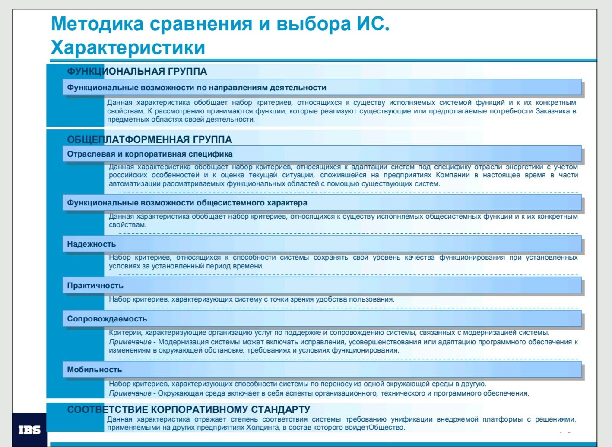
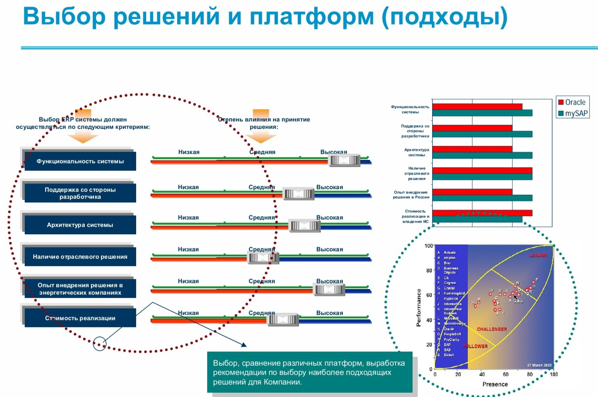
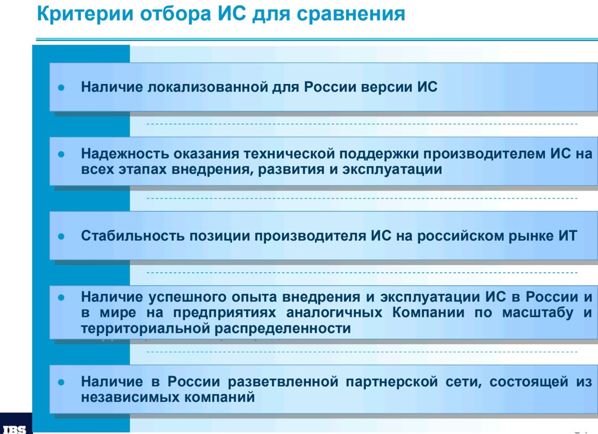
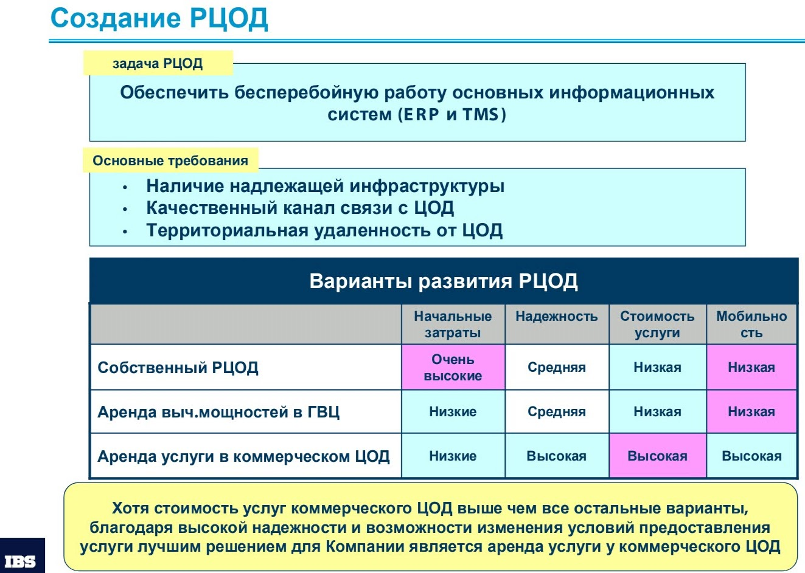
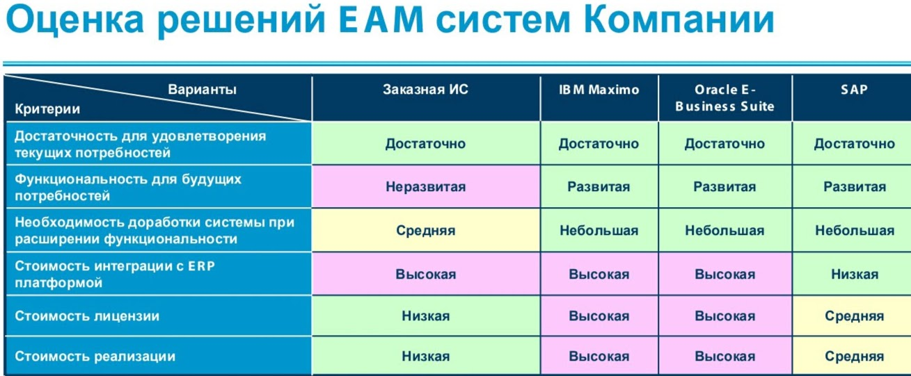

# Анализ вариантов решений

## Примеры

## Критерии анализа вариантов

Реализации новых требований (мес), параллельность разработки, отдельный roadmap - time to market
Покрытие требований: Соответствие из ""коробки"" требованиям Бизнеса (демо Бизнесу)
Реализации новых требований (не из "коробки")
Оценочная трудоемкость доработок
Надежность, Отказоустойчивость
Простота обновления\отката (поддержка контейнеризации)
Повторное использование: Сложность дальнейших интеграции
Простота адаптации
Оценочная стоимость поддержки
Интеграции (число потоков, разделение на сервисы)
Масштабирование горизонтальное
Производительность
Замещаемость (Технологический стек, Опыт разработки, Кроссплатформенность, Cloud Ready)
Покрытие требований: Защита информации (ОР\вендор оценивает), Авторизация\аутентификация
Экспертиза стороннего вендора\ОР для поддержки и сопровождения, доработки решения (код, исправление ошибок)
Оценочная трудоемкость установки/настройки ПО, серверов
Частота изменений функционала
Инф-ра: администрирование, установка
Эксплуатация (SLA на исправление ошибок)
Достаточность существующих ресурсов для поддержки
Резервирование (архивация, восстановление)
Качество доработок\изменений
Стабильность вендора\разработчика
Мы знаем контрагента/система разработана для нас
Лицензии
Оценочная стоимость инфраструктуры (сервера, БД и тп)
Возможность реализации без закупки ресурсов
Погружение команды ИТ в решение (изучение AS-IS), наличие документации технической, знание процессов
Уровень поддержки процессов CI\CD, автотесты (unit, НТ, user)
Тестовые контуры
Слабая связанность и сильная целостность компонентов ИС (SOA\модульность, независимость команд разработки)
Логирование\Мониторинг
Средняя стоимость разработчика
Документация (РП, РА и тп)
Тестирования (регресс, функциональное)
Соответствие из "коробки" вспомогательного функционала: НФТ, конфигурирование, ролевой доступ
Отчетность\статистика (если применимо)
Удобство тестирования, риски регресса
Разработки по Roadmap
Разработки новых требований
Интеграции
Тестирования (регресс, функциональное)
