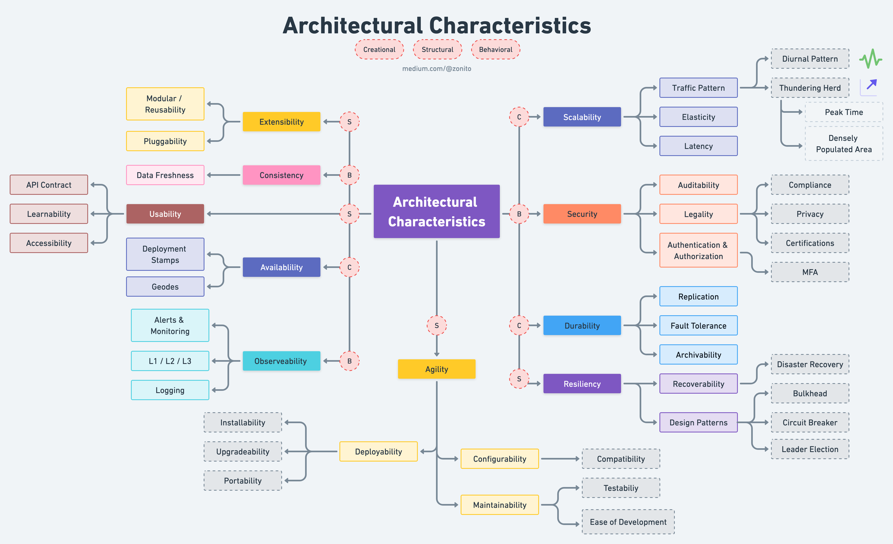

# Атрибуты качества (ability) архитектуры

- [Атрибуты качества (ability) архитектуры](#атрибуты-качества-ability-архитектуры)
  - [Стандарты](#стандарты)
  - [Атрибуты качества, архитектурные характеристики ИС](#атрибуты-качества-архитектурные-характеристики-ис)
    - [Функциональность Functionality](#функциональность-functionality)
    - [Надежность Reliability](#надежность-reliability)
    - [Быстродействие Performance](#быстродействие-performance)
    - [Переносимость Portability](#переносимость-portability)
    - [Сопровождаемость Maintainability](#сопровождаемость-maintainability)
    - [Пользовательский опыт Usability](#пользовательский-опыт-usability)
    - [TODO](#todo)
  - [Коммерческие атрибуты](#коммерческие-атрибуты)
  - [Кросс-системные правила и руководства](#кросс-системные-правила-и-руководства)
  - [Фитнес функции](#фитнес-функции)
  - [Категории](#категории)
  - [TODO](#todo-1)

## Стандарты  

- [ГОСТ Р ИСО/МЭК 9126-93](https://m-i-kuznetsov.livejournal.com/157150.html) (Информационная технология. Оценка программной продукции. Характеристики качества и руководства по их применению)
  - план для оценки качества информационной системы
  - следует также добавить шкалу веса
  - набор метрик для каждого показателя
- [HP FURPS+](https://sysana.wordpress.com/2010/09/16/furps/)
- ГОСТ 28195-89 (Оценка качества программных средств. Общие положения)

## Атрибуты качества, архитектурные характеристики ИС

### Функциональность Functionality

- Функциональность Functionality
  - Пригодность - для решения бизнес задачи
  - Правильность - точность выполнения бизнес функций
  - Способность к взаимодействию - интеграциям
  - Соответствие - стандартам принятым в компании
  - Защищенность [Security Безопасность](ability/security.md)

### Надежность Reliability

- [Надежность Reliability](ability/reliability.md)
  - Стабильность (Maturity) - количество отказов системы за единицу времени. Т.е. частота сбоев при штатной работе системы.
    - Изоляция сбоев [Resilience](ability/resilience.md)
  - [Отказоустойчивость Fault tolerance](ability/fault.tolerance.md)
  - Восстанавливаемость Recoverability - после сбоев
  - [Доступность Availability (Эксплуатационные)](ability/availability.md)
  
### Быстродействие Performance

- Быстродействие [Производительность Performance](ability/performance.md) (Эксплуатационные)  

### Переносимость Portability

- Переносимость (Мобильность) Portability
  - Адаптируемость Adaptability  
  - Простота внедрения Installability
  - Замещаемость [Replaceability](ability/replaceability.md)
  - Возможность повторного использования [Reusability](ability/reusability.md) (Единая кодовая база)
  - Модифицируемость Modifiability (Эволюция)
    - Способность к взаимодействию, изменениям
    - Сложность дальнейших интеграции
  - Совместимость Interoperability (Эволюция)
  - Расширяемость Extensibility

### Сопровождаемость Maintainability

- Сопровождаемость Поддерживаемость Maintainability
  - Анализируемость (Analyzability)
  - Изменяемость (Changeability)
  - Устойчивость (Stability)
  - [Тестируемость Testability](ability/testability.md)
  - Конфигурируемость Configurability
  - [Наблюдаемость Observability](ability/observability.md)

### Пользовательский опыт Usability

- Удобство использования Usability (Пользовательский опыт)
  - Практичность Usability
  - Удобство Accessibility (Пользовательский опыт)
  - Локализация Localization (Пользовательский опыт)

### TODO

- Durability
- Эксплуатационные
  - Согласованность Consistency (Эксплуатационные)  
  - Живучесть Robustness  
- Гибкость Flexibility
- Целостность Integrity
- [Автодокументирование API](../api/api.md)
- CI-CD куда?
- scalability interoperability
- responsiveness
- elasticity
- abstraction
- data integrity
- data consistency

## Коммерческие атрибуты

- Сроки выхода на рынок TimeToMarket
- Стоимость и прибыль Cost
- Срок службы системы Life Time
- Целевой рынок Target Market
- График развертывания продукта Product Schedule
- Интеграция с существующими системами Interoperability

## Кросс-системные правила и руководства

- Responsibilities Отвественности компонентов
- Ul integration Интеграция с UI
- Communication protocols Протоколы взаимодействия
- Data formats Форматы данных
- Redundant data Избыточность данных
- BI interfaces Интерфейсы с BI
- [Logging, Monitoring Логирование и мониторинг](ability/observability.md)

## Фитнес функции

Fitness Functions

- Тесты
  - Юнит тесты
  - Контрактные тесты
  - Интеграционные тесты
- Мониторинг
  - Процессные метрики
  - Арх-е метрики

Технологии:

- Danger

## Категории

- Ключевые
- Релевантные
- Нерелевантные

## TODO

- [TODO Excel list](ability/Quality-Attributes-2013.xlsx)
- 
