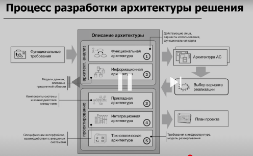
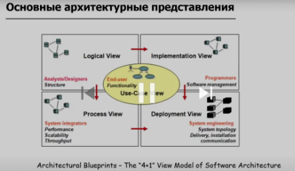

# Архитектура

- [Архитектура](#архитектура)
  - [Зачем](#зачем)
  - [Задачи IT-архитектора](#задачи-it-архитектора)
  - [Процесс](#процесс)
  - [Законы архитектуры](#законы-архитектуры)
  - [Класс систем](#класс-систем)
  - [Элементы архитектуры](#элементы-архитектуры)

## Зачем

- __Архитектура ~ [Architecture](https://docs.microsoft.com/ru-ru/azure/architecture/guide/):
  - __структура__ системы в определенном [Стиле архитектуры](arch.styles.md)
  - включающая все
    - __компоненты__ ПО из которых она состоит
    - оборудование и людей
  - устанавливает __границы__ между разными компонентами приложения и их __ответственностями__
  - обеспечивающая необходимые [Качества архитектуры (архитектурные характеристики)](arch.ability.md)
  - предоставляющая __интерфейсы__ компонентов
    - Требования для интерфейса внешнего устройства API ~ external interface requirement —
      - описание интерфейса между системой ПО и пользователем
      - другой системой ПО - __интеграции__
      - или оборудованием
  - __взаимосвязи__ между этими компонентами и поведение компонентов, видимое другим компонентам (слои приложения)
  - построеной на __[технологической базе](../technology/technology.md)__ ПО
  - совокупность __правил, методов и [Шаблонов Паттернов](patterns.md)__ разработки приложений

Архитектор знает

- когда полезно __использовать определенную технологию__ исходя из [Критерией выбора решения](arch.criteria.md), самое главное – когда этого не нужно делать
- какие есть __риски__
- общепринятые [Reference Architecture](arch.ref.md)
- Подходы к [Документированию архитектуры](pattern/pattern.docs.md)

## Задачи IT-архитектора

- Обеспечить __баланс__ между __стоимостью__ разработки и __гибкостью__ решения для быстрого внедрения __будущих требований__.
  - We design software to reduce its cost. The cost of software is ≈ the cost of changing the software.
    - The __cost of changing__ the software is ≈ the cost of the expensive changes (power laws and all that).
      - The cost of the expensive changes is generated by __cascading changes__ — if I change this then I have to change that and that, and if I change that then.
  - __Coupling__ between elements of a design is this propensity for a change to propagate.
  - So, design ≈ cost ≈ change ≈ big change ≈ coupling. Transitively, __software design ≈ managing coupling__
- Фиксировать и распространять знания
- Преодолевать разрыв между предметной областью и технической командой

Critical Skills:

- Анализирует бизнес-требования в рамках задач направления. Предлагает альтернативы.
- Разрабатывает и согласовывает архитектурное решение по задачам направления
- Проектирует компонентную, информационную, системную, техническую (деплой) архитектуру
  - Использует на практике профильные нотации описания архитектуры (например, C4).
  - Проектирует интеграцию систем. Определяет способы, протоколы, инструменты интеграции (очереди rabbit, kafka, ESB, ETL инструменты)
- Контролировать реализацию: заложить каркас системы и провести __архитектурный надзор__.
- Использует на практике архитектурные подходы проектирования(SOA, MSA, ED,...)
- Проводит декомпозицию вновь создаваемых решений, владеет подходом Domain Driven Design
- Понимает и иcпользует на практике требования информационной безопасности
- Разрабатывает нефункциональные требования
- Определяет техстек, компонентный состав решений. Знает языки и фреймворки, классы и экземпляры БД
- Архитектор __декларирует общие концепции__: аналитик, разработчик реализует их (пример шаблон API, ПЗ)
  - императивное программирование — как сделать. Пример: Купить овощи, замешать, сварить борщ
  - декларативное программирование — __что сделать__. Пример: Сделайте борщ.
    - декларативное программирование по-прежнему использует императивное программирование под капотом, поэтому невозможно писать только декларативный код

Other Skills:

- Применяет знания предметной области бизнеса
- Знает типовые концепты и ИТ-решения рынка бизнеса
- Владеет разными нотациями описания архитектуры
- Владеет языками программированиями, принципами проектирования БД
- Владеет и использует на практике стандарты и методологии гибкой разработки

## Процесс

- __Групповые ревью__ - коллективный архитектор

Порядок (пирамида) проработки архитектуры решения:

- Функциональная(use case, ПЗ, БТ)
- Информационная(модель данных, предметная область, сущность, связи)
- [Анализ вариантов](alternative.md)
  - Компромис бизнес проблем, целей и тех решения с __учетом дальнейшего развития__
  - [плюсы и минусы](https://docs.microsoft.com/ru-ru/azure/architecture/guide/architecture-styles/#consider-challenges-and-benefits)
  - Посчитать в деньгах, трудоемкости
- Прикладная(взаимодействия компонентов)
- Интеграционная(РИПВ)
- Технологическая(инфраструктура, ИБ)

## Законы архитектуры

- Everything in software architecture is a __trade-off__. Любое решение является __компромиссом__.
  - Нет плохих решений - есть __цели и контекст бизнеса__ (пример: сделать самолет военный, гражданский)
- Вопрос "__почему__" является важнее вопроса "__как__"
  - Библиотеки и фреймворки - детали реализации, которые должны быть скрыты.
- __Закон Конвея__ — «Организации проектируют системы, которые копируют структуру коммуникаций в этой организации»

## Класс систем

- [APM](system.class/apm.md)
- CDC
- CDN
- IAM
- DWH
- Report
- Mobile
- SIEM
- DSE
- BPMS

## Элементы архитектуры

- Сервис — это единица прикладного поведения, заключает полный сценарий
  - Сервис может использовать другие сервисы как части своего сценария
- Система — иерархия сервисов, сгруппированных в домены
- Продукт — это совокупность сервисов, совместно реализующих некоторую ценность для конечного пользователя
  - Границы продукта отражают некоторую предметную область бизнеса
  - Продукты могут использовать общую платформ
- Платформа
  - Платформа является частным случаем продукта для внутренних пользователей
  - Платформы решают задачи обеспечения бизнес-процессов, используемых множеством продуктов
  - Платформа предоставляет набор повторно используемых сервисов
  - Платформа может стать самостоятельным продуктом
