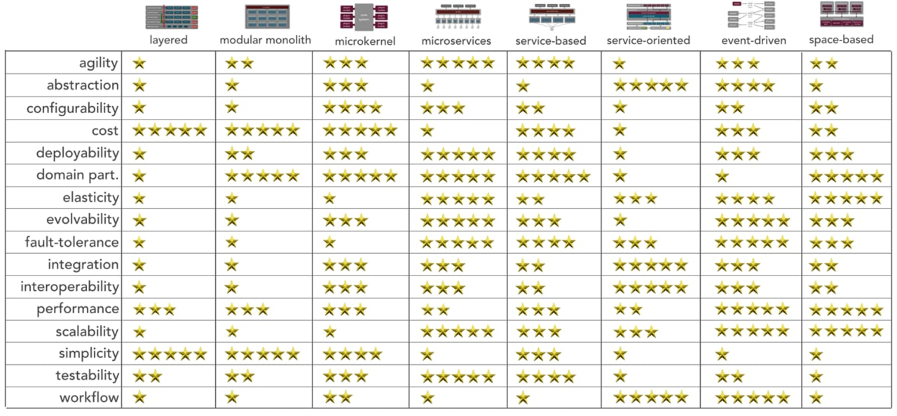
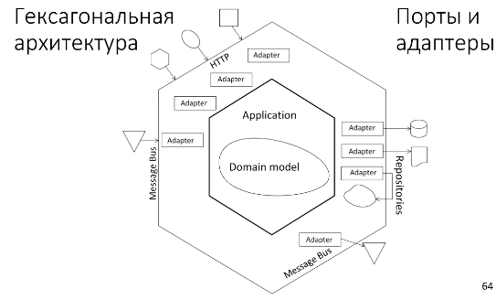

# Стили архитектуры

- [Стили архитектуры](#стили-архитектуры)
  - [Виды архитектур](#виды-архитектур)
    - [Onion Луковая гексагональная архитектура](#onion-луковая-гексагональная-архитектура)

[Архитектурный стиль](https://docs.microsoft.com/ru-ru/azure/architecture/guide/architecture-styles/) определяет семейство подобных систем с точки зрения структурной организации. В частности, стиль определяет набор компонентов и коннекторов, которые можно применять в реализациях этого стиля, а также ряд правил, согласно которым они могут сочетаться.

## Виды архитектур

[Виды архитектур Worksheet](https://www.developertoarchitect.com/downloads/worksheets.html)

- Клиент-Сервер
- __Многослойная__ n-уровневый Layered
  - Горизонтальные уровни, разделенные подсетью
  - Традиционный домен для бизнеса. Частота обновления не высокая.
- [__Модульный монолит__](style/monolit.md)
- __Сервисы__
  - является хорошей отправной точкой в ​​эволюционном переходе от монолитной архитектуры
  - затем возможно переход к микросервисам, если возникнет необходимость в __новом уровне масштабируемости__
- __Микросервисы__ Микрослужбы [MSA](style/msa.md)
  - Вертикально (функционально) разделенные службы, вызывающие друг друга через API-интерфейсы
  - Сложный домен. Частые обновления.
  - Высокораспределенная архитектура
- __Event Driven__ Управляемая событиями архитектура [EDA](style/eda.md)
  - Производитель и потребитель
  - Независимое представление для каждой подсистемы
  - Интернет вещей и системы, работающие в режиме реального времени
- [Большие данные](style/bigdata.md) BigData
  - Разделение большого набора данных на мелкие блоки. Параллельная обработка для локальных наборов данных
  - Пакетная обработка и анализ данных в режиме реального времени. Прогнозная аналитика с использованием машинного обучени
- [Большие вычисления](https://docs.microsoft.com/ru-ru/azure/architecture/guide/architecture-styles/big-compute) BigCompute
  - Распределение данных в тысячах ядер
  - Домены с ресурсоемкими вычислениями, например моделированием
- __Микроядерная__ Microkernel
  - этот шаблон позволяет вам добавлять дополнительные функции приложения в виде __плагинов__ к __основному приложению__
  - обеспечение расширяемости, а также разделения и изоляции функциональности
- [SOA](style/soa.md)
- [Vertical-slice](https://headspring.com/2019/11/05/why-vertical-slice-architecture-is-better/)
- Pipeline
  - ZeroMQ
  - Интерфейс — очередь — рабочая роль
    - Интерфейсные и серверные задания, разделенные асинхронным обменом сообщениями
    - Относительно простой домен с ресурсоемкими задачами.
- [Distributed System](style/dsa.md) Распределенная архитектура
- Symmetrically distributed system architectures - peer-to-peer (пример Torrent)
- [Hybrid system architectures](https://apolomodov.medium.com/coa-distributed-systems-4th-ed-2-architecture-af563b2332bd)
  - [Cloud](style/cloud.md) computing
  - edge-cloud computing
  - blockchain
- Массово-параллельная архитектура [(Massive Parallel Processing, MPP)](style/mpp.md)

### Onion Луковая гексагональная архитектура

- состоит из концентрических слоёв
- зависимости идут снаружи в центр
- гексагональная архитектура, или «порты и адаптеры»
- в основе [Clean Architecture](pattern/system.design/clean.architecture.md)
