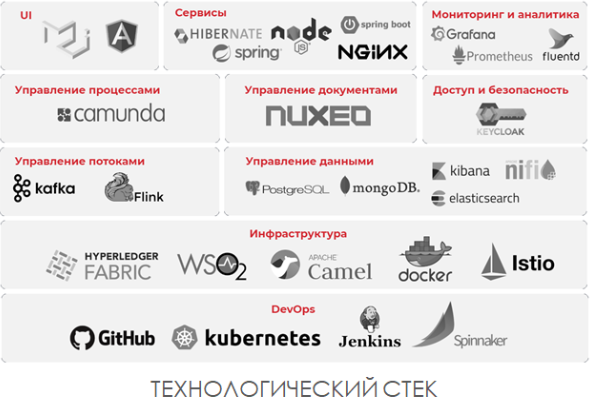

# Стили архитектуры

Архитектурный стиль определяет семейство подобных систем с точки зрения структурной организации. В частности, стиль определяет набор компонентов и коннекторов, которые можно применять в реализациях этого стиля, а также ряд правил, согласно которым они могут сочетаться.

| Стиль архитектуры | Управление зависимостями | Тип домена |
| -- | -- | -- |
| n-уровневый | Горизонтальные уровни, разделенные подсетью. | Традиционный домен для бизнеса. Частота обновления не высокая. |
| Интерфейс — очередь — рабочая роль | Интерфейсные и серверные задания, разделенные асинхронным обменом сообщениями. | Относительно простой домен с ресурсоемкими задачами. |
| Микрослужбы [MSA](style/msa.md) | Вертикально (функционально) разделенные службы, вызывающие друг друга через API-интерфейсы. | Сложный домен. Частые обновления. |
| Управляемая событиями архитектура [EDA](style/eda.md) | Производитель и потребитель. Независимое представление для каждой подсистемы. | Интернет вещей и системы, работающие в режиме реального времени |
| [Большие данные](style/bigdata.md) | Разделение большого набора данных на мелкие блоки. Параллельная обработка для локальных наборов данных. | Пакетная обработка и анализ данных в режиме реального времени. Прогнозная аналитика с использованием машинного обучения. |
| [Большие вычисления](https://docs.microsoft.com/ru-ru/azure/architecture/guide/architecture-styles/big-compute) | Распределение данных в тысячах ядер. | Домены с ресурсоемкими вычислениями, например моделированием. |

## Виды архитектур

[Виды архитектур Worksheet](https://www.developertoarchitect.com/downloads/worksheets.html)

  - Клиент-Сервер
  - Многослойная
  - Модульный монолит

  - Микроядерная Microkernel
  - [Vertical-slice](https://headspring.com/2019/11/05/why-vertical-slice-architecture-is-better/)

### Onion Луковая гексагональная архитектура

onion-архитектура («луковая»). Её отличие в том, что она состоит из концентрических слоёв, зависимости идут снаружи в центр.
гексагональная архитектура, или «порты и адаптеры»

### Распределенная архитектура

[TODO](https://github.com/Sairyss/distributed-systems-topics)

Плюсы
- подход Agile Integration( Apache Camel, NiFi, WSO2 API Manager), который не предполагает одного централизованного интеграционного решения на всю компанию или единую команду интеграции. С его использованием появляется несколько кросс-функциональных команд разработки, которые знают, какие данные им нужны и какого качества они должны быть.
- позволяет уменьшить зависимость между различными командами и помогает вести преимущественно параллельную разработку разных сервисов.
- разделении системы на отдельные блоки, ориентированные на бизнес-функции;
- выделении независимых команд, каждая из которых может создавать и эксплуатировать бизнес-функцию;
- распараллеливании работ между этими командами с целью повышения масштабируемости, скорости.
- существование дополнительного звена в виде очередей сообщений позволяет вставлять промежуточную обработку передаваемой информации для решения различных задач: обеспечение безопасности и совместимости форматов, динамической маршрутизации, анализа контента и т.д.
- поддерживает горизонтальное масштабирование практически неограниченного размера.
  - При необходимости всегда можно добавить новые сервера занимающиеся только анализом изображений или только сканированием страниц, соединенные в одну систему при помощи очереди сообщений, которая в свою очередь тоже легко масштабируется и с коробки умеет работать на нескольких серверах, быстро обрабатывая огромное количество сообщений.

Минусы
- Выполняемые работы могут дублироваться
- работают тысячи сервисов, которыми надо управлять, поддерживать и сопоставлять в части интерфейсов и данных.
- Это увеличивает расходы, увеличивает требования к квалификации людей и управлению проектами. ИТ-отдел и бизнес должны взять на себя дополнительные обязанности научатся управлять этой сложностью
- распределенная архитектура с n-ым количеством сервисов требует определенного уровня зрелости управления проектами и поддержки,
- увеличивает расходы, увеличивает требования к квалификации людей. Никакая цифровая трансформация не может быть выполнена без трансформации текущих орг.процессов.

### Clean Architecture

Interactor usecase entity
Clean architect bob
Пакеты по функционалу, а не слоям

## Links

- [Службы вычислений](https://docs.microsoft.com/ru-ru/azure/architecture/guide/technology-choices/compute-decision-tree)
- [MS Стили](https://docs.microsoft.com/ru-ru/azure/architecture/guide/architecture-styles/)
