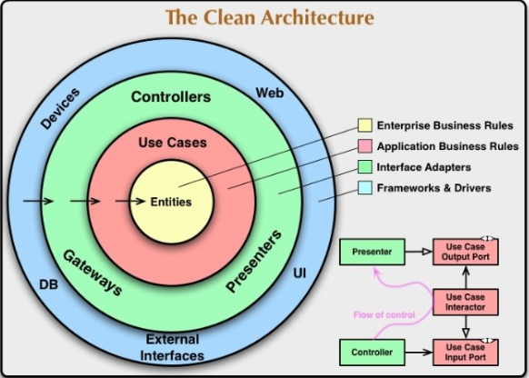

# Clean Architecture

## Плюсы и минусы

| + | - |
| - | - |
|[Независимость от фреймворков](https://youtu.be/fx6NWIgjH7w)|В некоторых местах будет больше кода|
|Независимость от БД|Будет большое количество классов|
|Независимость от транспорта|Понадобятся отдельные DTO на границах|
|Простота тестирования|Упадёт производительность (но не факт)|
|Принимаем технические решения как можно позже|Не очень стандартный подход|
|Хорошая модульность|Не всё так однозначно|
|Архитектура может защитить сама себя||

## Паттерны

- Положить бизнес правила в центр
- Следить чтобы бизнес правила были независимыми
- Все 10 операции — плагины
- Чтобы с бизнеса перепрыгнуть на инфраструктуру используйте интерфейсы
- Следить чтобы плагины не знали о друг друге, а знали о бизнесе
- Пакеты по функционалу, а не слоям

TODO Архитектура системы шаблон

- Presentation Layer
	- UI View
- Application Layer
	- Controller
	- паттерн Mediator - посредник - взаимодействие классов
	- CQRS - command handler
- Domain Layer
- Infrastructure Layer
