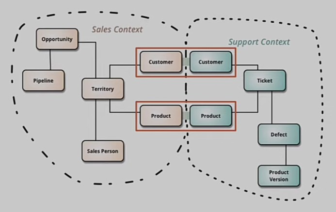
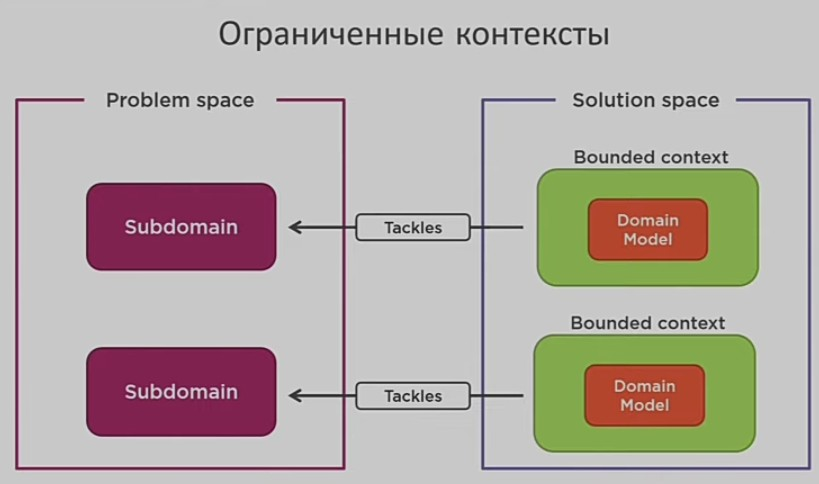
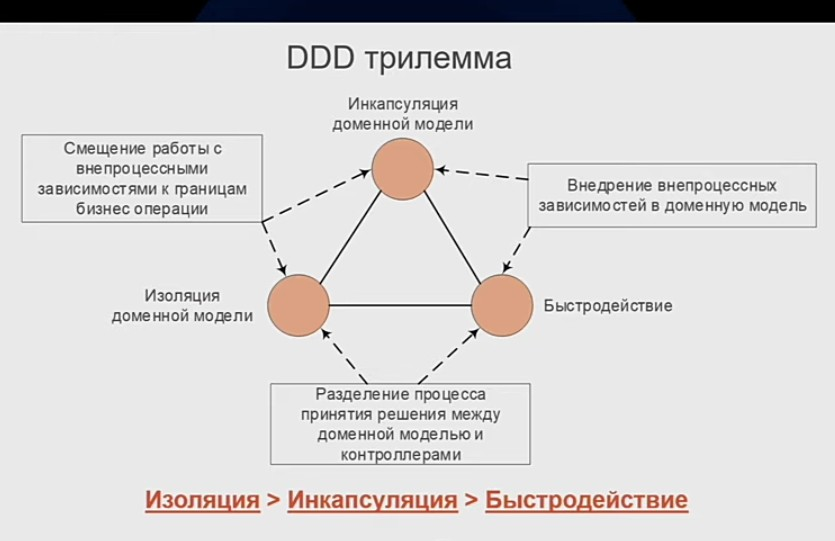
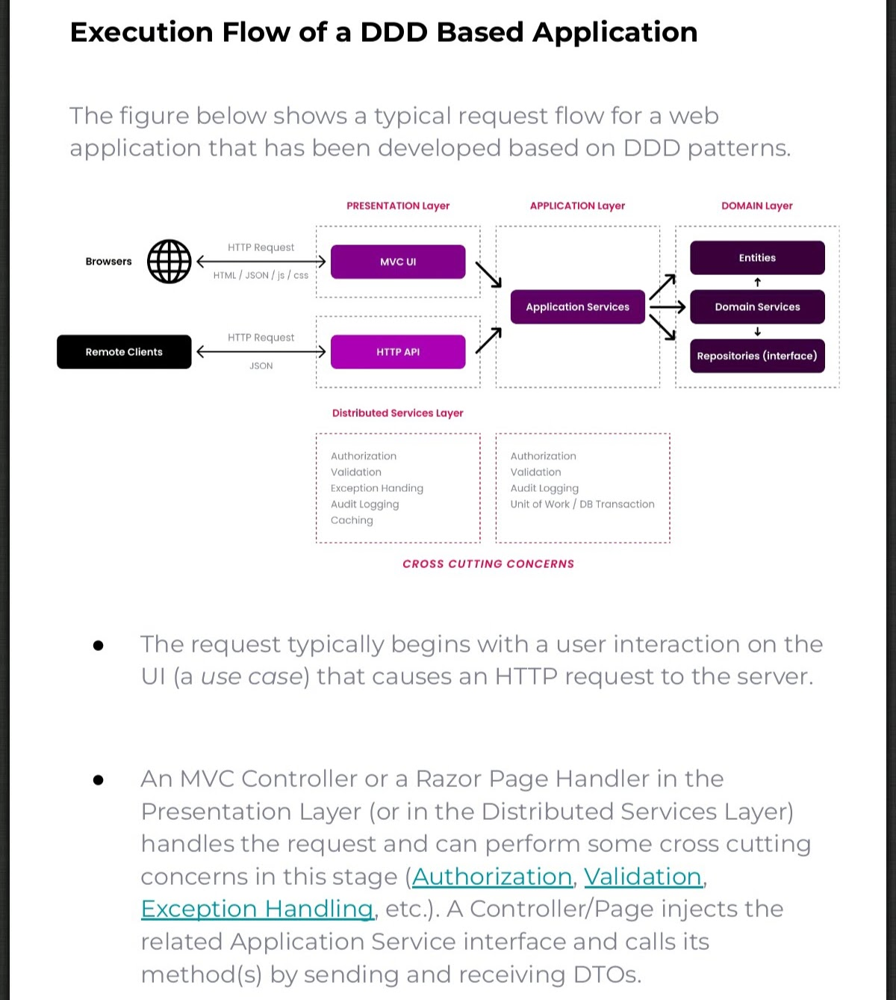
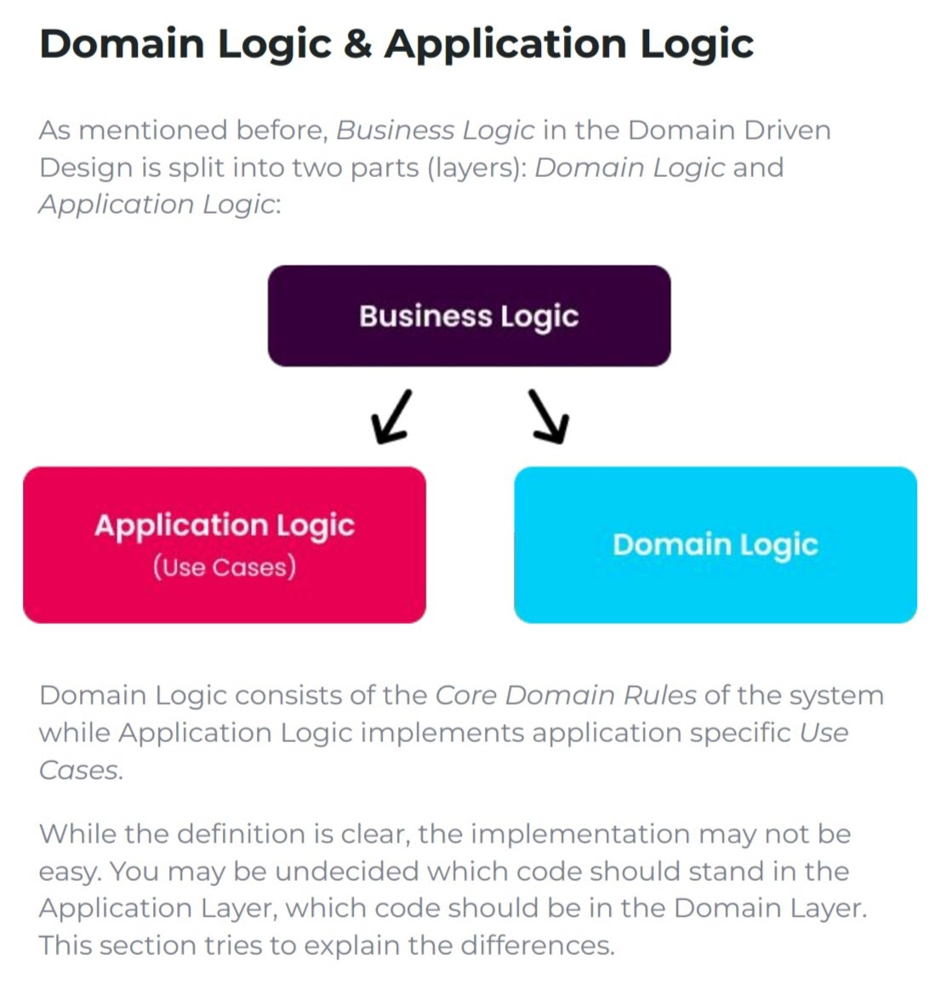

# Domain Driven Design DDD

Код должен в себе отражать предментую область, т.е. __классы__ должны __соответствовать__ объектам __реальной предметной области__ как __по структуре__, так и __по поведению__.

- [Domain Driven Design DDD](#domain-driven-design-ddd)
  - [Зачем](#зачем)
  - [Плюсы и минусы](#плюсы-и-минусы)
  - [Паттерны](#паттерны)
    - [Принципы проектирования](#принципы-проектирования)
      - [1 Стратегическое проектирование](#1-стратегическое-проектирование)
      - [2 Тактическое проектирование](#2-тактическое-проектирование)
    - [Слои приложения](#слои-приложения)
  - [Технологии](#технологии)

## Зачем

- Снизить сложность
- Уменьшить зависимости
- Бизнес ценность достичь
- Модель предметной области (сущности-функции) - доменная модель
- Единый язык ИТ и бизнеса

[План самостоятельного обучения DDD, CQRS, EventSourcing](https://habr.com/ru/articles/653421/).

## Плюсы и минусы

Плюсы:

- Единый язык

Минусы:

- DDD на 90% проектов оверхед, который не стоит потраченных усилий. Но это не повод не учиться. 

## Паттерны

- [TODO Паттерны](https://github.com/Sairyss/domain-driven-hexagon)
- [Event-storming](event.storming.md)
- [CQRS](pattern.cqrs.md)

### Принципы проектирования

- [IBM sample DDD](https://ibm-cloud-architecture.github.io/refarch-kc/implementation/domain-driven-design/)

#### 1 Стратегическое проектирование

  - Смысловое ядро - успех бизнеса
  - Контекст 
  - Предметная область(проблема) Domain
  - Подобласть (core, generic)
  - Пространство задач - бизнес целей. Подобласть Subdomain=Задачи бизнеса 
  - Пространство решений - ограниченных контекстов (Bounded context)=решение по Подобласти subdomain.
    - это явная граница, внутри которой существует модель предметной области, которая отображает ЕДИНЫЙ ЯЗЫК в модель программного обеспечения.
    - Не всегда равно сервису, может применяться и в модульном монолите (напр отдельные таблицы сущностей разных контекстов).
    - Теоретически каждая подобласть может иметь несколько ограниченных контекстов, хотя мы стремимся, чтобы для одной подобласти он был один.
  - [Карта ограниченных контекстов](https://nuancesprog.ru/p/9085/) - интеграции между контекстами

#### 2 Тактическое проектирование

[Тактическое проектирование](https://habr.com/ru/company/oleg-bunin/blog/551428/)

- Доменная модель
  - Консистентность данных обеспечить
  - Переход от анемичной к богатой модели
  - Изоляция от внешних зависимостей
  - __[Агрегат Aggregate](https://habr.com/ru/company/nix/blog/321686/)__ - кластер из сущностей и объектов значений
    - Определяется по идентификатору
    - Является границей транзакции при изменении данных
    - Другие элементы домена не могут ссылаться на внутренности агрегата
  - __Сущность Entity__
    - Описывает индивидуально существующие Элементы домена
    - Определяется по идентификатору, а не по значению атрибутов
    - Непрерывно и однозначно определяется на всём протяжении существования
  - __Объект значений [Value Object](https://learn.microsoft.com/ru-ru/azure/architecture/microservices/model/tactical-ddd)__
    - Не обладает идентификатором
    - Описывает элементы домена, полностью определяемые свойствами
    - Неизменяемый после создания
    - Используется для типизации и структурирования данных
  - Шаблон Спецификация для бизнес правил
  - Domain event [Доменные события](https://habr.com/ru/companies/ispring/articles/569648/)
- Слои приложения
  - Служба __Aplication Services__
  - Служба __Domain Services__ Interfaces
  - Инфраструктура
  - __Модули__
- DDD трилема 
- [Clean Architecture](clean.architecture.md)
- Не допускать анемии модели 
  - Модель отображает связи
  - В модели есть геттеры и сеттеры для свойств
  - Модель не описывает действий и логики домена

### Слои приложения

- Служба __Aplication Services__
  - Реализация Use Case UI
  - Используют Domain Services
  - CQRS - command, query and handler, command bus
- Служба __Domain Services__ Interfaces
  - Сервисы предоставляют приложению интерфейсы для работы с доменом
  - Содержат методы, описывающие операции Домена
  - Не содержат состояния
  - Могут обращаться к репозиториям и другим сервисам
  - Уносят логику из контроллеров
- __[Инфраструктурный слой](https://learn.microsoft.com/ru-ru/dotnet/architecture/microservices/microservice-ddd-cqrs-patterns/ddd-oriented-microservice?source=recommendations)__
  - Содержит реализации репозиториев и сервисов
  - Знает о БД
  - Работает с [IOC контейнером](https://habr.com/ru/post/131993/)

## Технологии

- Framework, Platform
  - [ABP.IO](../../technology/framework/abp.md)
  - [PHP](../ref/ddd/php.md)
- Plantuml + vs code
- Context Mapping DSL (CML) - [A Modeling Framework](https://contextmapper.org/) for Strategic Domain-driven Design
- [Microservice DSL (MDSL)](https://github.com/Microservice-API-Patterns/MDSL-Specification) support Generators. In the MDSL Editor, you can invoke the following generators from the “MDSL” entry in the context menu:
  - Generate OpenAPI Specification
  - Generate Protocol Buffers Specification
  - Generate GraphQL Schema
  - Generate Jolie Lang(uage) Specification
  - Generate Java “Modulith” Code
  - Generate ALPS specification (status: technology preview)
  - Generate AsyncMDSL specification (this actually is an in-model transformation, it does not generate a new output file)
  - Generate Text File with Freemarker Template
  - Generate AsyncAPI (from AsyncMDSL). See page AsyncAPI Specification Generator and readme in this examples folder for further information.
  - Generate MSML
  - From MSML OpenAPI
