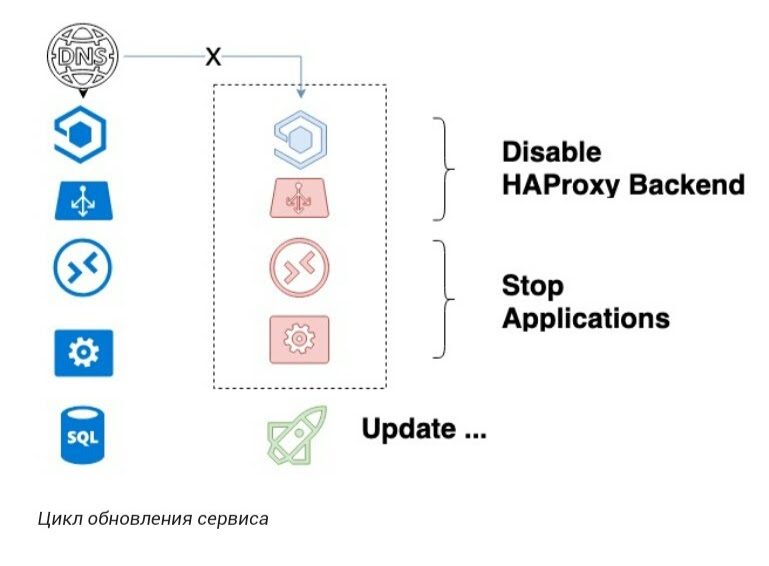

# Deployment

- [Deployment](#deployment)
  - [Версионирование обновлений приложения](#версионирование-обновлений-приложения)
  - [Стратегии](#стратегии)
    - [Canary Deployment](#canary-deployment)
  - [Как обновлять кодовую базу незаметно для пользователей](#как-обновлять-кодовую-базу-незаметно-для-пользователей)
  - [Технологии](#технологии)

## Версионирование обновлений приложения

- Цель
  - Не зависеть от обновлений бэка. Бэк выкатывается раньше.
  - Обратная совместимость
  - Простота поддержки
  - Минимальное время простоя
- Проблемы
  - Пользователь не обновляется
  - Проверка долго, могут не пустить версию
  - Новая версия приложения еще неработает, а бэк новый уже обновлен
- Версионирование варианты
  - Mediator pattern
  - Expand contract избыточность кода, поддержка документации
  - Номер версии: В данных, api - url, header
  - Правила версионирования [SemVer](https://semver.org/lang/ru/)
  - Язык запрсов к API: Graphql
- Unit tests api version
  
## Стратегии

- Надежность
	- [Rollback pattern](./pattern.rollback.md) - [Blue Green Deployment](https://codefresh.io/learn/software-deployment/what-is-blue-green-deployment/)
	- k8s
		- [Recreate](https://rtfm.co.ua/kubernetes-tipy-deployment-strategies-i-argo-rollouts/) - с простоем
		- [Rolling Update](https://rtfm.co.ua/kubernetes-tipy-deployment-strategies-i-argo-rollouts/) - запускает новые поды параллельно с запущенными старыми, а затем убивает старые, и оставляет только новые.
- Сокращение TTM, проверка гипотез
	- [Canary Deployment](https://martinfowler.com/bliki/CanaryRelease.html) - гибче __Rolling Update__, т.к. часть запросов переключается __на новую версию, а часть продолжает использовать старую версию__
	- [Dark (скрытые) или А/В-развертывания](https://temofeev.ru/info/articles/strategii-deploya-v-kubernetes-rolling-recreate-blue-green-canary-dark-a-b-testirovanie/) - вариация Canary стратегии . Разница между скрытым и канареечным развертыванием (Canary Deployment) состоит в том, что скрытые развертывания __имеют дело с фронтендом, а не с бэкендом__, как канареечные.
	- __Feature toggle__
      - сложный код, тестирование, удалять надо со временем, чтобы не было множества условий.
      - Бэк выкатили, затем приложение, когда надо включили фичу.
      - Стратегии включения фичи.
      - Типы: релизные, экспериментальные (ав тесты), разрешающие, операционные
      - Тогл правила, проверка результата
      - Избегать зависимостей тоглов
- [варианты](https://blog.bytebytego.com/i/98040721/what-is-the-process-for-deploying-changes-to-production) 

### Canary Deployment

- [TODO нюансы](https://habr.com/ru/company/oleg-bunin/blog/493026/)
- [Reference arch Oracle](https://docs.oracle.com/en/solutions/mod-app-deploy-strategies-oci/index.html#GUID-2207DEDA-718D-4264-B851-144EBF0E57CF)

## Как обновлять кодовую базу незаметно для пользователей

- возможности управления HAProxy и реализации [Graceful Shutdown](graceful.shutdown.md) в наших сервисах
- [Миграции бд](../refactoring/migration.db.md)
- поддерживаем на бою одновременно старую и новую версии сервиса
- Заранее, на этапе разработки софта, закладывается, что даже если будут изменения в базе данных сервиса, они не будут ломать предыдущий код.

## Технологии

- [Feature toggle](../feature.toggle.md)
- [k8s](../../../technology/ci-cd/k8s.md)
