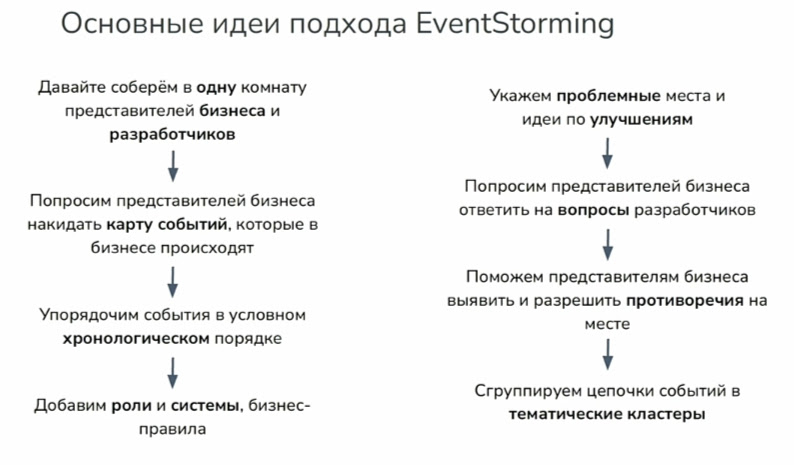
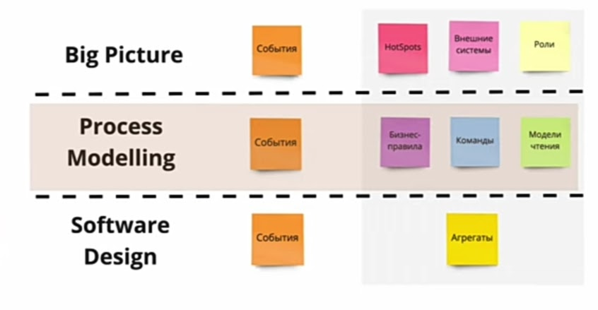

# Event Storming

Метод, который смещает акцент у __событий__ с технического на организационный и бизнес уровни и помогает [создать __устойчивую модульную систему__](https://habr.com/ru/companies/oleg-bunin/articles/537862/).

## Зачем

- Общее понимание бизнеса
- Ошибки декомпозиции на сервисы снижает и риск распределенного монолита. В  монолите проще провести рефакторинг, микросервисы как распределенный монолит - боль.  

- [IBM sample event-storming analysis](https://ibm-cloud-architecture.github.io/refarch-kc/implementation/event-storming-analysis/)
- [IBM sample Event-storming](https://www.ibm.com/cloud/architecture/architecture/practices/event-storming-methodology-architecture/)

