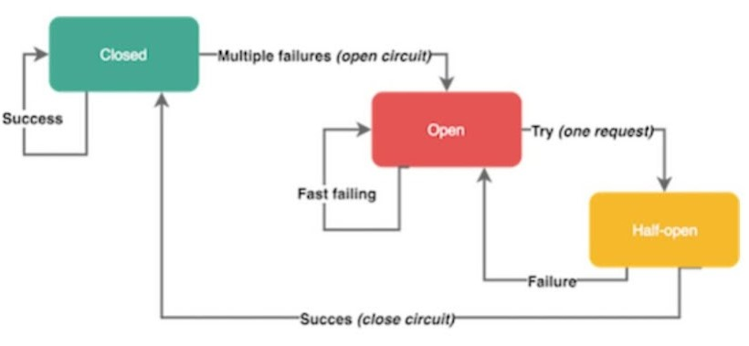

# Паттерны обработки сбоев

- [Паттерны обработки сбоев](#паттерны-обработки-сбоев)
  - [Rate limit](#rate-limit)
  - [Логика повторения (Retry Logic, Retry Policy)](#логика-повторения-retry-logic-retry-policy)
  - [Fail fast](#fail-fast)
  - [Каскадные сбои](#каскадные-сбои)
  - [Автоматы замыкания (Circuit Breakers)](#автоматы-замыкания-circuit-breakers)
  - [Технологии](#технологии)

[TODO](https://learn.microsoft.com/ru-ru/dotnet/architecture/microservices/implement-resilient-applications/)

Cбои разделяют:

- [временные](https://docs.microsoft.com/ru-ru/azure/architecture/best-practices/transient-faults)
- долгосрочные
- окончательные

Регистрируйте и отслеживайте временные и не временные ошибки для мониторинга:

- увеличения числа и частоты возникновения сбоев
- среднего числа повторных попыток
- общего времени, затрачиваемого на успешное выполнение операций

[TODO scheme](https://docs.google.com/document/d/1uVwJSFrDnKlJCQoK81P2UmpGzuPHoRQ7L9u8dFuB3yQ/edit?usp=sharing)

## Rate limit

- [Rate limit](../performance/rate.limit.md)

## Логика повторения (Retry Logic, Retry Policy)

- Повтор инициируется ИС\клиент потребитель (браузером, другим микросервисом и так далее), который не знает, была ли операция сбойной до или после обработки запроса, ИС источник должно уметь обрабатывать **[идемпотентность](../integration/idempotent.md)**. Например, когда вы повторяете операцию покупки, то вы не должны дублировать взимание средств с покупателя. Вам поможет использования **уникального ключа идемпотентности** для каждой транзакции.
- число повторных попыток и интервал между ними ограничен общим максимальным временем для операции\процесса
  - типы интервалов:
    - Экспоненциальная задержка
    - Интервалы с приращениями
    - Постоянные интервалы
    - Немедленный повтор
    - Случайный выбор
- [В общем случае используйте стратегию](https://docs.microsoft.com/ru-ru/azure/architecture/best-practices/transient-faults)
	- **экспоненциальной задержки** для фоновых операций
	- стратегии **немедленного повтора или постоянных интервалов** для интерактивных операций
- паттерны [RMQ failure](../../../technology/middleware/messagebus/rmq/rmq.failure.md)

## Fail fast

[Выбросить ошибку как можно раньше](https://habr.com/ru/company/nix/blog/342058/) подходы:

- Лимит на объемы любых запрашиваемых клиентом данных
- Обязательный таймаут на все удаленные операции
  - Для баз данных и на клиенте и на сервере, т.к прерванный запрос может продолжать выполнение
- Ограничение частоты обращений к серверу, а после превышения - 429 error code
- Ограничение количества открываемых входящих / исходящих соединений
- Ограничение размера задействованных пулов потоков под каждый тип операций
- Валидация аргументов запроса к сервису на стороне клиента (запрос все равно будет отвергнут, но мы сохраним время на удаленных вызов и пропускную способность сети)

Применение парадигмы «быстрого сбоя» **fail fast** в микросервисах посредством таймаутов является **антипаттерном**, которого следует избегать. Вместо таймаутов можете применять шаблон **circuit-breaker**, который зависит от статистики успешных/сбойных операций.

## Каскадные сбои

- В микросервисной архитектуре нужно подготовить свои сервисы **сбоить быстро и раздельно**.
- Быстрый сбой компонентов нужен потому, что мы не хотим ждать, пока закончатся таймауты сломанных инстансов. Ничто так не раздражает, как зависший запрос и не отвечающий на ваши действия интерфейс. Это не только потерянные ресурсы, но и испорченный пользовательский опыт.
- Сервисы вызывают друг друга по цепочке, поэтому нужно уделять особое внимание предотвращению повисания операций, не допуская накопления задержек.

## Автоматы замыкания (Circuit Breakers)

- **Таймауты** можно использовать для ограничения продолжительности операций. Они могут предотвратить подвисание операций и поддерживать реагирование системы на ваши действия. Использование в **микросервисной архитектуре** статичных, тонко настраиваемых таймаутов является **антипаттерном**, поскольку речь идёт о высокодинамичной среде, в которой практически невозможно подобрать подходящие временные ограничения, хорошо работающие в любых ситуациях.
- Автомат замыкания открывается, когда в течение короткого времени несколько раз возникает ошибка определённого типа. [Открытый автомат предотвращает передачу запросов](https://docs.microsoft.com/ru-ru/azure/architecture/patterns/circuit-breaker)
- Не все ошибки должны инициировать автомат замыкания. Например, вы наверняка захотите пропустить ошибки на стороне клиента вроде запросов с кодами 4хх, но при этом отреагировать на серверные сбои с кодами 5хх.
- Использование методов Isolate (размыкает цепь и сохраняет ее в таком состоянии) и Reset (снова замыкает цепь). Таким образом, можно создать служебную конечную точку HTTP, которая напрямую вызывает методы [Isolate и Reset политики](https://learn.microsoft.com/ru-ru/dotnet/architecture/microservices/implement-resilient-applications/implement-circuit-breaker-pattern). Такую конечную точку HTTP с надлежащей защитой можно также использовать в рабочей среде для __временной изоляции подчиненной системы__, например, если ее необходимо обновить. Кроме того, с ее помощью можно __размыкать цепь вручную для защиты подчиненной системы__, если есть подозрения на ее неисправность.

## Технологии

- Circuit Breakers, Retry Policy
  - [Polly](https://medium.com/aspnetrun/microservices-resilience-and-fault-tolerance-with-applying-retry-and-circuit-breaker-patterns-c32e518db990)
