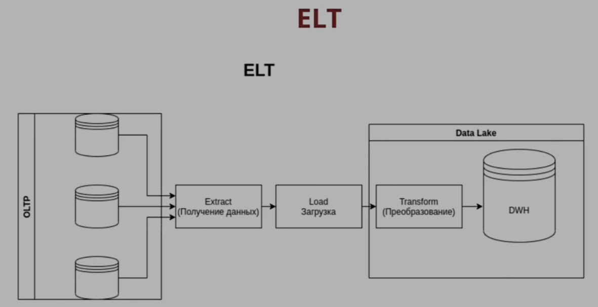

# ELT

Особенности

- B ELT подходе не обоснованно применять ETL средства из за их особенностей
  - EL — можно заменить на Debezium
  - T — можно заменить Airflow. Код будет исполнятся на самих системах хранения (к примеру SQL скрипты)
- Данные переливаются в «Большое хранилище» без обработки
- При трансформации код летит к данным
- Более легковесные системы обработки данных
- Позволяют использовать микросервисную архитектуру
- Разнообразные методологии DWH
