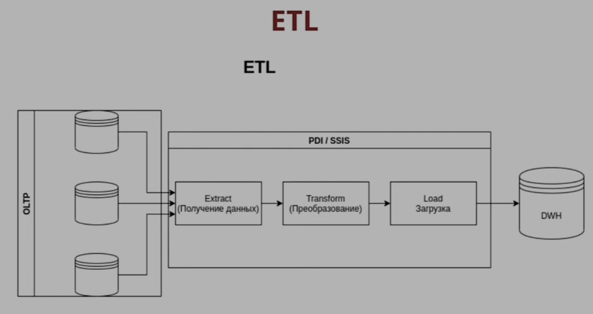

# ETL

## Плюсы и минусы

Плюсы

- Данные летят к системе обработки
- Реализованы «bulk load» ко многим системам
- Подключение через SQL запросы
- Топологии: Снежинка и звезда

Минусы

- Плохо масштабируемые решения
- Тяжелые монстры
- Получают данные порциями
- Популярны Look up
- только SQL источники, NoSQL нет
