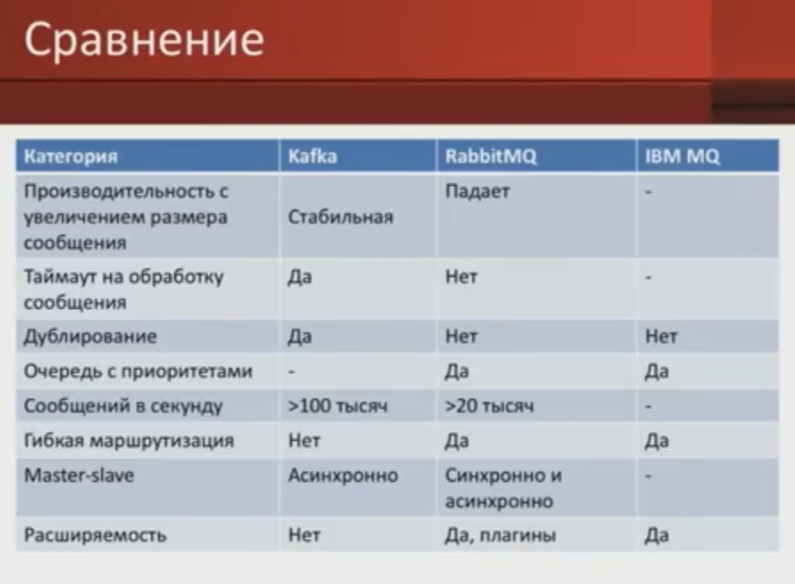
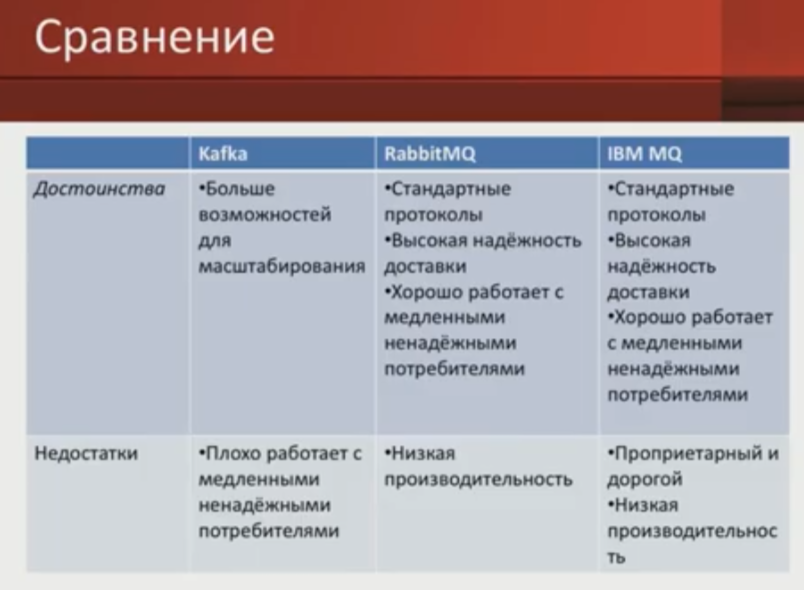

# Брокер сообщений Message Broker Bus

- [Брокер сообщений Message Broker Bus](#брокер-сообщений-message-broker-bus)
	- [Зачем](#зачем)
	- [Плюсы-минусы](#плюсы-минусы)
	- [Patterns](#patterns)
	- [Технологии](#технологии)
		- [Критерии выбора](#критерии-выбора)
			- [RMQ vs Kafka](#rmq-vs-kafka)
			- [RMQ vs ActiveMQ Artemis](#rmq-vs-activemq-artemis)

## Зачем

- асинхронное взаимодействие
- 1 Издатель - Х подписчиков
- Буфер запросов
- Очередь задач

## Плюсы-минусы

Плюсы

- Масштабируемость
- Гарантированная доставка
- Буферизация
- Слабая связность ИС [Low Coupling](../system.design/low.coupling.md)
- принцип "глупая шина (канал) умные клиенты"
  
Минусы

- Дополнительный архитектурный слой
- Затраты на мониторинг, настройку, управление
- влияет на общую надежность и безопасность системы

## Patterns

- [Advanced transient messaging](https://apolomodov.medium.com/coa-distributed-systems-4th-ed-4-communication-c5ce331015e9)
	- ZeroMQ
- Message-oriented persistent - Message Bus
	- Транспорт
		- [RMQ](../../../technology/middleware/messagebus/rmq.md)  
		- ActiveMQ
- Log-based message queue
	- [Kafka](../../../technology/middleware/messagebus/kafka.md)
- [Messaging Patterns](https://www.enterpriseintegrationpatterns.com/patterns/messaging/)
  - [MS](https://docs.microsoft.com/ru-ru/azure/architecture/patterns/category/messaging)
  - Pub\Sub События
  - Task (Worker) Queue
  - [Очереди с приоритетом](https://habr.com/ru/companies/arcadia/articles/571442/)
  - Content-Based Routing
  - Filter message
  - Dynamic Router
  - Splitter
  - Dead Leater Channel
  - Message Translator
  - Wire Tap - наблюдение за сообщениями
- Event Sourcing
- Тип способа получения сообщений
  - Pull (по запросу)
  - Push (подписка)
- Как узнать когда сообщение в очередь добавлено - [Timestamp](https://www.rabbitmq.com/publishers.html#message-properties)

## Технологии

- Транспорт  
	- [Kafka](../../../technology/middleware/messagebus/kafka.md)
	- [RabbitMQ](../../../technology/middleware/messagebus/rmq.md)
	- [Apache ActiveMQ Artemis](../../../technology/middleware/messagebus/activemq.md)
	- Azure service bus
	- MSMQ
	- SQL Server
	- Azure Queue Storage
	- Azure Service Bus
	- Amazon SQS

### Критерии выбора

#### RMQ vs Kafka

- [RMQ](../../../technology/middleware/messagebus/rmq.md#плюсы-и-минусы)
- [Kafka](../../../technology/middleware/messagebus/kafka.md#плюсы-и-минусы)
	- [vs RMQ](https://blog.bytebytego.com/p/how-to-choose-a-message-queue-kafka):
    	- сообщения __хранятся__ (так спроектирована), одно и то же сообщение может быть обработано сколько угодно раз разными консьюмерами и в разных контекстах
    	- выше производительность, Kafka легче масштабируется горизонтально
    	- строгая __последовательность__ сообщений
    	- меньше гибкости в роутинге сообщений
    	- нет приоритета сообщений
    	- __vendor lock__: Kafka использует собственный __двоичный протокол поверх TCP__. Вы не сможете так просто удалить или [__заменить эту платформу__](https://vc.ru/dev/869548-kafka-vs-rabbitmq-chto-nuzhno-znat-analitiku-pro-brokery-soobshenii)
    	- __транзакции__ между несколькими топиками

TODO

- <https://habr.com/ru/company/itsumma/blog/416629/>

#### RMQ vs ActiveMQ Artemis

- [RMQ](../../../technology/middleware/messagebus/rmq.md#плюсы-и-минусы)
- [Artemis](../../../technology/middleware/messagebus/activemq.md#плюсы-минусы)
  - vs RMQ
    - поддерживает более __широкий спектр протоколов__ обмена сообщениями (+ JMS)
    - [RMQ имеет наилучшую пропускную способность](https://www.okbsapr.ru/library/publications/shkola_kzi_chadov_mikhalchenko_2019/)
    - Менее гибкая маршрутизация сообщений
      - Artemis Реализует концепцию "адреса" для маршрутизации сообщений и поддерживает различные типы маршрутизации, [включая anycast и multicast](https://www.mastertheboss.com/rabbitmq/activemq-vs-rabbitmq-a-comparison/)
        - Паттерны: PUB-SUB
      - RMQ концепцию "обмена". Exchange в RabbitMQ - это компонент маршрутизации сообщений, который определяет, как сообщения распределяются по очередям
        - Паттерны: Message Queue, PUB-SUB, RPC, Routing
