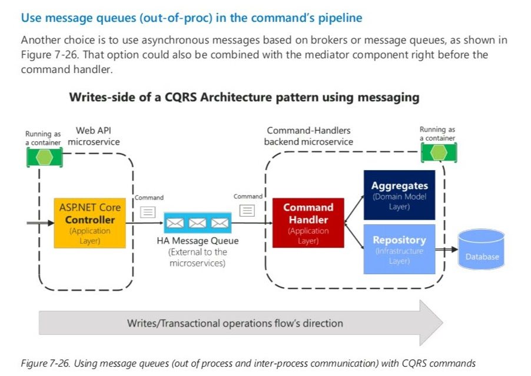

# CQRS

- [CQRS](#cqrs)
	- [Команда](#команда)
		- [Обработчик комманд](#обработчик-комманд)
	- [Запрос](#запрос)
	- [Links](#links)

## Команда

- это запрос к системе на выполнение действия, [которое изменяет состояние системы](https://docs.microsoft.com/ru-ru/dotnet/architecture/microservices/microservice-ddd-cqrs-patterns/microservice-application-layer-implementation-web-api#implement-the-command-and-command-handler-patterns). Команды являются императивными и должны обрабатываться только один раз
- Команды имеет смысл делать [идемпотентными](idempotent.md), если этого требуют бизнес-правила и инварианты предметной области.
- Команда — это объект передачи данных (DTO) особого типа, предназначенный специально для запроса изменений или транзакций.

### Обработчик комманд

[Обработчик комманд](https://docs.microsoft.com/ru-ru/dotnet/architecture/microservices/microservice-ddd-cqrs-patterns/microservice-application-layer-implementation-web-api#the-command-handler-class)

- [FAQ](https://cqrs.nu/Faq/command-handlers)

- Конвейер обработки команд: активация обработчика команд - [Медиатор](https://docs.microsoft.com/ru-ru/dotnet/architecture/microservices/microservice-ddd-cqrs-patterns/microservice-application-layer-implementation-web-api#the-command-process-pipeline-how-to-trigger-a-command-handler)

- Message Bus 

## Запрос

- Чтение это просто «отфильтруй данные и преобразуй их в формат удобный для фронта». Уже фраза - формат удобный для фронта намекает что это не про домен.
- Плюс чтение не оказывает влияние на целостность агрегатов, их инварианты и тд 
- В противовес же (как техническое обоснование почему чтению нечего делать в домене) - операции чтения редко требуется вернуть модель в том виде в котором она представлена в домене. Куда чаще это какие-то более плоские ViewModel. Тогда зачем городить для всего этого лишний слой абстракции?
- Представим ситуацию что мы сделали репозиторий и достаём из него пагинированные агрегаты чтобы потом представить их в плоскую модель для отображения таблички на фронте. Операция «достать агрегат» дорогостоящая (в силу того что агрегат почти всегда имеет достаточно сложную иерархическую структуру). Вместо этого мы могли бы сразу написать query которая достанет только необходимые данные и не создаст лишнего оверхеда
- Чтение является бизнес-требованием, но вряд ли его можно назвать бизнес-правилом доменной области. Потребности чтения могут меняться в зависимости от смены фронта или дизайна приложения. Является ли это частью описания жизненного цикла бизнес сущностей в домене?

## Links

Для архитектурных демонстраций выбирается, как правило, .Net, но, думаю, что в области Java тоже можно кое что найти:
- https://github.com/heynickc/awesome-ddd#jvm-languages

Пример реализации паджинатора от @zimareff (присутствует в этом чате) :
-https://github.com/PacktPublishing/Hands-On-Domain-Driven-Design-with-.NET-Core/search?q=page

Пример от Kamil Grzybek:
- https://github.com/kgrzybek/modular-monolith-with-ddd/search?q=page

Пример от @vkhorikov (присутствует в этом чате) :
- https://github.com/vkhorikov/SpecPattern/search?q=page
- https://github.com/vkhorikov/SpecificationPattern/search?q=page

Пример от MS (включая фронтенд):
- https://github.com/dotnet-architecture/eShopOnContainers/search?q=page

Пример от Jimmy Bogard:
- https://github.com/jbogard/ContosoUniversityDotNetCore-Pages/search?q=page

Есть пример от Криса Ричардсона (на Java). Я его почти не изучал, и, честно говоря, у меня по нему были вопросы. Но как точка зрения заслуживает внимания.
- https://github.com/microservices-patterns/ftgo-application/search?q=page
