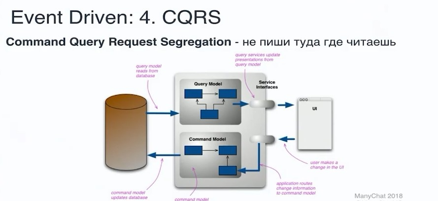

# Command Query Responsibility Segregation (CQRS)

- [Command Query Responsibility Segregation (CQRS)](#command-query-responsibility-segregation-cqrs)
	- [Зачем](#зачем)
	- [Плюсы и минусы](#плюсы-и-минусы)
	- [Команда](#команда)
		- [Обработчик комманд](#обработчик-комманд)
	- [Запрос](#запрос)
	- [Паттерны](#паттерны)
	- [Технологии](#технологии)

## Зачем

- это __разделение ответственности за команды и запросы__, шаблон, который разделяет операции чтения и обновления для хранилища данных. 
- Внедрив в приложение CQRS, можно __максимально увеличить его производительность, масштабируемость и защиту__.
- __Гибкость__, достигнутая при переходе на CQRS, позволяет системе лучше развиваться с течением времени и не мешает командам обновления вызывать конфликты слияния [на уровне домена](https://learn.microsoft.com/ru-ru/azure/architecture/patterns/cqrs)
- В основном используется с [Event Sourcing](event.sourcing.md)

## Плюсы и минусы

Плюсы

- __Независимое масштабирование__. CQRS позволяет раздельно масштабировать рабочие нагрузки чтения и записи, [снижая риск конфликтов блокировки](https://learn.microsoft.com/ru-ru/azure/architecture/patterns/cqrs).
- __Оптимизированные схемы данных__. Для процессов чтения можно применить схему, оптимизированную для запросов, а для процессов записи — другую схему, оптимизированную для обновлений.
- __Безопасность__. Так будет проще назначить для выполнения операций записи данных только допустимые сущности домена.
- __Разделение проблем__. Разделение процессов чтения и записи позволяет получить более гибкие и простые в обслуживании. Большая часть сложной бизнес-логики переместится в модель записи. Это в некоторой степени упростит модель чтения.
- __Более простые запросы__. Сохраняя в базе данных для чтения материализованное представление данных, вы предотвратите использование приложением сложных соединений в запросах.

Минусы

- в любой системе с разделением хранилищ для записи и чтения, здесь возможна только __итоговая согласованность__. Между созданием события и обновлением данных в хранилище __всегда будет некоторая задержка__.
- __повышает сложность системы__, так как в нем [нужно создать код для запуска и обработки событий](https://habr.com/ru/articles/347908/), а также постоянно собирать или __обновлять все представления__ и объекты, необходимые для обработки запросов в __модели чтения__.
  - Применять когда read — подсистема не справляется с нагрузками

## Команда

- это запрос к системе на выполнение действия, [которое изменяет состояние системы](https://docs.microsoft.com/ru-ru/dotnet/architecture/microservices/microservice-ddd-cqrs-patterns/microservice-application-layer-implementation-web-api#implement-the-command-and-command-handler-patterns)
- Команды являются __императивными__ и должны обрабатываться только один раз
- Команды имеет смысл делать [идемпотентными](idempotent.md), если этого требуют бизнес-правила и инварианты предметной области
- Команда — это объект передачи данных (DTO) особого типа, предназначенный специально для запроса изменений или транзакций.

### Обработчик комманд

[Обработчик комманд](https://docs.microsoft.com/ru-ru/dotnet/architecture/microservices/microservice-ddd-cqrs-patterns/microservice-application-layer-implementation-web-api#the-command-handler-class):

- [FAQ](https://cqrs.nu/Faq/command-handlers)
- Конвейер обработки команд может активировать обработчик команд способами:
  - в памяти паттерн [Медиатор](mediator.md)
  - вне процесса через [Command Bus](command.bus.md) on [Message Broker](pattern.messagebroker.md) transport 
    - Реализация паттерна [Command](command.md) и [Command Bus](command.bus.md).

## Запрос

- Чтение это просто «отфильтруй данные и преобразуй их в формат удобный для фронта». Уже фраза - формат удобный для фронта намекает что это __не про домен__.
- Плюс __чтение не оказывает влияние на целостность агрегатов, их инварианты__
- В противовес же (как техническое обоснование почему чтению нечего делать в домене) - операции чтения редко требуется вернуть модель в том виде в котором она представлена в домене. Куда чаще это какие-то более плоские ViewModel. Тогда зачем городить для всего этого лишний слой абстракции?
- Представим ситуацию что мы сделали репозиторий и достаём из него пагинированные агрегаты чтобы потом представить их в плоскую модель для отображения таблички на фронте. Операция «достать агрегат» дорогостоящая (в силу того что агрегат почти всегда имеет достаточно сложную иерархическую структуру). Вместо этого мы могли бы сразу написать query которая достанет только необходимые данные и не создаст лишнего оверхеда
- Чтение является бизнес-требованием, но вряд ли его можно назвать бизнес-правилом доменной области. Потребности чтения могут меняться в зависимости от смены фронта или дизайна приложения. Является ли это частью описания жизненного цикла бизнес сущностей в домене?

## Паттерны

- [Command](command.md)
- [Command Bus](command.bus.md)
- [Materialized view](https://learn.microsoft.com/ru-ru/azure/architecture/patterns/materialized-view)
- [Event Sourcing](event.sourcing.md)
  - Если хранилище чтения и записи единое Event sourcing не требуется.
- Event Store

## Технологии

- [.Net](https://github.com/heynickc/awesome-ddd#jvm-languages)
  - [NCQRS](https://habr.com/ru/articles/146429/)
  - Lokad CQRS
  - SimpleCQRS
  - [Akka](https://getakka.net/)
  - [eShopOnContainers](https://github.com/dotnet-architecture/eShopOnContainers/search?q=page)
  - [Пример от Jimmy Bogard](https://github.com/jbogard/ContosoUniversityDotNetCore-Pages/search?q=page)
  - Пример реализации [паджинатора](https://github.com/PacktPublishing/Hands-On-Domain-Driven-Design-with-.NET-Core/search?q=page)
  - NEventStore - [Event Store](https://github.com/NEventStore/NEventStore)
- [PHP DDS + CQRS + Event Store](../ref/ddd/php.md)
- Пример от [Kamil Grzybek](https://github.com/kgrzybek/modular-monolith-with-ddd/search?q=page)
- Спецификация
  - Пример от [vkhorikov](https://github.com/vkhorikov/SpecPattern/search?q=page)
  - [Пример](https://github.com/vkhorikov/SpecificationPattern/search?q=page)
