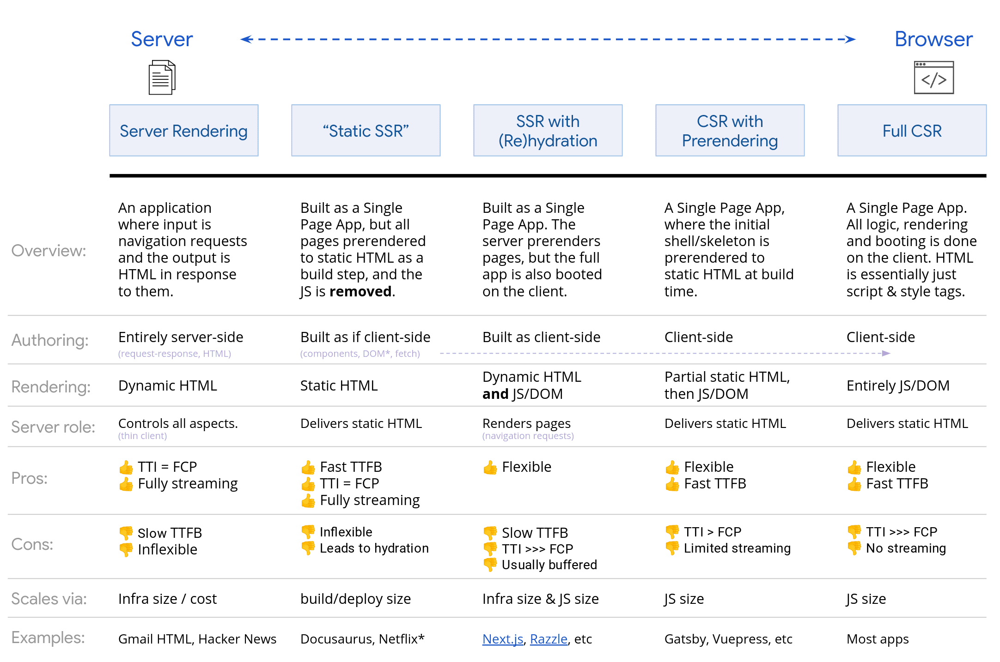

# Server Side Rendering (SSR) серверный рендеринг

## Зачем

Способ рендеринга одностраничного приложения (SPA) __на стороне сервера__, когда в браузер пользователя отправляется уже __полностью отрисованная страница__

