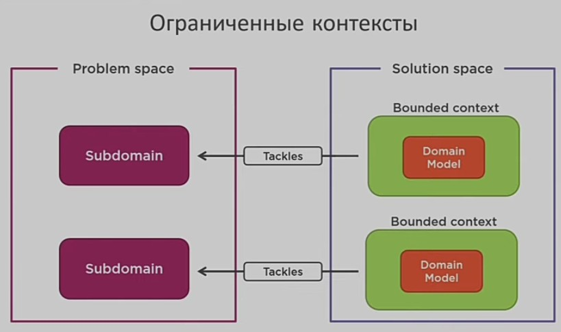
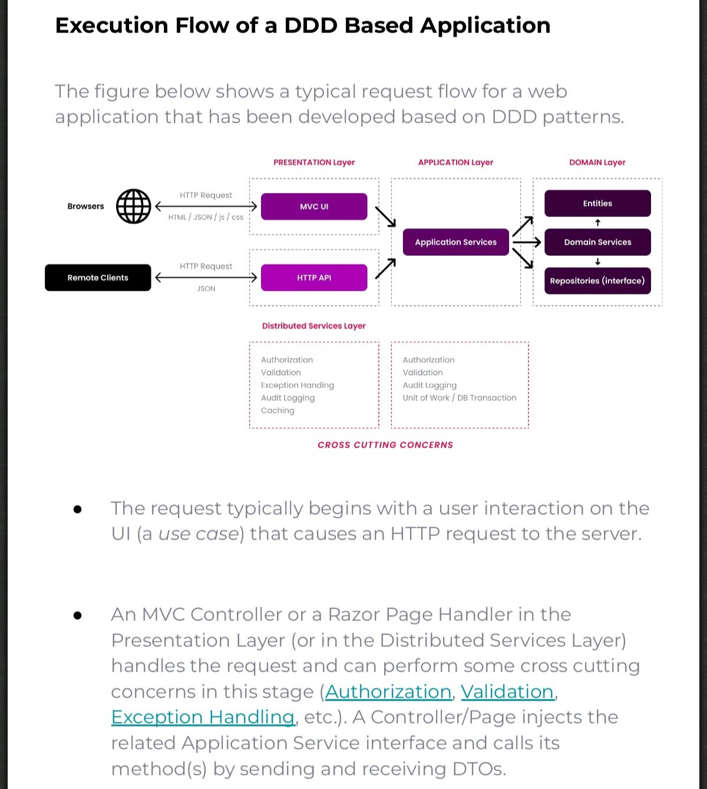

# Domain Driven Design DDD

- [Domain Driven Design DDD](#domain-driven-design-ddd)
  - [Зачем](#зачем)
  - [Плюсы и минусы](#плюсы-и-минусы)
  - [Паттерны](#паттерны)
    - [Стратегическое проектирование](#стратегическое-проектирование)
    - [Тактическое проектирование](#тактическое-проектирование)
      - [Агрегат (Aggregate root)](#агрегат-aggregate-root)
      - [Слои приложения](#слои-приложения)
  - [Технологии](#технологии)

## Зачем

- [Снизить сложность](https://habr.com/ru/articles/497656/), избежать "большого комка грязи"
- Бизнес ценность достичь
- Модель предметной области (сущности-функции) - доменная модель
- Единый язык ИТ и бизнеса
  - Код должен в себе отражать предметную область, т.е. __классы__ должны __соответствовать__ объектам __реальной предметной области__ как __по структуре__, так и __по поведению__.
- Уменьшить зависимости
  - разрыв __зависимостей__ (связности) на уровне предметной области, а именно:
    - устранение множественных, несовместимых на уровне моделей/контекстов, ответственностей и атрибутов
      - Несовместимых здесь означает, что есть одна сущность, например Contract, используется в двух моделях и в каждой из моделей у этой сущности есть атрибуты или поведение, которые
        - не определены в этой модели
        - или имеют собственное определение в каждой из моделей. Каждая модель использует атрибут по-своему в своем контексте и изменения в одной модели могут привести (и часто приводят) к некорректному поведению в другой модели.
  - Несколько моделей Order не нарушают __принципа DRY__: не должны повторяться именно в __поведении__, а не в __данных__
  - __Причины изменений__ - люди. Люди, запрашивающие изменения. И вам бы не хотелось сбивать с толку людей и себя смешивая в одном месте код, нужный разным людям по разным причинам (Robert C. Martin (Uncle Bob))
- За счет автономности сервисов\модулей значительно упрощается управление __техническим долгом__

[План самостоятельного обучения DDD, CQRS, EventSourcing](https://habr.com/ru/articles/653421/).

## Плюсы и минусы

Плюсы:

- Единый язык

Минусы:

- DDD на 90% проектов оверхед, который не стоит потраченных усилий? Но это не повод не учиться.

## Паттерны

- [TODO Паттерны](https://github.com/Sairyss/domain-driven-hexagon)
- [Event-storming](event.storming.md)
- [CQRS](../performance/pattern.cqrs.md)
- [IBM sample DDD](https://ibm-cloud-architecture.github.io/refarch-kc/implementation/domain-driven-design/)

### Стратегическое проектирование

  - __Контекст__ 
  - __Предметная область(проблема) Domain__
  - Делится на __Подобласть__
    - [делится по преимуществам для бизнеса](https://habr.com/ru/articles/316438/)
      - 1 __core__ ядро бизнеса - смысловое ядро - успех бизнеса
      - 2 __support__ поддерживающие ядро, жизненно необходимы
      - 3 __generic__ не критичная функциональность
  - Пространство задач - бизнес целей, бизнес проблем. __Подобласть Subdomain__=Задачи бизнеса
  
  - Пространство технических решений - __ограниченных контекстов Bounded context__ = решение по Подобласти subdomain (не всегд 1-1)
    - это явная граница, внутри которой существует модель предметной области, которая отображает __ЕДИНЫЙ ЯЗЫК__ в модель программного обеспечения.
    - Не всегда равно сервису, может применяться и в __модульном монолите__ (например отдельные таблицы сущностей разных контекстов).
    - Теоретически каждая подобласть __может иметь несколько ограниченных контекстов__, хотя мы стремимся, чтобы для одной подобласти он был один.
    - Как __искать границы Bounded context__
      - Данные
      - Оргструктура
      - Этапы бизнес процесса
      - Роли - Заинтересованные лица
      - Единый язык
      - Свои цели и своя ответственность
  - [Карта ограниченных контекстов](https://nuancesprog.ru/p/9085/) - интеграции между контекстами

### Тактическое проектирование

[Тактическое проектирование](https://habr.com/ru/company/oleg-bunin/blog/551428/)

- Доменная модель
  - __Консистентность__ данных обеспечить
  - Переход от анемичной к __богатой модели__
    - Не допускать анемии модели 
    - Модель отображает связи
    - В модели есть геттеры и сеттеры для свойств
    - Модель описывает действия и логику домена
    - При использовании универсальных __анемичных моделей__ и слоя сервисов часто получаем широкое использование доменных классов внутри Сервисов. Что в свою очередь приводит к __повышению связности Coupling__.
  - Изоляция от внешних зависимостей - __слабая связность Coupling__
  - __[Агрегат Aggregate](#агрегат-aggregate-root)__
    - Состоит из
      - __Сущность Entity__
        - Описывает индивидуально существующие Элементы домена
        - Определяется по __идентификатору__, а не по значению атрибутов
        - Непрерывно и однозначно определяется на всём протяжении существования
      - __Объект значений [Value Object](https://learn.microsoft.com/ru-ru/azure/architecture/microservices/model/tactical-ddd)__
        - Не обладает идентификатором
        - Описывает элементы домена, полностью определяемые свойствами
        - Неизменяемый после создания
        - Используется для типизации и структурирования данных
  - Шаблон __Спецификация__ для __бизнес правил__
  - Domain event [Доменные события](https://habr.com/ru/companies/ispring/articles/569648/)
- [Слои приложения](#слои-приложения)
- DDD трилема 
- [Clean Architecture](clean.architecture.md)

#### Агрегат (Aggregate root)

 [Агрегат](https://habr.com/ru/company/nix/blog/321686/) - кластер из __сущностей__ и __объектов значений__

- Определяется [по идентификатору](https://habr.com/ru/articles/316890/)
  - имеет глобальную идентичность, а остальные объекты локальную идентичность
- Является __границей транзакции__ при изменении данных
  - корень проверяет и гарантирует, что удовлетворяются все инварианты
  - в случае изменения объекта все инварианты по-прежнему должны удовлетворяться
- Другие элементы домена не могут ссылаться на внутренности агрегата
  - сущности, находящиеся вне агрегата, содержат __ссылки только на корень__
- Позволяет получить [Low Coupling](../low.coupling.md) и [Strong Cohesion](../strong.cohesion.md)
  - вся бизнес-логика обычно локализована в самом агрегате, так мы получаем Strong Cohesion.
- при удалении агрегата удаляется вся содержавшаяся в нем информация

#### Слои приложения

- Служба __Aplication Services__
  - Реализация Use Case UI
  - Используют Domain Services
  - [CQRS](../performance/pattern.cqrs.md) - command, query and handler, [command bus](../development/command.bus.md)
- Служба __Domain Services__ Interfaces
  - Сервисы предоставляют [приложению интерфейсы для работы с доменом](https://slides.silverfire.me/2017/yiiconf-ddd/#/83)
  - Содержат методы, описывающие операции Домена
  - Не содержат состояния
  - Могут обращаться к репозиториям и другим сервисам
  - Уносят логику из контроллеров
- __[Инфраструктурный слой](https://learn.microsoft.com/ru-ru/dotnet/architecture/microservices/microservice-ddd-cqrs-patterns/ddd-oriented-microservice?source=recommendations)__
  - Содержит реализации репозиториев и сервисов
  - Знает о БД
  - Работает с [IOC контейнером](https://habr.com/ru/post/131993/)
- Слой, предохраняющий абстракцию __Anti Corruption Layer__ (ACL) предлагается создавать фильтры, не дающие __концепциям из другой предметной области просочиться в вашу модель__. Они поддерживают чистоту модели.
- __Модули__

## Технологии

- Framework, Platform
  - [ABP.IO](../../../technology/framework/abp.md)
  - [PHP](../../ref/ddd/php.md)
- Plantuml + vs code
- Context Mapping DSL (CML) - [A Modeling Framework](https://contextmapper.org/) for Strategic Domain-driven Design
- [Microservice DSL (MDSL)](https://github.com/Microservice-API-Patterns/MDSL-Specification) support Generators. In the MDSL Editor, you can invoke the following generators from the “MDSL” entry in the context menu:
  - Generate OpenAPI Specification
  - Generate Protocol Buffers Specification
  - Generate GraphQL Schema
  - Generate Jolie Lang(uage) Specification
  - Generate Java “Modulith” Code
  - Generate ALPS specification (status: technology preview)
  - Generate AsyncMDSL specification (this actually is an in-model transformation, it does not generate a new output file)
  - Generate Text File with Freemarker Template
  - Generate AsyncAPI (from AsyncMDSL). See page AsyncAPI Specification Generator and readme in this examples folder for further information.
  - Generate MSML
  - From MSML OpenAPI
