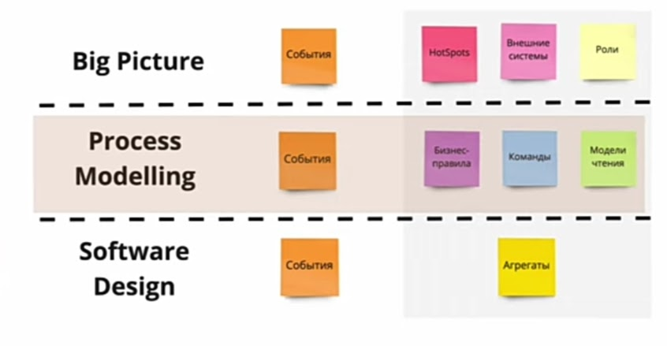
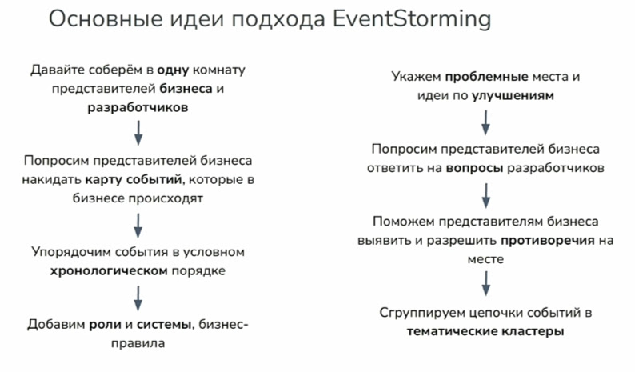
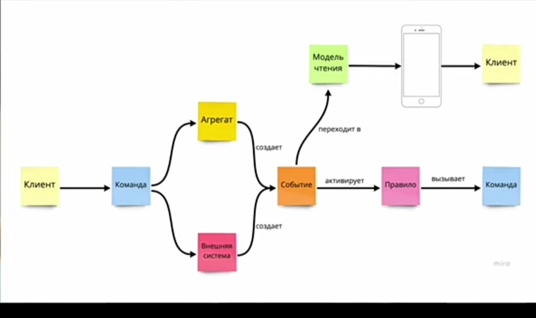

# Event Storming

- [Event Storming](#event-storming)
	- [Зачем](#зачем)
	- [План проведения](#план-проведения)

Метод, который смещает акцент у __событий__ с технического на организационный и бизнес уровни и помогает [создать __устойчивую модульную систему__](https://habr.com/ru/companies/oleg-bunin/articles/537862/).

## Зачем

- Быстро собрать унифицированные __требования__
- Описание __бизнес-процесса__
- Поиск зон ответственности (акторов, заинтересованных лиц)
- Создание непротиворечивой __терминологии__
- Помогает быстро получить __стратегический дизайн__, определив границы, в рамках которых технические __решения можно принимать автономно__
  - За счет автономности значительно упрощается управление __техническим долгом__
  - Если преднамеренно не нарушать границы на уровне реализации, то зависимости не появятся
- Общее __понимание бизнеса__
- Формирование границ доменов
  - __снижает риски__ декомпозиции на сервисы  и __реализации [распределенного монолита](../../style/monolit.md#распределенный-монолит)__
- Появляется возможность __эволюционного развития__ к целевому видению
- Поиск ключевых __сущностей__
- Моделирование реактивной архитектуры
- Позволяет получить разный __уровень детализации__

Примеры

- [IBM sample event-storming analysis](https://ibm-cloud-architecture.github.io/refarch-kc/implementation/event-storming-analysis/)
- [IBM sample Event-storming](https://www.ibm.com/cloud/architecture/architecture/practices/event-storming-methodology-architecture/)

## План проведения

- можете ли вы разделить __область знаний__ на более мелкие __бизнес-процессы__, которые вы моделируете один за другим в __нескольких циклах__ Event Storming.

- __События__ (факты) в прошедшем времени
	- вопросы для уточнения событий
	- Hot Spots - вопросы на подумать
- __Основные события__ выступают как главы в общем повествовании, предоставляя порядок и структуру общего контекста. Эти «главы» естественная граница для поддоменов и/или процессов. Признаки выделения основных событий:
  	- Временные границы - начало или окончание процесса Начало или окончание пути пользователя
  	- Лингвистические границы - изменение названия сущности (Объявление > Вакансия)
  	- Роли и ответственности
      	- Передача сущности от одного человека другому
      	- Начало или окончание процесса с точки зрения роли
      	- Начало или окончания пути пользователя с точки зрения роли
  	- Точки принятия решений
  	- Критические события
- акторы (роли) -> команды
- единый язык (термины)
- __команды__
	- команды -> __агрегаты__
	- команды -> __внешняя система__
	- решение пользователя в ответ на информацию в Модели Чтения
	- Запрос на выполнение действия
	- Действие еще не выполнено и может быть отменено
	- Формулируется в будущем времени
- агрегаты -> события
- внешняя система -> события
- события -> __бизнес правила__
- события -> __модель чтения__
	- Границы моделей данных
- ограниченные контексты [DDD](ddd.md) -> микросервисы\модульный монолит
