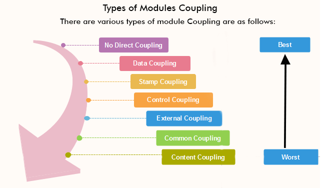

# Low Coupling Слабая связанность

## Зачем

[Слабая связанность](https://medium.com/german-gorelkin/low-coupling-high-cohesion-d36369fb1be9) и [сильная связность\целостность](./strong.cohesion.md) (high cohesion\strong cohesion)

- не зависеть от UI
- не зависеть от БД, внешних фреймворков и библиотек
- мера взаимозависимости различных классов и модулей друг с другом
- 

## Плюсы и минусы

- Плюсы
	- Сложность ИС декомпозируется на модули, проще изучать код, скорость изменений выше
	- Модуль реализует ограниченный бизнес контекст, тестирование изолировать проще
	- Качество разработки изолировано, проще модуль заменить переписать
	- Уменьшение зависимостей между модулями, меньше регрессионных рисков
	- Проще вынести в отдельный сервис и масштабировать под рост нагрузки или переиспользовать
- Минусы
	- Трудоемкость реализации, экспертиза разработчиков