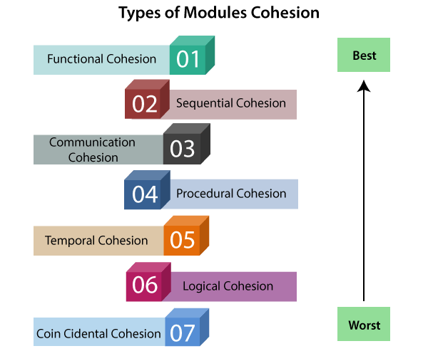

# Strong Cohesion Сильная связность\целостность

- Мера того, насколько задачи одного программного модуля требуют использования других модулей
- Один из плюсов сильной Cohesion — локализация изменений для новой фичи
- 
