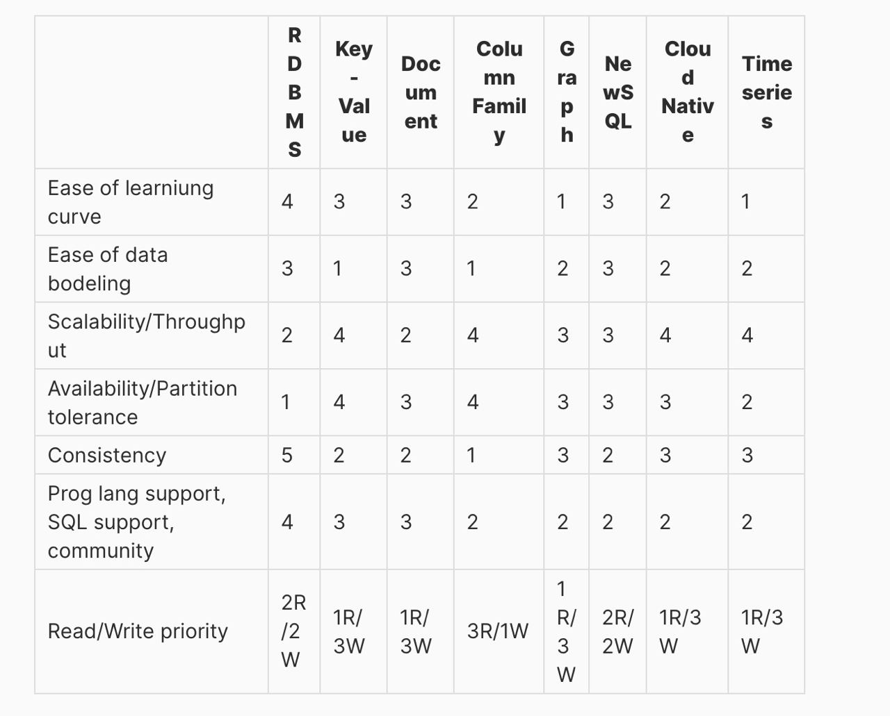

# Хранилища данных

- [Хранилища данных](#хранилища-данных)
  - [Зачем](#зачем)
  - [Плюсы и минусы](#плюсы-и-минусы)
  - [Паттерны](#паттерны)
  - [Принципы проектирования](#принципы-проектирования)
  - [Технологии](#технологии)

## Зачем

- [MS Хранилища данных](https://docs.microsoft.com/ru-ru/azure/architecture/guide/technology-choices/data-store-overview)
- Интегрирует множество источников данных и помогает снизить нагрузку на производственную систему.
- Оптимизированные данные для доступа к чтению и последовательного сканирования диска.
- Хранилище данных помогает защитить данные от обновлений исходной системы.
- Позволяет пользователям выполнять управление основными данными.
- Улучшение качества данных в исходных системах.

## Плюсы и минусы

[Критерии](arch.criteria.md)

| + | - |
| - | - |
|  |  |

- RDBMS (Relational Database Management System)
  - Almost anything could be solved by them.
- Time-series database
  - Store and manage time-stamped data.
- NoSQL
  - Key Value
    - In-memory store. Their speed and limited data size make them ideal for fast operations.
  - Graph database. It is suitable for complex relationships between unstructured objects.
  - Document store. They are good for large immutable data.
  - Wide column store. They are usually used for big data, analytics, reporting, etc., which needs denormalized data.
- Full text search Полнотекстовый поиск

## Паттерны

- Модель данных [звезда — оптимальная структура данных при переходе на российский BI](https://habr.com/ru/company/visiology/blog/678346/)
- Агрегированные витрины
  - Materialized View
- [Data Mining против хранилища данных](https://coderlessons.com/tutorials/bolshie-dannye-i-analitika/teoriia-khraneniia-dannykh/21-data-mining-protiv-khranilishcha-dannykh)
- On-Line Analitical Processing (OLAP) - оперативная аналитическая обработка данных
  - принципы построения систем поддержки принятия решений (Decision Support System - DSS)
  - хранилищ данных (Data Warehouse)
  - систем интеллектуального анализа данных (Data Mining)
- Мутабельные (изменяемые) или иммутабельные данные
- Принципы ACID
  - atomaric
  - consistently
  - isolation
  - durability
- Нормальная форма отношений в РСУБД 1, 2, 3 для OLTP
  - Денормализация отношений для OLAP
  - В решениях 1С компромисс реализован следующим образом: События при записи в базу пишутся сразу в несколько мест
    - В одном месте записи имеют мало индексов и оптимизированы под OLTP нагрузки
    - в другом месте записи индексируются по всем полям и адаптированы для OLAP нагрузок
    - Такие таблицы называются регистрами накоплений и регистрами сведений.
- OLTP (Online Transaction Processing)
  - CRUD обработка транзакций
- [Секционирование шардирование](../arch/pattern/shard.db.md)
  
## Принципы проектирования

- [SQL vs NoSQL](https://towardsdatascience.com/datastore-choices-sql-vs-nosql-database-ebec24d56106)
  - 
- SQL, NoSQL, TimeSeries
  - 

## Технологии

[Технологии](../technology/store.md)
