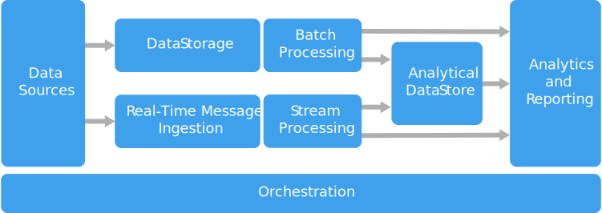

# Большие данные Big data

- [Большие данные Big data](#большие-данные-big-data)
  - [Зачем](#зачем)
    - [vs хранилища данных](#vs-хранилища-данных)
  - [Плюсы-минусы](#плюсы-минусы)
  - [Функции](#функции)
  - [Паттерны](#паттерны)
  - [Технологии](#технологии)
  - [Deployment](#deployment)

## Зачем

[Архитектурный стиль](../arch.styles.md).

- крупные __массивы информации__, которые помогают принимать обоснованные __решения__ основанные на данных (__data-driven__)
- стек специальных технологий для работы с информацией

UC:

- преобразование неструктурированных данных для анализа и создания отчетов
- архивные данные
- построение [единой отчетности](../system.class/report.md) (BI)
- ML

### vs хранилища данных

- Характеристики данных обрабатываемых
  - Volume объем >150гб\д
	- Velocity скорость обработки
	- Variety разнообразие типов данных
	- Veracity достоверность
	- Variability изменчимовсть
	- Value ценность для бизнеса
- [Data Lake](../pattern/system.design/data.lake.md#vs-хранилища-данных)
- Алгоритмы параллельной распределенной обработки данных
  - Distributed Processing Frameworks
  - MPP архитектура обработки данных
- Распределенное хранение данных (DFS)
- __Распределённая структура__ - управлять данными и анализировать их можно с помощью множества сервисов

## Плюсы-минусы

[Критерии](../arch.criteria.md)

Плюсы

- Разнородность типов данных
- Скорость сбора, обработки, анализа данных
- Большие объемы хранилищ (более 150 Гб)

Минусы

- Множество компонентов
- Безопасность
- [Высокие затраты](https://yandex.cloud/ru/docs/glossary/bigdata)
- Трудности с масштабированием

## Функции

[Этапы](https://practicum.yandex.ru/blog/chto-takoe-big-data/):

- Сбор данных
  - Реплики
  - CDC
  - ETL
  - Очистка данных Data Cleaning
- Хранение: DWH, Data Lake
- Обработка: Пакетная, RealTime
- Анализ: BI, OLAP, ML

## Паттерны

- Сбор
  - Streaming Data
    - [Kafka](../../technology/middleware/messagebus/kafka.md)
    - Amazon Kinezis
  - [CDC](../system.class/cdc.md)
  - Репликация, синхронизация данных [Sync Data](../pattern/sync.data.md)
- Хранение
  - [Distributed Storage Systems](../../technology/filesystem/dfs.md)
  - структурированные данные в [DWH](../system.class/dwh.md)
      - РСУБД [Хранилища данных](../store.md)
      - [Data Vault](../pattern/system.design/data.vault.md) - одна из моделей хранилища Data Warehouse с __временными отметками__ размещения данных
  - слабо структурированные
    - [NoSQL](../store.nosql.md): Columnar Store  
    - [Data Mart](../pattern/system.design/data.mart.md) - витрина __однородных__ данных одной __предметной области__
  - Озеро данных [Data Lake](../pattern/system.design/data.lake.md)
    - хранит любые типы данных
    - данные в хранилище поступают непрерывно в __реальном времени__
- Обработка
  - [Distributed Processing Frameworks](https://gogeometry.com/software/big-data-mind-map.html)
    - [MapReduce](../pattern/system.design/map.reduce.md)
    - Spark
  - [Massive Parallel Processing](mpp.md) (MPP) архитектура
- [Оркестратор](https://docs.microsoft.com/ru-ru/azure/architecture/guide/architecture-styles/big-data) Big Data Orchestration Tools
- Анализ
  - [Системы отчетности](../system.class/report.md)
    - BI
    - OLAP
  - ML

Reference Architecture:

- [1С-Битрикс BigData](http://habrahabr.ru/post/272041/): Amazon Kinezis, Apache Hadoop, Apache Spark, S3, DynamoDB, Apache Mahout

TODO:

- [mind map](https://360digitmg.com/mindmap/big-data)
- [Data Mining TODO](https://coderlessons.com/tutorials/bolshie-dannye-i-analitika/teoriia-khraneniia-dannykh/21-data-mining-protiv-khranilishcha-dannykh)

## Технологии

- Сбор
  - Streaming
    - [Kafka](../../technology/middleware/messagebus/kafka.md)
    - Центры событий Azure
    - Центры Интернета вещей Azure
  - CDC: Debezium
- Хранение
  - Distributed Storage Systems: HDFS, GFS, CFS
  - структурированные Structured
    - MSSQL, PGSQL
    - Data Vault: [Yandex Data Lens](../../technology/store/yandex.data.lens.md)
  - слабо структурированные Semi structured
    - [Yandex Data Lens](../../technology/store/yandex.data.lens.md)
    - [ClickHouse](../../technology/store/clickhouse.md)
    - [Apache Hadoop](../../technology/store/apache.hadoop.md)
  - Data Lake
    - [Apache Hive](../../technology/store/apache.hive.md)
    - Apache Hadoop
    - Kafka
    - Azure Data Lake Store
- Обработка
  - Apache Hadoop: Hive, Pig, Map Reduce
  - [Apache Spark](../../technology/store/apache.spark.md)
  - Azure Data Lake Analytics
  - Azure Stream Analytics
- [Оркестратор](https://docs.microsoft.com/ru-ru/azure/architecture/guide/architecture-styles/big-data)
  - фабрика данных [Azure](../../technology/azure.md)
  - [Apache Oozie](../../technology/apache.oozie.md) shedule Job Spark
  - Apache [Sqoop](../../technology/apache.sqoop.md) shedule Job ETL
  - Apache [Airflow](../../technology/apache.airflow.md) создания, выполнения, мониторинга и оркестровки потоков операций по обработке данных
- Анализ
  - Apache Spark
  - Apache Hive
  - HBase
  - ClickHouse
  - Splunk - платформа для сбора, хранения, обработки и [анализа машинных данных, то есть логов](https://habr.com/ru/companies/tssolution/articles/323814/)
  - Vertica - платформа продвинутой аналитики и машинного обучения с возможностью масштабирования и работы с различными источниками данных
  - BI
    - MS Power BI
    - Google Biq Query
    - Yandex Data Lens
  - OLAP
    - Azure Analysis Services
  - ML
    - Apache Mahout

## Deployment

- [Test DataSet](https://habr.com/ru/companies/edison/articles/480408/)
