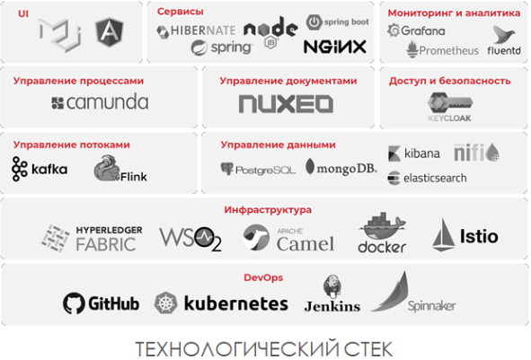

# Distributed System Распределенная архитектура

## Зачем

- Децентрализация не может быть целью сама по себе и надо фокусироваться на важности причин для распространения процессов и ресурсов по разным компьютерам.
- 
- 
- [TODO](https://github.com/Sairyss/distributed-systems-topics)

## Плюсы и минусы

Плюсы

- подход Agile Integration( Apache Camel, NiFi, WSO2 API Manager), который не предполагает одного централизованного интеграционного решения на всю компанию или единую команду интеграции. С его использованием появляется несколько кросс-функциональных команд разработки, которые знают, какие данные им нужны и какого качества они должны быть.
- позволяет уменьшить зависимость между различными командами и помогает вести преимущественно параллельную разработку разных сервисов.
- разделении системы на отдельные блоки, ориентированные на бизнес-функции;
- выделении независимых команд, каждая из которых может создавать и эксплуатировать бизнес-функцию;
- распараллеливании работ между этими командами с целью повышения масштабируемости, скорости.
- существование дополнительного звена в виде очередей сообщений позволяет вставлять промежуточную обработку передаваемой информации для решения различных задач: обеспечение безопасности и совместимости форматов, динамической маршрутизации, анализа контента и т.д.
- поддерживает горизонтальное масштабирование практически неограниченного размера.
  - При необходимости всегда можно добавить новые сервера занимающиеся только анализом изображений или только сканированием страниц, соединенные в одну систему при помощи очереди сообщений, которая в свою очередь тоже легко масштабируется и с коробки умеет работать на нескольких серверах, быстро обрабатывая огромное количество сообщений.

Минусы

- Выполняемые работы могут дублироваться
- работают тысячи сервисов, которыми надо управлять, поддерживать и сопоставлять в части интерфейсов и данных.
- Это увеличивает расходы, увеличивает требования к квалификации людей и управлению проектами. ИТ-отдел и бизнес должны взять на себя дополнительные обязанности научатся управлять этой сложностью
- распределенная архитектура с n-ым количеством сервисов требует определенного уровня зрелости управления проектами и поддержки,
- увеличивает расходы, увеличивает требования к квалификации людей. Никакая цифровая трансформация не может быть выполнена без трансформации текущих орг.процессов.
