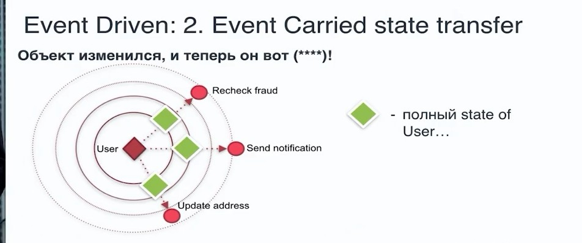

# Event Driven Architecture (EDA) Событийно ориентированная архитектура

- [Event Driven Architecture (EDA) Событийно ориентированная архитектура](#event-driven-architecture-eda-событийно-ориентированная-архитектура)
  - [Зачем](#зачем)
  - [Плюсы и минусы](#плюсы-и-минусы)
  - [Паттерны](#паттерны)
  - [Технологии](#технологии)
  - [Links](#links)

[Схемы](https://docs.google.com/document/d/1WBshnSO-F0S4zbQOjANvhFNKPepSMlhoU38OdIPV0i8/edit?usp=sharing)

## Зачем

- __Multiple subsystems__ must process the __same events__.
- Real-time processing with minimum time lag.
- Complex event processing, such as pattern matching or aggregation over time windows.
- High volume and high velocity of data, such as IoT.
- __Background Jobs__: Sending background messages, emails, or notifications to loads of users.
- __Asynchronous Messaging__: Messaging queues are the best way to implement asynchronous programming.
- High Response Time: When the response time of a request is too much. For example, calculations, searching or pdf creation, etc.

## Плюсы и минусы

[Критерии](../arch.criteria.md)

| + | - |
| - | - |
| Слабая связность. Подсистемы получают независимые представления потока событий. | [Обеспечить последовательность событий](https://docs.microsoft.com/ru-ru/azure/architecture/guide/architecture-styles/event-driven) |
| Масштабируемость. [Производительность](https://habr.com/ru/company/oleg-bunin/blog/310418/) | Асинхронный обмен сообщениями и итоговая согласованность |
| Отправители и получатели независимы друг от друга. | Управляемость |
| Нет интеграции "точка — точка". Очень легко добавлять в систему новые объекты-получатели.| Взаимодействие между службами |
| Объекты-получатели могут реагировать на события сразу при их поступлении. | Гарантированная доставка |
||  |

agility Rating: High
Testability Rating: Low
Ease of development Rating: Low

## Паттерны

- pattern consists of two main topologies, 
- The mediator topology is com‐ monly used when you need to orchestrate multiple steps within an event through a central mediator, 
. - Spring Integration, Apache Camel, Mule ESB
  - BPEL (business process execution language)
  - BPMS
- broker topology is used when you want to chain events together without the use of a central mediator.
- __Событие__ Event driven
  - [Publish-subscribe](../../technology/middleware/rmq.md)
    - event-base
    - [shared-data space](https://apolomodov.medium.com/coa-distributed-systems-4th-ed-2-architecture-af563b2332bd)
  <!--  -->
  - Подходы к передаче событий
    - событие 
    - состояние 
  - __Слабая связанность__ ([Loose Coupling](https://habr.com/ru/post/706630/)) — одно из основных преимуществ обработки, управляемой событиями. Это позволяет производителям событий создавать события, не зная о том, кто будет потреблять эти события. Точно так же потребители событий не должны знать об источниках событий. Из-за слабой связанности модули, потребляющие события, и модули, создающие события, могут быть реализованы на разных языках или использовать разные технологии, подходящие для конкретных задач.
- __Команда__ Command driven
  - [Task (Worker) Queue](../../technology/middleware/rmq.md)
  - [RPC (команды)](../../technology/middleware/rmq.md)
- __Запросы__ [CQRS](../pattern/pattern.cqrs.md) - command query request segregation

- [Event sourcing](https://habr.com/ru/company/nix/blog/322214/) - источник правды событие, не состояние ИС

- Медиатор
- __Распределенные транзакции__ (лучше не делать)
  - [SAGA](../pattern/pattern.saga.md) - компенсационные действия для отмены "транзакции"
  - двухфазный комит - намерение, получено ок от участников, комит  
- [Versioning Message](https://www.youtube.com/watch?v=mEzYTuYSork&list=PLx8uyNNs1ri2MBx6BjPum5j9_MMdIfM9C&index=11&ab_channel=ChrisPatterson)
  - [EasyNetQ by message type](https://github.com/EasyNetQ/EasyNetQ/wiki/Versioning-Messages)

## Технологии

- Шины сообщений\событий Event\Message Bus (брокер обмена сообщениями [Message Broker](../pattern/pattern.messagebroker.md)) можно выбрать одну из нескольких технологий (траспорт) обмена сообщениями
- Реализации шин сообщений (фреймворк)
  - .NET
    - NServiceBus
    - MassTransit или Brighter
    - EasyNetQ
    - [abp.io](https://docs.abp.io/en/abp/4.4/Distributed-Event-Bus)
  - Python
    - Celery
  - PHP TODO
    - [prooph](https://github.com/prooph/service-bus)
    - [Symfony Messenger](https://symfony.com/doc/current/messenger.html)
    - [Laravel Queues](https://laravel.com/docs/9.x/queues)
    - [Ecotone Framework](https://github.com/ecotoneFramework/ecotone)
    - [Symfony Messenger vs Laravel Queue vs Ecotone Framework](https://blog.devgenius.io/message-processing-in-php-symfony-messenger-laravel-queues-and-ecotone-8ca17102c5b2)
    - <https://github.com/php-enqueue/> поддержка Laravel, Magento2
    - <http://docs.simplebus.io/en/latest/index.html>
    - [Task (Worker) Queue YII2](https://github.com/yiisoft/yii2-queue/blob/master/docs/guide/README.md)
- [MS Обмен сообщениями](https://docs.microsoft.com/ru-ru/azure/architecture/guide/technology-choices/messaging)

## Links

- <https://habr.com/ru/company/itsumma/blog/416629/>
- <https://habr.com/ru/post/422151/>
- <https://habr.com/ru/post/150134/>
- <https://docs.microsoft.com/ru-ru/azure/architecture/guide/architecture-styles/event-driven>
- pattern TODO
  - <https://github.com/plantuml-stdlib/EIP-PlantUML>
  - <https://medium.com/@objectzen/content-enricher-pattern-in-rabbitmq-eae504a8504e>
  - <http://rubyamqp.info/articles/patterns_and_use_cases.html>
  - <https://www.enterpriseintegrationpatterns.com/patterns/messaging/MessageRoutingIntro.html>
  - <https://www.rabbitmq.com/tutorials/tutorial-two-python.html>
  - <https://blog.rnds.pro/019-poison2>
  - <https://alexandrugris.github.io/distributed/systems/2017/06/03/rabbitmq-patterns.html>
  - <https://www.cloudamqp.com/docs/delayed-messages.html>
  - <https://solace.com/blog/messaging-patterns-for-event-driven-microservices/>
- naming
  - <https://solace.com/blog/designing-and-naming-topics-for-event-driven-architecture-with-pubsub/?mkt_tok=MDcyLUNCSS05MjUAAAGDJ7N-6jFCOwXRBzE_4Ku_niXJQniSVNAJ-nNBD0JvROkzqo3tQbzDTFFx5PHlhTJj16lqF8xZCHb8IIy_29iOyZFYViJCWwpsU1X393ljZGzf>&ю
  - <https://docs.solace.com/Best-Practices/Topic-Architecture-Best-Practices.htm>
  - <https://codeopinion.com/message-naming-guidelines/>
  - <https://stackoverflow.com/questions/32220312/rabbitmq-amqp-best-practice-queue-topic-design-in-a-microservice-architecture>
  - <http://thoai-nguyen.blogspot.com/2012/05/rabbitmq-exchange-queue-name-convention.html>
