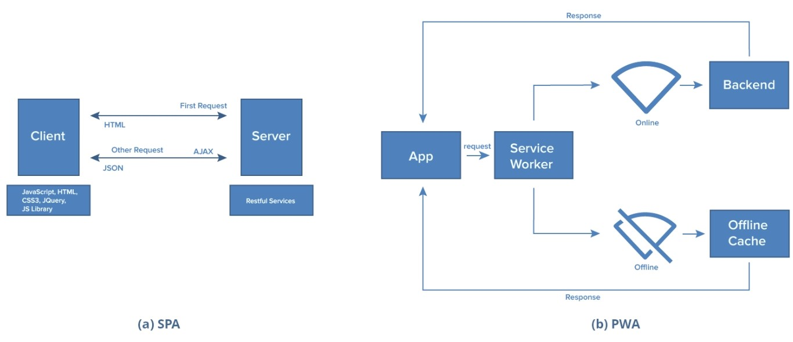

# Прогрессивные веб приложения (PWA)

## Зачем

- PWA(https://webcase.com.ua/blog/razrabotka-odnostranichnyh-prilozhenij-spa-webcase/#f5)
- Под разные платформы мобил, ПК из браузера
- Примеры: pinterest

## Плюсы-минусы

- добавление значка приложения на домашний экран смартфона
- Google. JS + HTML + CSS
- метод постепенного улучшения как основной принцип работы. приложение с ограниченным функционалом сможет работать на любом гаджете, в любом месте, но при переходе пользователя на более совершенное устройство или браузер, расширяются функции PWA.
- "Толстый" браузер с Service Worker api: обновление, оффлайн
- Без установки из store android, но можно и через него установить

## Технологии

- Chrome и Opera начали поддержку прогрессивных Web Apps. Firefox и Microsoft взяли на себя обязательство по поддержке
