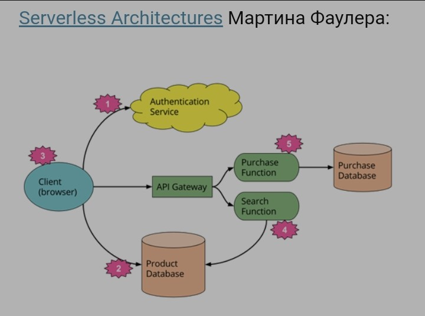

# Serverless

- [Serverless](#serverless)
  - [Зачем](#зачем)
  - [Плюсы-минусы](#плюсы-минусы)
  - [Faas (function-as-a-service)](#faas-function-as-a-service)
  - [Бессерверные контейнеры](#бессерверные-контейнеры)
  - [Паттерны](#паттерны)
  - [Технологии](#технологии)

## Зачем

- Редко выполняемые операции; задания, выполняемые по таймеру; stateless-операции, требующие создания отдельного экземпляра; обработка файлов и видео
- HTTP- и CronJob-триггеры и др способы вызова функций

## Плюсы-минусы

Плюсы

- Не надо думать о инфраструктуре
- Более низкая стоимость
- Более высокая скорость разработки
- Возможность разрабатывать сервисы различными командами одновременно
- Повышенная отказоустойчивость и как правило, лучшая масштабируемость
- Версионирование

Минусы

- Vendor lock in cloud
- Док-я нужна
- Безопасность
- На [короткие действия заточено](https://habr.com/ru/companies/otus/articles/477930/)

## Faas (function-as-a-service)

- Kubernetes-based installable serverless platform
  - Не требуется облачный провайдер AWS, Azure и тп
- Функция поднимает pod для выполнения
- Экономия ресурсов k8s на container, если кодовая база довольно невелика
- Способы запустить функцию
  - HTTP--триггеры - требуют конфигурации ingress и выполняют функцию после запроса, отправленного на определённый URL
  - CronJob-триггеры - будут запускать функцию по расписанию.
  - webhooks
  - триггеры очереди

## Бессерверные контейнеры

- так же, как и бессерверные функции, позиционируются для __событийно-ориентированной архитектуры__
  - выгода начинается, когда рабочие нагрузки носят кратковременный характер и большую часть времени ничего не происходит, но внезапно вам нужно выполнить какие-то запросы.
  - бессерверные контейнеры требуют меньшей переработки приложения, к ним легче перейти с уже существующим приложением, тогда как функции – это вариант для создания нового приложения или сервиса, и они имеют __ограничения на используемый язык__ программирования

## Паттерны

- [Azure Serverless](https://learn.microsoft.com/ru-ru/azure/architecture/reference-architectures/serverless/web-app)

## Технологии

- __serverless-фреймворки__ on-premise
  - Kubeless
  - Openwhisk
  - Knative
