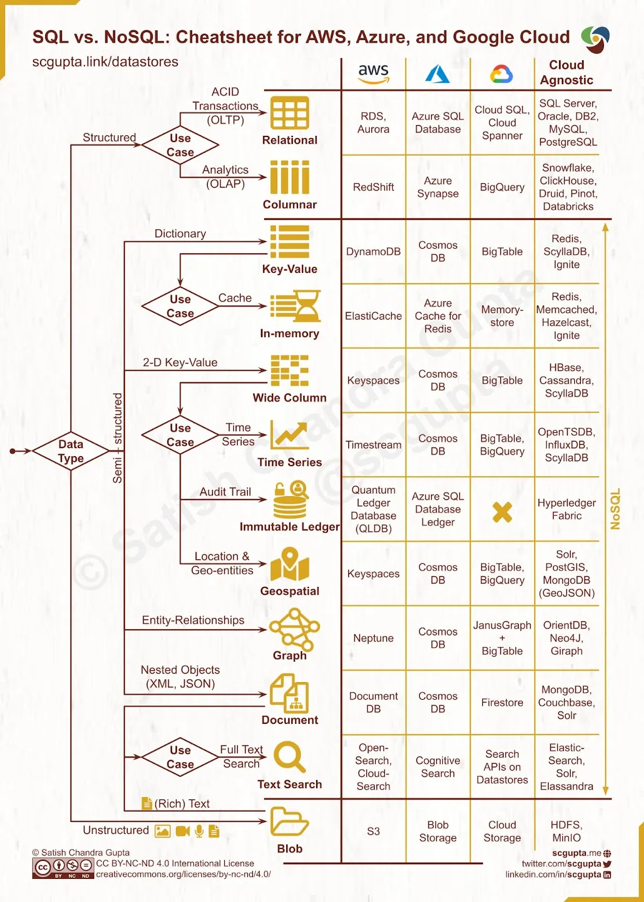
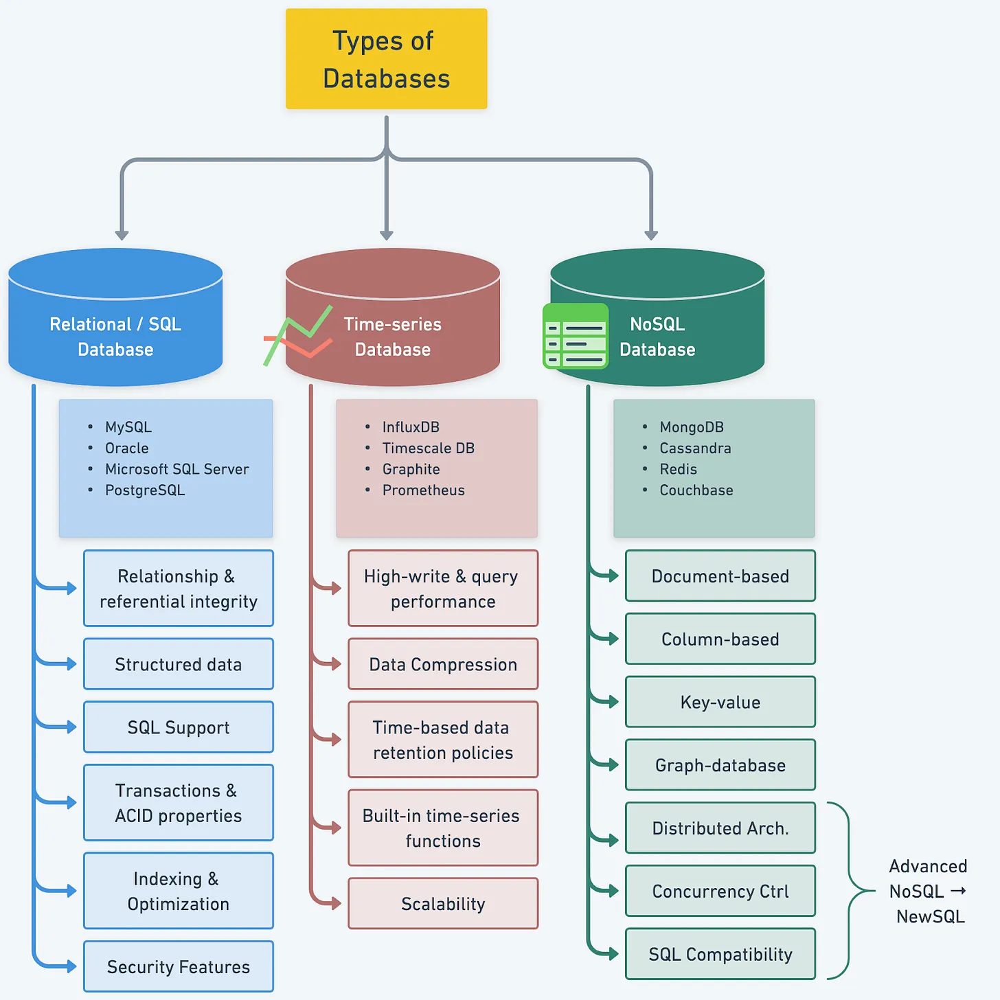

# Хранилища данных

- [Хранилища данных](#хранилища-данных)
  - [Зачем](#зачем)
  - [Виды](#виды)
  - [Паттерны](#паттерны)
  - [Критерии выбора](#критерии-выбора)
  - [Технологии](#технологии)

## Зачем

- [MS Хранилища данных](https://docs.microsoft.com/ru-ru/azure/architecture/guide/technology-choices/data-store-overview)
- Интегрирует множество источников данных и помогает снизить нагрузку на производственную систему
- Оптимизированные данные для доступа к чтению и последовательного сканирования диска
- Хранилище данных помогает защитить данные от обновлений исходной системы
- Позволяет пользователям выполнять управление основными данными
- Улучшение качества данных в исходных системах

Основные [типы хранилищ](https://yandex.cloud/ru/docs/glossary/datavault
):

- хранилища в третьей нормальной форме (3NF)
- хранилища с измерениями (типа «Звезда» или «Снежинка»)
- хранилища с измерениями [Data Vault](../pattern/system.design/data.vault.md)

## Виды

[Критерии](../arch.criteria.md)

- Structured
  - OLTP (MSSQL..)
    - RDBMS (Relational Database Management System)
      - Almost anything could be solved by them
  - OLAP
    - Column Family (ClickHouse..)
- Time-series database (Prometheus..)
  - Store and manage time-stamped data
- Semi Structured
  - [NoSQL](store.nosql.md)
    - Key Value (Redis)
    - Graph database (Neo4J)
    - Document store (MongoDB)
    - Wide column store (Cassandra)
  - Full text search Полнотекстовый поиск (ElasticSearch) - [DSE](dse.md) системы
- UnStructured
  - BLOB (Minio)

## Паттерны

- Модель данных [звезда — оптимальная структура данных при переходе на российский BI](https://habr.com/ru/company/visiology/blog/678346/)
- Агрегированные витрины
  - Materialized View
- [Data Mining против хранилища данных](https://coderlessons.com/tutorials/bolshie-dannye-i-analitika/teoriia-khraneniia-dannykh/21-data-mining-protiv-khranilishcha-dannykh)
- On-Line Analitical Processing (__OLAP__) - оперативная аналитическая обработка данных
  - принципы построения систем поддержки принятия решений (Decision Support System - DSS)
  - хранилищ данных (Data Warehouse)
  - систем интеллектуального анализа данных (Data Mining)
- __Мутабельные__ (изменяемые mutable) или иммутабельные (не изменяемые immutable) данные
- Принципы __ACID__
  - atomaric
  - consistently
  - isolation
  - durability
- __OLTP__ (Online Transaction Processing)
  - CRUD обработка транзакций
- Нормальная форма отношений в РСУБД 1, 2, 3 для __OLTP__
  - __Денормализация__ отношений для OLAP
  - В решениях 1С компромисс реализован следующим образом: События при записи в базу пишутся сразу в несколько мест
    - В одном месте записи имеют мало индексов и оптимизированы под OLTP нагрузки
    - в другом месте записи индексируются по всем полям и адаптированы для OLAP нагрузок
    - Такие таблицы называются регистрами накоплений и регистрами сведений.
- [Секционирование шардирование](../pattern/performance/shard.db.md)
  
## Критерии выбора

- [SQL vs NoSQL](https://towardsdatascience.com/datastore-choices-sql-vs-nosql-database-ebec24d56106)
  - 
- SQL, NoSQL, TimeSeries
  - 

## Технологии

[Технологии](../../technology/store.md)
