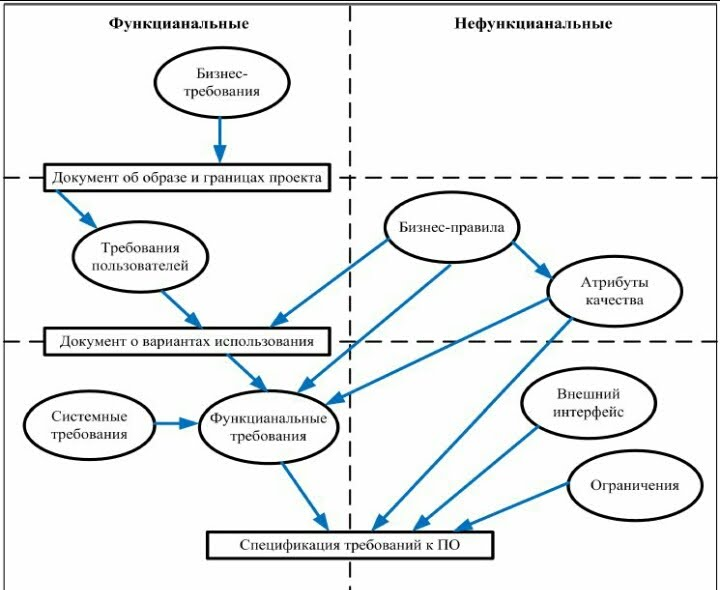

# Аналитика

Checklist:

- AN Нормативная документация
  - Термины
  - Критерии готовности, приемки решения
  - SLA
- BT Бизнес-требования
  - Проблема
    - [Impact mapping](../analytic/ba.md#карта-влияния-impact-mapping)
  - Требования пользователей
    - UC [use-case](../analytic/ba.md#use-case-uc-сценарии-использования), клик-событие, акторы
    - [Event Storming](../arch/pattern/system.design/event.storming.md)
  - [Бизнес процессы](../analytic/ba.md#бизнес-процесс-бп) AS-IS, TO-BE
  - Бизнес-правила
- FT Функциональные требования __по ИС__ - функции ИС
  - DB Доменная модель
    - Доменные объекты (Бизнес Сущности): Аттрибуты, Правила валидации, Связи
    - Статусная модель
    - Доменные события
    - [Инварианты агрегата](../arch/pattern/system.design/ddd.md#агрегат-aggregate-root)
  - Алгоритмы Процессы
  - Отчетность
    - ПФ, Макросы
  - Регулярные процессы (по расписанию)
- Справочники
- Настройки (UC, FT, Название, Назначение, Значение по умолчанию)
- Метрики
- Прикладная защита (RBAC, ABAC и тп)
  - Ролевой доступ
- Ограничения, Допущения
  - Границы проекта(scope)
  - Бэклог
  - Этапы (MVP), Фазы
- Риски: вероятность, шаги минимизации
- НФТ
  - Протоколирование и бизнес мониторинг
  - Атрибуты качества
  - ИБ
- Требования к запуску
- TD Технический дизайн
  - Компоненты ИС (web, back, process, и тп)
  - Операции обработки данных, функции
  - Интеграции
    - События, Команды, Запросы
      - Входящие\исходящие
    - [API](../api/api.md)
    - Схемы взаимодействия (SQD)
  - UI
    - [Спецификация ЭФ](../analytic/ba.md#ui-эф), Макеты\Прототипы
  - База данных: ХП, функции, таблицы
  - Локализация
  - Технологический стек
- Маппинг ФТ на ТД: Связь потребностей (UC), требований (FT) и решений (TD)
- Консультации на этапе реализации
- Демо
  - от разработчиков
  - заказчику
- Консультации на этапе ОПЭ
- Документация для передачи в эксплуатацию: РП, мониторинг, метрики, логи, описание ИС
- Актуализация документации: РИПВ, API
