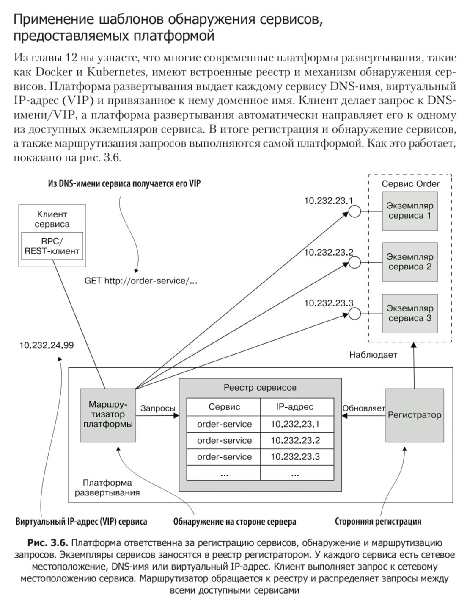
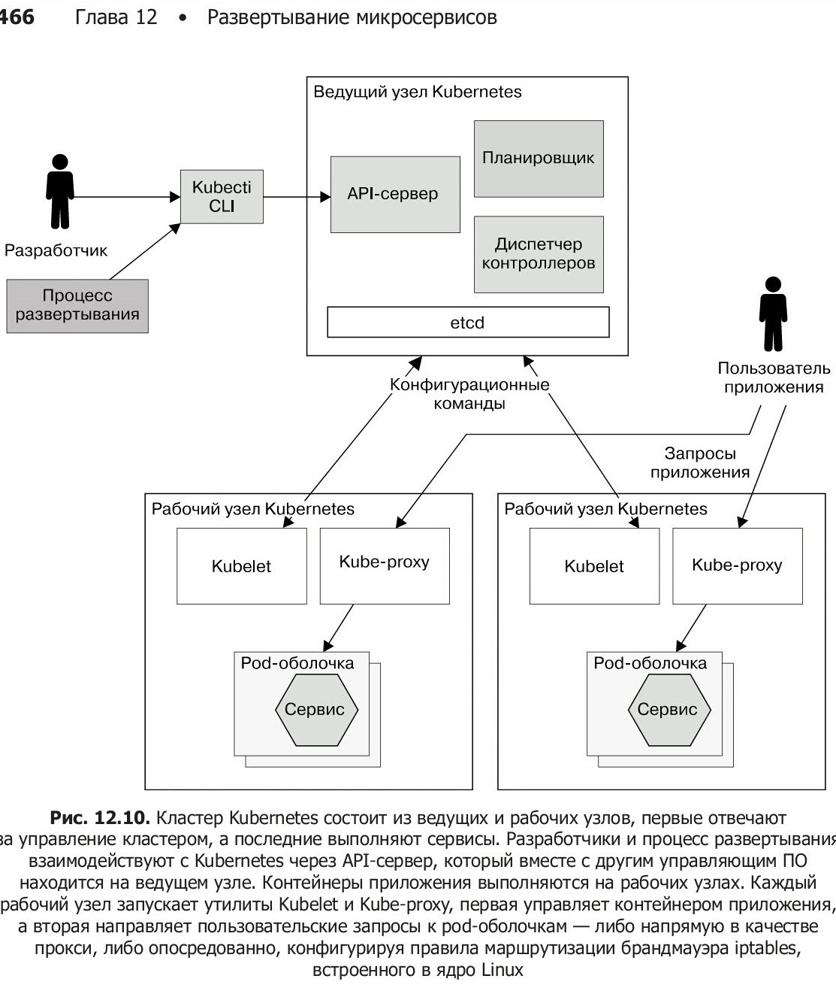
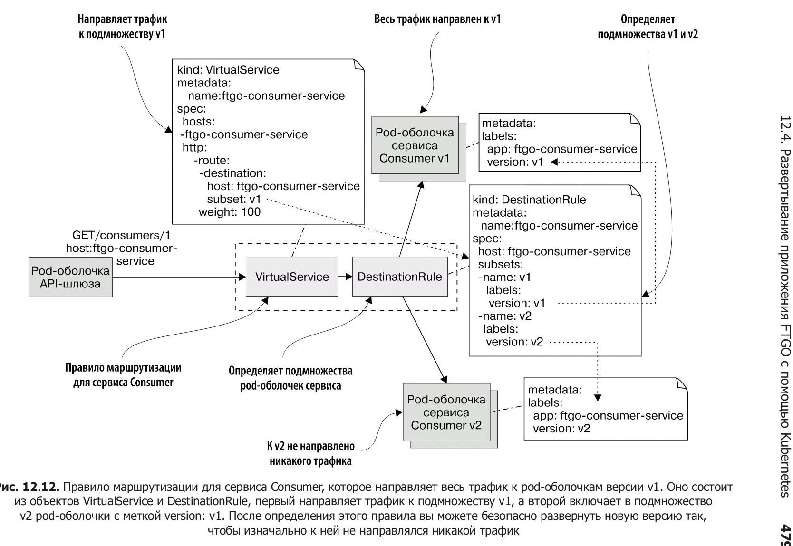
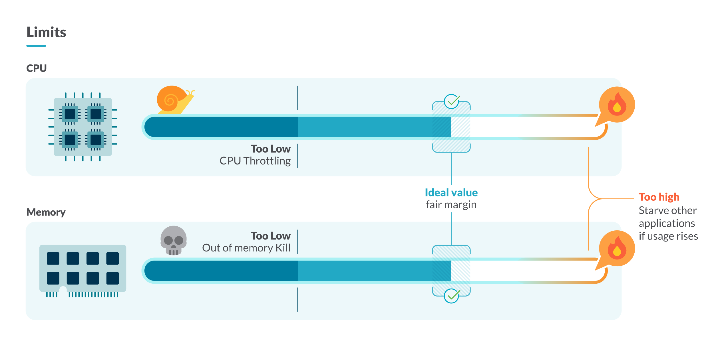

# Kubernetes (k8s)

- [Kubernetes (k8s)](#kubernetes-k8s)
  - [Зачем](#зачем)
  - [Reference Architecture](#reference-architecture)
  - [Patterns](#patterns)
    - [Deployment](#deployment)
      - [Canary deployment](#canary-deployment)
    - [Scalability Performance масштабирование](#scalability-performance-масштабирование)
  - [Технологии](#технологии)

## Зачем

- обнаружение сервисов 
- Окружения
  - организованы используя kubernetes namespaces в рамках одного кластера. Такой подход является максимально простым и быстрым на старте, но так же имеет свои недостатки: namespaces не полностью изолированы друг от друга в kubernetes
- Удобство для разработчиков. Встроить Kubernetes в workflow разработки можно разными способами:
  - Telepresence.io
  - Skaffold
- управление конфигурациями и секретами
  - Config, secrets
  - Configmaps
  - Consul, Vault и Consul Template для управления конфигурациями.
    - Consul Template запускается как init-контейнер, а в будущем планируется запускать его как sidecar к pod'ам, чтобы он следил за изменениями конфигурации в Consul и обновлял секреты с истекающим сроком действия в Vault и мягко (gracefully) перезапускал процессы приложений.
- [Observability](../../arch/ability/observability.md)
  - [Logs](../logging.md)
  - [Metrics monitoring](../monitoring.md)
    - Метрики
      - кол-ва k8s дашборд
      - Утилизация ресурсов?
    - в процессе мониторинга нам необходимо постоянно сопоставлять физический мир контейнеров с реальностью Kubernetes
    - health checks. У Kubernetes есть два их типа: liveness и readiness probes.

## Reference Architecture

- [NGINX Modern Apps Reference Architecture (MARA)](https://github.com/nginxinc/kic-reference-architectures/)
  - [Distributed storage](../../technology/filesystem/filesystem.md)
  - [Object Storage](../../technology/filesystem/object.storage.md)
- [Oracle MuShop](https://oracle-quickstart.github.io/oci-cloudnative/)
- MSA 

## Patterns

- [Rate limiting](https://www.nginx.com/blog/microservices-march-protect-kubernetes-apis-with-rate-limiting/)
- TODO Кол-во сервисов на контейнер
  - Ограничение кластера по подам на ноде?
  - создание маленьких контейнеров, т.к. контейнеры автоматически запускаются на разных хостах, и их меньший размер ускорит время запуска (поскольку предварительно их нужно физически скопировать на хостовую систему).

### Deployment

#### Canary deployment

- [Nginx](https://www.nginx.com/blog/microservices-march-improve-kubernetes-uptime-and-resilience-with-a-canary-deployment/)

### Scalability Performance масштабирование

- Avtoscaling
  - Min max nodes in cluster
- Запросы requests и лимиты limits CPU - by namespace, node, pod, container
- memory limit and a memory request
)
- Quality of Service (QoS) classes to the Pod:
  - Guaranteed
  - Burstable
  - BestEffort
- Утилизация ресурсов cluster, nodes, pods, container
  - Когда вы утилизируете большую часть ресурсов кластера, контейнеры могут работать без проблем при обычной нагрузке, но в сценариях с высокой нагрузкой контейнеры могут начать использовать ЦП и память до предела. Это приведет к тому, что узел начнет выселять pods, а в критических ситуациях узел перестанет работать из-за нехватки ресурсов.
- настраивать проверки работоспособности (health probes)

## Технологии

- CI/CD
  - [Jenkins](jenkins.md)	- automation server on Kubernetes, pipeline
- IaC
  - Helm
- Container Registry
  - Nexus
- [Service mesh](../servicemesh.md)