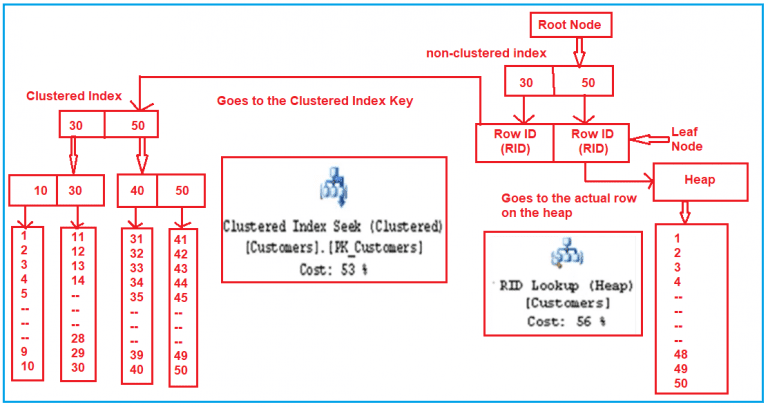

# Индексы

- [Индексы](#индексы)
	- [Паттерны](#паттерны)
	- [Рекомендации по выбору таблиц и столбцов для создания индексов](#рекомендации-по-выбору-таблиц-и-столбцов-для-создания-индексов)
	- [Рекомендации по использованию кластерных или некластерных индексов](#рекомендации-по-использованию-кластерных-или-некластерных-индексов)

## Паттерны

- Не все индексы одинаково полезны. При разработке индексов необходимо учитывать их селективность
- Using [sys.dm_db_index_physical_stats](http://blogs.msmvps.com/gladchenko/2008/03/30/tips-for-dba-using-sys-dm_db_index_physicalstats-in-a-script-to-rebuild-or-reorganize-indexes-no-partitions-sql-server-2005/) in a script to 
  - rebuild 
  - or reorganize indexes (no partitions / SQL Server 2005)
- [Избыток может увеличить io wait](http://blogs.msmvps.com/gladchenko/2008/03/30/tips-for-dba-using-sys-dm_db_index_physicalstats-in-a-script-to-rebuild-or-reorganize-indexes-no-partitions-sql-server-2005/)
- De-fragmentation of Index can help as more data can be obtained per page. (Assuming close to 100 fill-factor)
- Измените подходящие для Вашего сервера опции ONLINE , SORT_IN_TEMPDB,
MAXDOP=10
  - Помним про 3-х повышение производительности при использовании в 2012 и в 2014 SORT_IN_TEMPDB=ON SQL Server 2014. [TEMPDB Hidden Performance Gem](https://techcommunity.microsoft.com/t5/sql-server-support-blog/sql-server-2014-tempdb-hidden-performance-gem/ba-p/318255)  
- [Анализ __плана выполнения__](mssql.md#query-plan) после применения индексов: Scan, Seek, Lookup

## Рекомендации по выбору таблиц и столбцов для создания индексов

- __Не индексировать__
  - Таблицы с небольшим количеством строк
  - Столбцы, редко используемые в запросах
  - Столбцы, хранящие широкий диапазон значений и имеющие малую вероятность быть выбранными в типичном запросе
  - Столбцы, имеющие большой размер в байтах
  - Таблицы, где данные часто изменяются, но относительно редко считываются
- __Индексировать__
  - Таблицы с большим количеством строк
  - Столбцы, часто используемые в запросах
  - Столбцы, хранящие широкий диапазон значений и имеющие большую вероятность быть выбранными в типичном запросе
  - Столбцы, используемые в агрегатных функциях
  - Столбцы, применяемые в предложении GROUP BY
  - Столбцы, применяемые в предложении ORDER BY
  - Столбцы, используемые в соединениях таблиц

## Рекомендации по использованию кластерных или некластерных индексов

- Использовать __кластерный индекс__ для
  - Первичных ключей, часто используемых при поиске, например номеров счетов
  - Запросов, возвращающих обширные результирующие наборы
  - Столбцов, используемых во многих запросах 
  - Столбцов с высокой селективностью
  - Столбцов, применяемых в предложениях ORDER BY или GROUP BY
  - Столбцов, используемых в соединениях таблиц
- Использовать __некластерный индекс__ для
  - Первичных ключей, хранящих последовательные значения идентификаторов, например идентификационных столбцов
  - Запросов, возвращающих небольшие результирующие наборы
  - Столбцов, используемых в агрегатных функциях
  - Внешних ключей

## Удаление не используемых индексов

- Влияет на объем БД, скорость операций чтения, изменения данных
- sys.dm_db_index_usage_stats
  - UserSeek и UserScans почти везде нули, что означает, что индексы не используются СУБД для работы, количество же вставок в них очень велико.
