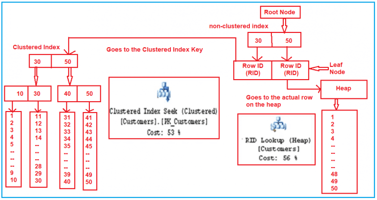

# MS SQL Server

- [MS SQL Server](#ms-sql-server)
  - [Масштабируемость](#масштабируемость)
  - [Паттерны](#паттерны)
  - [Производительность](#производительность)
    - [Способы анализа производительности](#способы-анализа-производительности)
    - [Индексы](#индексы)
      - [Рекомендации по выбору таблиц и столбцов для создания индексов](#рекомендации-по-выбору-таблиц-и-столбцов-для-создания-индексов)
      - [Рекомендации по использованию кластерных или некластерных индексов](#рекомендации-по-использованию-кластерных-или-некластерных-индексов)
    - [Виды ожиданий Wait statistics](#виды-ожиданий-wait-statistics)
      - [Параллелизм MAXDOP](#параллелизм-maxdop)
  - [Мониторинг](#мониторинг)
  - [TODO](#todo)
  - [Version](#version)

## Масштабируемость

HA:

- Read Only Replica
  - log-shipping
  - Always On Group из за использования возможности чтения со вторичной реплики (read-intent access)
    - Увеличение в скорости формирования в два и более раза, возможность использования maxdop
    - Не потребляются ресурсы первичной реплики
      - tempdb
      - Сеть
      - I/O
      - CPU
  - [log-shipping VS always on](https://dba.stackexchange.com/questions/199064/log-shipping-or-always-on-as-dr-for-sql-failover-cluster)
  	- AlwaysOn high availability group, HAG, is easier to maintain than log shipping
  	- Возможно больше трудностей с AlwaysOn, экспертиза DBA более высокая трубется

## Паттерны

- delete rows VS update rows state - удаление блокирующая и длительная операция
	- https://social.msdn.microsoft.com/Forums/sqlserver/en-US/d214f0ef-b995-4a14-bed9-0bf5b27a264c/performance-delete-rows-vs-update-rows-state?forum=transactsql
	- https://stackoverflow.com/questions/1271641/in-sql-is-update-always-faster-than-deleteinsert
	- https://dba.stackexchange.com/questions/8028/whats-better-for-large-changes-to-a-table-delete-and-insert-every-time-or-upd

## Производительность

Зависит от:

- Настройка OS, SQL Server
- Блокировки
- Индексирование
- Оптимизация запросов
- Дизайн приложения

- [Оценка производительности SQL Server](http://www.interface.ru/home.asp?artId=6968)
- [Benchmark](../benchmark.md)

Стратегии оптимизации запросов:

- можно использовать индексы
- другие варианты запроса
  - To write __sargable queries__:
    - Avoid using functions or calculations on indexed columns in the WHERE clause
    - Use direct comparisons when possible, instead of wrapping the column in a function
    - If we need to use a function on a column, consider creating a computed column or a function-based index, if the database system supports it
- сохранение промежуточных результатов
- Для проверки быстродействия запроса:	SET STATISTICS TIME ON
- Для проверки статистики ввода/вывода:	SET STATISTICS IO ON
- Для вывода плана запроса:	SET STATISTICS XML ON

### Способы анализа производительности

1. Записать с помощью SQL Server Profiler (или AnjLab.SqlProfiler) запросы, исполняемые при запуске функции (например редактирование анкеты)
2. Добавить метки времени в начало и в конец запроса CONVERT(nvarchar(30), GETDATE(), 126)
3. Запустить скрипт на локальном сервере и на сервере разработчика
4. Вычислить времени выполнения на локальном сервере и на сервере разработчика (ручным способом)/ Результаты позволяют уверенно говорить о причинах медленной загрузки страниц (например редактирование анкеты) в браузере.

### Индексы

- Не все индексы одинаково полезны. При разработке индексов необходимо учитывать их селективность
- Using [sys.dm_db_index_physical_stats](http://blogs.msmvps.com/gladchenko/2008/03/30/tips-for-dba-using-sys-dm_db_index_physicalstats-in-a-script-to-rebuild-or-reorganize-indexes-no-partitions-sql-server-2005/) in a script to rebuild or reorganize indexes (no partitions / SQL Server 2005)
- [Избыток может увеличить io wait](http://blogs.msmvps.com/gladchenko/2008/03/30/tips-for-dba-using-sys-dm_db_index_physicalstats-in-a-script-to-rebuild-or-reorganize-indexes-no-partitions-sql-server-2005/)
- De-fragmentation of Index can help as more data can be obtained per page. (Assuming close to 100 fill-factor)
- Измените подходящие для Вашего сервера опции ONLINE , SORT_IN_TEMPDB,
MAXDOP=10
  - Помним про 3-х повышение производительности при использовании в 2012 и в 2014 SORT_IN_TEMPDB=ON SQL Server 2014. [TEMPDB Hidden Performance Gem](https://techcommunity.microsoft.com/t5/sql-server-support-blog/sql-server-2014-tempdb-hidden-performance-gem/ba-p/318255)

#### Рекомендации по выбору таблиц и столбцов для создания индексов

- __Не индексировать__
  - Таблицы с небольшим количеством строк
  - Столбцы, редко используемые в запросах
  - Столбцы, хранящие широкий диапазон значений и имеющие малую вероятность быть выбранными в типичном запросе
  - Столбцы, имеющие большой размер в байтах
  - Таблицы, где данные часто изменяются, но относительно редко считываются
- __Индексировать__
  - Таблицы с большим количеством строк
  - Столбцы, часто используемые в запросах
  - Столбцы, хранящие широкий диапазон значений и имеющие большую вероятность быть выбранными в типичном запросе
  - Столбцы, используемые в агрегатных функциях
  - Столбцы, применяемые в предложении GROUP BY
  - Столбцы, применяемые в предложении ORDER BY
  - Столбцы, используемые в соединениях таблиц

#### Рекомендации по использованию кластерных или некластерных индексов

- Использовать __кластерный индекс__ для
  - Первичных ключей, часто используемых при поиске, например номеров счетов
  - Запросов, возвращающих обширные результирующие наборы
  - Столбцов, используемых во многих запросах 
  - Столбцов с высокой селективностью
  - Столбцов, применяемых в предложениях ORDER BY или GROUP BY
  - Столбцов, используемых в соединениях таблиц
- Использовать __некластерный индекс__ для
  - Первичных ключей, хранящих последовательные значения идентификаторов, например идентификационных столбцов
  - Запросов, возвращающих небольшие результирующие наборы
  - Столбцов, используемых в агрегатных функциях
  - Внешних ключей

### Виды ожиданий Wait statistics

- Виды [ожиданий](https://msdn.microsoft.com/ru-ru/library/ms179984.aspx)
  - [SQL Wait Statistics скрипт](https://blog.sqlauthority.com/2021/03/08/sql-server-wait-stats-collection-scripts-updated-march-2021/?amp)
  - [PAGEIOLATCH_SH и PAGEIOLATCH_EX](https://blog.sqlauthority.com/2011/02/09/sql-server-pageiolatch_dt-pageiolatch_ex-pageiolatch_kp-pageiolatch_sh-pageiolatch_up-wait-type-day-9-of-28/)
    - см [нагружающие запросы по вводу/выводу](https://msdn.microsoft.com/ru-ru/magazine/cc135978.aspx)
  - [CXPACKET](https://blog.sqlauthority.com/2011/02/06/sql-server-cxpacket-parallelism-usual-solution-wait-type-day-6-of-28/)
    - [Advanced](https://blog.sqlauthority.com/2011/02/07/sql-server-cxpacket-parallelism-advanced-solution-wait-type-day-7-of-28/?amp)
    - Если у нас транзакционная система: имеет смысл установить Max Degree Parallelism = 1
    - Хранилища и витрины данных: установить Max Degree Parallelism = 0 или явное количество CPU
    - Смешанные: установить Max Degree Parallelism = 1 , a y запросов требующих параллелизма установить hint MAXDOP=0
  - Maxdop см и cost Threshold
  - LATCH_EX
  - LCK_M_IS - блокировка
  - [LCK_M_IX](https://www.sqlskills.com/help/waits/LCK_M_IX/) - блокировка
- [Локализация причин](https://www.google.ru/amp/s/blog.sqlauthority.com/2011/02/01/sql-server-wait-stats-wait-types-wait-queues-day-0-of-28-2/)

#### Параллелизм MAXDOP

- SQL OLTP Max degree of parall [maxdop](https://habr.com/ru/post/448044/)
- Для выявления нехватки процессорного времени достаточно воспользоваться системным представлением sys.dm_os_schedulers.
  - показатель runnable_tasks_count постоянно больше 1, то существует большая вероятность того, что количество ядер не хватает экземпляру MS SQL Server.
  - select max([runnable_tasks_count]) as [runnable_tasks_count] from sys.dm_os_schedulers where scheduler_id<255;
- алгоритм действий для OLTP-систем для настройки свойств параллелизма:
  - сначала запретить параллелизм, выставив на уровне всего экземпляра Max Degree of Parallelism в 1
  - проанализировать самые тяжелые запросы и подобрать для них оптимальное количество потоков
  - выставить Max Degree of Parallelism в подобранное оптимальное количество потоков, полученное из п.2, а также для конкретных баз данных выставить Max DOP значение, полученное из п.2 для каждой базы данных
  - проанализировать самые тяжелые запросы и выявить негативный эффект от многопоточности. Если он есть, то повышать Cost Threshold for Parallelism.
  - Для таких систем как 1С, Microsoft CRM и Microsoft NAV в большинстве случаев [подойдет запрет многопоточности](https://its.1c.ru/db/metod8dev#content:5945:hdoc)
- [Как определить maxdop](https://www.sentryone.com/blog/is-maxdop-configured-correctly)
  - I set the “Maximum Degree of Parallelism” to 2, which means the query still uses parallelism but only on 2 CPUs.
  - However, I keep the “Cost Threshold for Parallelism” very high. This way, not all the queries will qualify for parallelism but only the query with higher cost will go for parallelism. I have found this to work best for a system that has OLTP queries and also where the reporting server is set up.

## Мониторинг

- Метрики
  - Database properties
  - Quick Stats
  - Database size
  - Performance counters
  - Memory break down
  - Database I/O
  - Database Latency
  - Availability Replica
- Стандартные отчеты
  - Data Collection
    - Query Statistics History: by CPU, duration, IO, Physical Reads, Logical Writes
    - Server Activity History: CPU, RAM, IO, Network, Waits
- Use Grafana to monitor your [SQL Server + InfluxDB and Telegraf](https://tsql.tech/how-to-use-grafana-on-docker-to-monitor-your-sql-server-eventually-on-docker-too-feat-influxdb-and-telegraf/)
  - [Grafana Dashboard](https://grafana.com/grafana/dashboards/9386-sql-servers/)
  - [telegraf metric](https://github.com/influxdata/telegraf/tree/master/plugins/inputs/sqlserver)
- [sp_Blitz](https://github.com/BrentOzarULTD/SQL-Server-First-Responder-Kit/tree/main)
  - overall health check, run sp_Blitz.
  - To learn which queries have been using the most resources, run sp_BlitzCache.
  - To analyze which indexes are missing or slowing you down, run sp_BlitzIndex.
  - To find out why the server is slow right now, run sp_BlitzFirst.
- [MS: Мониторинг и настройка производительности](http://www.sql.ru/forum/actualthread.aspx?tid=858780)
  - [MS инструменты](https://learn.microsoft.com/en-us/sql/relational-databases/performance/performance-monitoring-and-tuning-tools?view=sql-server-ver15)
- Data collection - сбор авто метрик за период времени в отдельной БД с sqlplan.
  - Версия с 2008: используем 2012, DWH 2016
  - Блокировки
  - Настройки [СУБД get](https://www.mssqltips.com/sqlservertip/6090/sql-server-configuration-settings-query/)
    - SELECT * from sys.configurations ORDER BY name
  - Альтернатива [sp_Blitz](https://garrybargsley.com/2020/07/14/sp_blitz-for-all-servers/)
- [Мониторинг запросов, хранимых процедур и триггеров](https://habr.com/ru/articles/314494/)
  - AvgWorkerSec — само время выполнения запроса в секундах
  - AvgElapsedSec — время ожидания или ожидания + AvgWorkerSec
  - В результатах представлений важным показателем является следующее __равенство: AvgWorkerSec=AvgElapsedSec__
    - Если это не так, то __проблема не в самом запросе и не в плане запроса__
- [sp_WhoIsActive](https://habr.com/ru/articles/136481/) более подробная инф-я, кто что запустил
- [Dynamic Management Views](https://learn.microsoft.com/ru-ru/previous-versions/sql/sql-server-2005/ms188068(v=sql.90)?redirectedfrom=MSDN)
  - System view [dmv sql](http://www.sqlskills.com/blogs/paul/wait-statistics-or-please-tell-me-where-it-hurts/) 
  - минусы: показывают общую статистику, а не за период. При перезагрузке СУБД очищается

## TODO

- http://f1incode.blogspot.com/2011/07/i_28.html	
- http://f1incode.blogspot.com/2011/08/performance-testing-part-2.html
- http://www.itcommunity.ru/Msgs/default.aspx?MessageID=60	
- http://msmvps.com/blogs/irinanaumova/archive/2011/05/06/1792775.aspx	
- http://www.mssqltips.com/tip.asp?tip=1039	

## Version

- 2012
- 2016
- 2019
