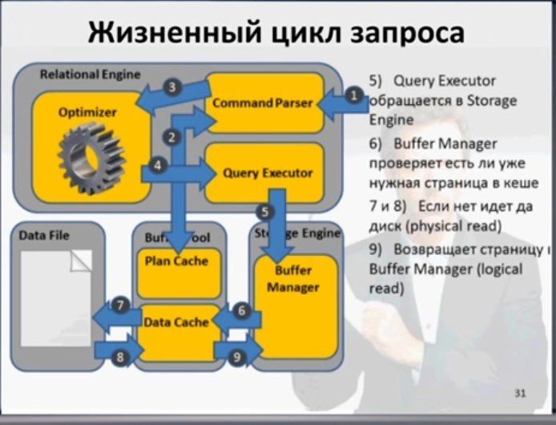

# MS SQL Server

- [MS SQL Server](#ms-sql-server)
  - [Масштабируемость](#масштабируемость)
  - [Паттерны](#паттерны)
  - [Производительность](#производительность)
    - [Способы анализа производительности](#способы-анализа-производительности)
      - [SQL Trace Profiler (Deprecated)](#sql-trace-profiler-deprecated)
      - [Query plan](#query-plan)
    - [Настройки](#настройки)
      - [Параллелизм MAXDOP](#параллелизм-maxdop)
    - [Стратегии оптимизации запросов](#стратегии-оптимизации-запросов)
  - [Мониторинг](#мониторинг)
    - [Онлайн](#онлайн)
    - [Исторически](#исторически)
  - [TODO](#todo)
  - [Benchmark Load Test](#benchmark-load-test)
  - [Version](#version)

## Масштабируемость

HA:

- Read Only Replica
  - log-shipping
  - Always On Group из за использования возможности чтения со вторичной реплики (read-intent access)
    - Увеличение в скорости формирования в два и более раза, возможность использования maxdop
    - Не потребляются ресурсы первичной реплики
      - tempdb
      - Сеть
      - I/O
      - CPU
  - [Log-shipping VS Always on](https://dba.stackexchange.com/questions/199064/log-shipping-or-always-on-as-dr-for-sql-failover-cluster)
  	- AlwaysOn High Availability Group (HAG), is easier to maintain than log shipping
  	- Возможно больше трудностей с AlwaysOn, экспертиза DBA более высокая трубется

## Паттерны

- delete rows VS update rows state - удаление блокирующая и длительная операция
	- https://social.msdn.microsoft.com/Forums/sqlserver/en-US/d214f0ef-b995-4a14-bed9-0bf5b27a264c/performance-delete-rows-vs-update-rows-state?forum=transactsql
	- https://stackoverflow.com/questions/1271641/in-sql-is-update-always-faster-than-deleteinsert
	- https://dba.stackexchange.com/questions/8028/whats-better-for-large-changes-to-a-table-delete-and-insert-every-time-or-upd

## Производительность

Зависит от:

- [Настроек OS, SQL Server](#настройки)
- [Блокировки](mssql.locks.md)
- [Индексирование](mssql.index.md)
- [Оптимизация запросов](#стратегии-оптимизации-запросов)
- Дизайна (архитектуры) приложения
- Обслуживания БД
  - __SHRINK__ [не всегда хорошо на больших БД](https://habr.com/ru/articles/741212/)
  - REBUILD индексов (INDEX REORGANIZE не рекомендуется на больших объемах БД)

### Способы анализа производительности

- [Оценка производительности SQL Server](http://www.interface.ru/home.asp?artId=6968)
- [MS инструменты](https://learn.microsoft.com/en-us/sql/relational-databases/performance/performance-monitoring-and-tuning-tools?view=sql-server-ver15)
  - Data Collection
  - [Extended Events](mssql.extended.events.md)
  - [DMV](mssql.dmv.md)
  - [Query Store](https://learn.microsoft.com/en-us/sql/relational-databases/performance/monitoring-performance-by-using-the-query-store)
  - SQL Trace Profiler (deprecated)
  - QTA
- [Мониторинг](#мониторинг)

#### SQL Trace Profiler (Deprecated)

1. Записать с помощью SQL Server Profiler (или AnjLab.SqlProfiler) запросы, исполняемые при запуске функции (например редактирование анкеты)
2. Добавить метки времени в начало и в конец запроса CONVERT(nvarchar(30), GETDATE(), 126)
3. Запустить скрипт на локальном сервере и на сервере разработчика
4. Вычислить времени выполнения на локальном сервере и на сервере разработчика (ручным способом)/ Результаты позволяют уверенно говорить о причинах медленной загрузки страниц (например редактирование анкеты) в браузере.

- Аналитический отчёт по [трейсу Microsoft SQL Server tutorial](http://habrahabr.ru/post/243587/)

#### Query plan

- How to [view xml query plans graphically](https://docs.microsoft.com/ru-ru/sql/relational-databases/performance/save-an-execution-plan-in-xml-format?view=sql-server-ver15)
	- Rename the file from .xml to .sqlplan and use Open File to launch it.
- Анализ плана выполнения
  - __Плохо__
    - Index scan
    - Rid / key lookup - чтение из [кучи databaselog](https://dotnettutorials.net/lesson/how-to-use-covering-index-to-reduce-rid-lookup/)
    - Статистика плана запросов устаревает- см сколько записей оптимизатор предполагает вернуть, а сколько по факту
    - Physical reads не из Кеша данных
  - __Хорошо__
    - Index seek
    - Logical reads
      - но если их очень много, то ресурсы RAM сильно потребляются?

### Настройки

- Настройки [СУБД get](https://www.mssqltips.com/sqlservertip/6090/sql-server-configuration-settings-query/)
  - SELECT * from sys.configurations ORDER BY name

#### Параллелизм MAXDOP

- SQL OLTP Max degree of parall [maxdop](https://habr.com/ru/post/448044/)
- Для выявления __нехватки процессорного времени__ достаточно воспользоваться системным представлением __sys.dm_os_schedulers__.
  - показатель runnable_tasks_count постоянно больше 1, то существует большая вероятность того, что количество ядер не хватает экземпляру MS SQL Server.
  - select max([runnable_tasks_count]) as [runnable_tasks_count] from sys.dm_os_schedulers where scheduler_id<255;
- алгоритм действий для __OLTP__-систем для настройки свойств параллелизма:
  - сначала запретить параллелизм, выставив на уровне всего экземпляра Max Degree of Parallelism в 1
  - проанализировать самые тяжелые запросы и подобрать для них оптимальное количество потоков
  - выставить Max Degree of Parallelism в подобранное оптимальное количество потоков, полученное из п.2, а также для конкретных баз данных выставить Max DOP значение, полученное из п.2 для каждой базы данных
  - проанализировать самые тяжелые запросы и выявить негативный эффект от многопоточности. Если он есть, то повышать __Cost Threshold for Parallelism__.
  - Для таких систем как 1С, Microsoft CRM и Microsoft NAV в большинстве случаев [подойдет запрет многопоточности](https://its.1c.ru/db/metod8dev#content:5945:hdoc)
- [Как определить maxdop](https://www.sentryone.com/blog/is-maxdop-configured-correctly)
  - I set the “Maximum Degree of Parallelism” to 2, which means the query still uses parallelism but only on 2 CPUs.
  - However, I keep the “Cost Threshold for Parallelism” very high. This way, not all the queries will qualify for parallelism but only the query with higher cost will go for parallelism. I have found this to work best for a system that has OLTP queries and also where the reporting server is set up.

### Стратегии оптимизации запросов

- можно использовать [индексы](mssql.index.md)
- другие варианты запроса
  - To write __sargable queries__:
    - Avoid using functions or calculations on indexed columns in the WHERE clause
    - Use direct comparisons when possible, instead of wrapping the column in a function
    - If we need to use a function on a column, consider creating a computed column or a function-based index, if the database system supports it
- сохранение промежуточных результатов
- Для проверки быстродействия запроса:	SET STATISTICS TIME ON
- Для проверки статистики ввода/вывода:	SET STATISTICS IO ON
- Для вывода плана запроса:	SET STATISTICS XML ON

## Мониторинг

- Метрики
  - Database properties
  - Quick Stats
  - Database size
  - Performance counters
  - Memory break down
  - Database I/O
  - Database Latency
  - Availability Replica
- [MS: Мониторинг и настройка производительности](http://www.sql.ru/forum/actualthread.aspx?tid=858780)
- [performance dashboard](https://learn.microsoft.com/en-us/sql/relational-databases/performance/performance-dashboard)
- Метрики
  - Latency
    - [Total latch wait Time](https://documentation.red-gate.com/sm/metrics-alerts-and-notifications/metrics-and-alerts-reference/list-of-metrics#Listofmetrics-Latchwaittime)
    - [Total average wait time]
    - Buffer cache hit ratio
  - Traffic
    - Active transactions

### Онлайн

- [sp_Blitz](https://github.com/BrentOzarULTD/SQL-Server-First-Responder-Kit/tree/main)
  - To find out why the server is slow right now, run sp_BlitzFirst.
- Sp_Who2
- [sp_WhoIsActive](https://habr.com/ru/articles/136481/) более подробная инф-я, кто что запустил
- Общая статистика без детализации до запросов, планов выполнения [SQL Server + InfluxDB and Telegraf](https://tsql.tech/how-to-use-grafana-on-docker-to-monitor-your-sql-server-eventually-on-docker-too-feat-influxdb-and-telegraf/)
  - [Grafana Dashboard](https://grafana.com/grafana/dashboards/9386-sql-servers/)
  - [telegraf metric](https://github.com/influxdata/telegraf/tree/master/plugins/inputs/sqlserver)
- [Dynamic Management Views](mssql.dmv.md)

### Исторически

- Стандартные отчеты
  - __Data Collection__  - сбор авто метрик за период времени в отдельной БД с sql plan.
    - Query Statistics History: by CPU, duration, IO, Physical Reads, Logical Reads
    - Server Activity History: CPU, RAM, IO, Network, Waits
    - Версия MS SQL с 2008: используем 2012, DWH 2016
    - Блокировки
- [sp_Blitz](https://github.com/BrentOzarULTD/SQL-Server-First-Responder-Kit/tree/main)
  - overall health check, run sp_Blitz.
  - To learn which queries have been using the most resources, run sp_BlitzCache.
  - To analyze which indexes are missing or slowing you down, run sp_BlitzIndex.
  - [Мониторинг нескольких серверов](https://garrybargsley.com/2020/07/14/sp_blitz-for-all-servers/)
- [Мониторинг запросов, хранимых процедур и триггеров](https://habr.com/ru/articles/314494/)
  - AvgWorkerSec — само время выполнения запроса в секундах
  - AvgElapsedSec — время ожидания или ожидания + AvgWorkerSec
  - В результатах представлений важным показателем является следующее __равенство: AvgWorkerSec=AvgElapsedSec__
    - Если это не так, то __проблема не в самом запросе и не в плане запроса__

## TODO

- http://f1incode.blogspot.com/2011/07/i_28.html	
- http://f1incode.blogspot.com/2011/08/performance-testing-part-2.html
- http://www.itcommunity.ru/Msgs/default.aspx?MessageID=60	
- http://msmvps.com/blogs/irinanaumova/archive/2011/05/06/1792775.aspx	
- http://www.mssqltips.com/tip.asp?tip=1039	

## Benchmark Load Test

- [Benchmark](../benchmark.md)
  - [Тестирование производительности баз данных при помощи tSQLt и SQLQueryStress](https://habr.com/ru/articles/310328/)

## Version

- [2012](https://sqlserverbuilds.blogspot.com/2012/01/sql-server-2012-versions.html) 11.0.x.x
  - use 11.0.6579.0
- [2014](https://sqlserverbuilds.blogspot.com/2014/01/sql-server-2014-versions.html) 12.0.x.x
- 2016
  - use
- 2019
