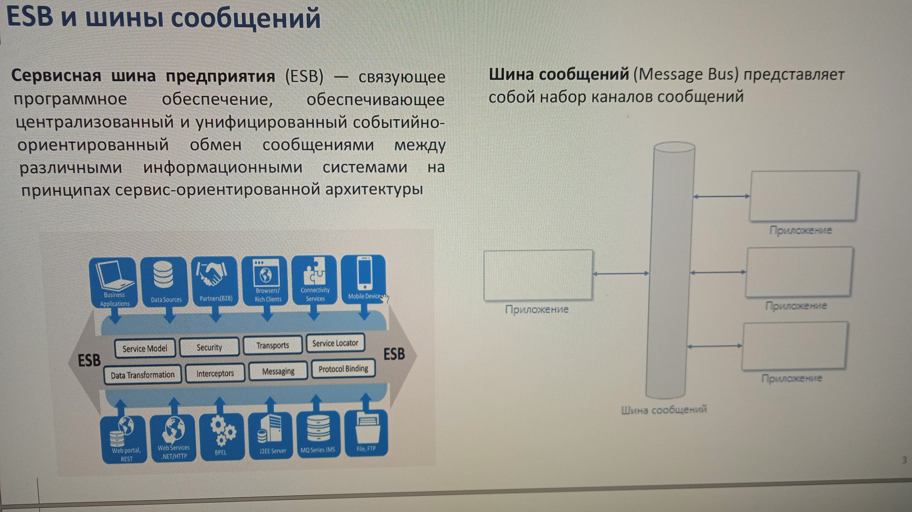

# ESB

Enterprise Integration Patterns
- "умная шина (канал) глупые клиенты" с бизнес логикой
- Spring Integration
- Mule ESB
- [Apache Camel](https://habr.com/ru/company/naumen/blog/230265/)
- [EIP паттерны интеграции](https://habr.com/ru/company/naumen/blog/231861/)

- IBM Integration Bus

