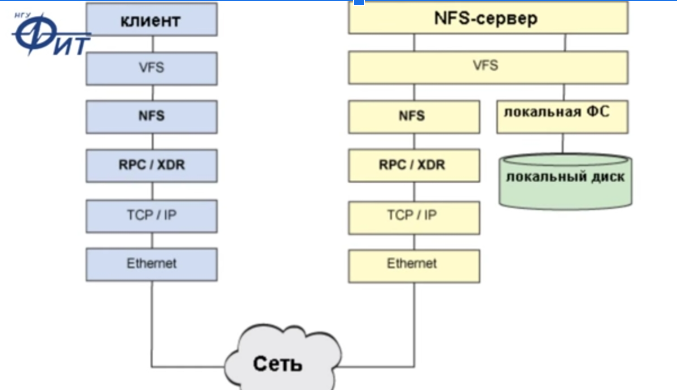

# Распределённая файловая система DFS (Distributed File System)

Зачем:

- предоставления прозрачного доступа к хранилищам данных (как удаленный жёсткий диск), общие папки (монтирование папок на клиенте), управляемые распределенной файловой системой
- [партнеров по репликации для отказоустойчивости](https://windata.ru/windows-world/lokalnaya-set/raspredelennaya-fajlovaya-sistema-dfs-osnovy)

Протоколы:

- Облако
  - Amazon S3
- NFS
	- 
	- Под unix\win
	- [Active Directory по протоколу Kerberos для NFSv4](https://www.k-max.name/windows/active-directory-as-kdc-nfsv4/)
- Common internet file system (CIFS) на базе SMB - 
	- Под win
- SMB 
	- сервер\клиент Samba под unix
- [Кластерная система (Cluster)](https://itelon.ru/blog/raspredelennye-faylovye-sistemy-tekhnologicheskiy-obzor-produktovyy-obzor/) содержит несколько серверов в общей сети.
  - Gfs2
- [Что выбрать по производительности и надежности?](http://codernet.ru/amp/?page=kakoj_setevoj_protokol_obmena_fajlami_imeet_luchshuyu_proizvoditelnost_i_nadezhnost)

Безопасность:

- [Ввод в домен AD, доменная авторизация, синхронизация учетных записей из домена на unix](../os/unix.md)
