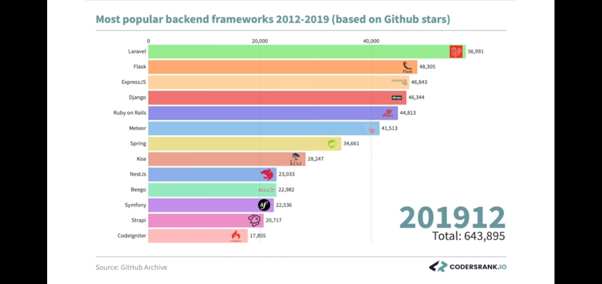

# Ui web framework фреймворк для создания пользовательских интерфейсов

https://codersrank.io/

- Extjs
	RIA enterprise gui
- Google Angular2
	AngularJS использует двунаправленное связывание данных между областями видимости
  - support TypeScript
- [React](react.md) 15 Facebook
	предоставляют реактивность
	компонентную структуру
	управления состоянием приложения (см. Flux/Redux)
	Нужны знания JSX, ES2015
	[React native](../mobile/react.native.md) позволяет писать нативные приложения для iOS и Android
- [Vue.js](vuejs.md)
- Knockout
	поддержка браузеров вплоть до IE6
	пионер MVVM-подхода и отслеживания изменений в данных
	Model-View-ViewModel (MVVM) — шаблон проектирования архитектуры приложения.
- Ember
