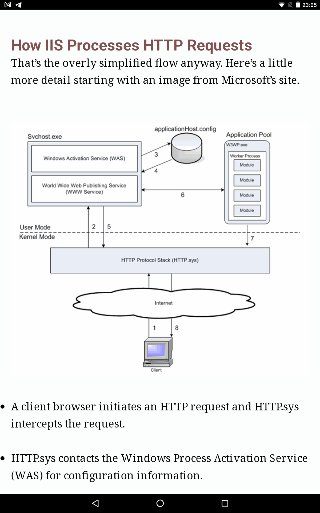

# IIS

- [IIS](#iis)
	- [Архитектура](#архитектура)
		- [Процесс обработки запроса и основные компоненты](#процесс-обработки-запроса-и-основные-компоненты)
	- [Метрики производительности](#метрики-производительности)
		- [HTTP.SYS](#httpsys)
		- [IIS](#iis-1)
		- [Application Pool](#application-pool)
		- [Worker process (w3wp.exe)](#worker-process-w3wpexe)
		- [ASP.NET: CLR Thread](#aspnet-clr-thread)
		- [APP](#app)
	- [log-parser](#log-parser)
	- [Трассировка](#трассировка)
	- [Мониторинг](#мониторинг)
	- [Version](#version)

## Архитектура

[Request-processing architecture](https://learn.microsoft.com/en-us/iis/get-started/introduction-to-iis/introduction-to-iis-architecture)
 which includes:

- __WWW Service__
- __Windows Process Activation Service (WAS)__, which enables sites to use protocols other than HTTP and HTTPS.
	- ApplicationHost.config
	- manages __application pools__ and __worker processes__ (w3wp.exe) for both HTTP and non-HTTP requests.
- Web server engine that can be customized by adding or removing __modules__.
- Integrated request-processing __pipelines from IIS and ASP.NET__.
- Protocol listener
	- IIS provides Hypertext Transfer Protocol Stack __HTTP.sys__ as the protocol listener that listens for HTTP and HTTPS requests.
	- Windows Communication Foundation (__WCF__) - protocols other than HTTP and HTTPS
- [Modules](https://learn.microsoft.com/en-us/iis/get-started/introduction-to-iis/introduction-to-iis-architecture?#modules-in-iis)
	- [Native Modules](https://learn.microsoft.com/en-us/iis/get-started/introduction-to-iis/iis-modules-overview)
    	- HTTP Modules
    	- Security Modules
    	- Content Modules
    	- Compression Modules
    	- Caching Modules
    	- Logging and Diagnostics Modules
	- Managed Modules

### Процесс обработки запроса и основные компоненты

- [IIS 7](https://krishnansrinivasan.wordpress.com/2014/08/18/throttling-wcf-services-on-iis7/) - на разных версиях IIS может отличаться. IIS listens for HTTP __requests__ (as well as requests for other protocols) before creating __worker processes__ to [handle the request](https://learn.microsoft.com/en-us/iis/get-started/introduction-to-iis/introduction-to-iis-architecture?#http-request-processing-in-iis)
  - listener Hypertext Transfer Protocol Stack [HTTP.SYS](#httpsys)
    - Waits for an HTTP request and then sends the __request__ to an IIS service for processing.
      - HTTP.sys contacts WAS to obtain information from the __configuration__ store
        - WAS requests configuration information from the configuration store, __applicationHost.config__
    		- The WWW Service receives configuration information, such as application pool and site configuration.
            	- The WWW Service uses the configuration information to configure HTTP.sys.
		- WAS starts a __worker process__ for the __application pool__ to which the request was made.
	  - IIS [Application pool 1](#application-pool) - container for __worker processes__, isolate site
        - [IIS Worker Processes 1](#worker-process)
	      - ASP.NET: [CLR Thread](#aspnet-clr-thread)
            - ASP.NET [App 1](#app)
            - ASP.NET App X
        - IIS Worker Processes X
      - IIS App pool X
        - IIS Worker Processes 1
        - IIS Worker Processes X
    - When processing is complete, HTTP.sys sends the __response__ back to the browser.
    - HTTP.sys also has a __cache__ and if it has the requested file in cache it can return it directly to the client browser without having to contact any IIS services for processing.
  - listener [WCF Service](protocols.integration/wcf.md)

## Метрики производительности

[ability](../arch/ability/performance.md)

### HTTP.SYS

- [Queue](https://blog.leansentry.com/all-about-iis-asp-net-request-queues/)
  - Http Service Request Queues\CurrentQueueSize

### IIS

- Web Service\ [Current Connections](http://www.microsoft.com/technet/prodtechnol/WindowsServer2003/Library/IIS/af36e903-75c3-4a4c-ae47-8663f8543b0c.mspx?mfr=true) – [общее число активных подключений на сервере IIS](https://winitpro.ru/index.php/2015/02/13/monitoring-kolichestva-polzovatelej-na-sajte-iis/).
	- Можно мерить в разрезе конкретного сайта IIS.
	- Любые запросы к сайту, не только к Веб-сервисам.
	- [Просмотр списка соединений IIS8](https://learn.microsoft.com/en-us/previous-versions/windows/it-pro/windows-server-2012-r2-and-2012/jj635856(v=ws.11))

### Application Pool

[concurrent](https://www.dotnetfunda.com/articles/show/3485/11-tips-to-improve-wcf-restful-services-performance)

  - maxConcurrentRequestsPerCPU
  - maxConcurrentThreadsPerCPU
  - requestQueueLimit
  - Maximum Worker [Processes in IIS application pool](https://www.dotnetfunda.com/articles/show/3485/11-tips-to-improve-wcf-restful-services-performance)
  - два основных параметра, влияющих на [доступность приложения и его производительность](https://habr.com/ru/articles/250881/).
	- appConcurrentRequestLimit — __максимальное количество одновременных запросов__ в приложении. Увеличение числа одновременных запросов IIS расширит доступные ресурсы веб-сервера для обслуживания запросов.
    	- Значение по умолчанию — 5000. UsersCount * 1.5, где usersCount — количество одновременно работающих пользователей
	- QueueLength — максимальное количество запросов, которые драйвер Http.sys размещает в очереди пула приложений

### Worker process (w3wp.exe)

- [W3SVC_W3WP](https://blogs.iis.net/mailant/new-worker-process-performance-counters-in-iis7) - exposes HTTP request processing related counters for the __worker process__
	- [Maximum Threads Count](https://www.dotnetfunda.com/articles/show/3485/11-tips-to-improve-wcf-restful-services-performance)
	- Active Threads Count - Number of threads actively processing requests in the worker process
	- Requests / Sec - HTTP requests/sec being processed by the worker process
	- Active Requests - Current number of requests being processed by the worker process
	- Threads Per Processor Limit in IIS
	- HTTP Service Request Queues (CurrentQueueSize): [The request count in the IIS queue](https://techcommunity.microsoft.com/t5/iis-support-blog/performance-counters-for-monitoring-iis/ba-p/683389)
	- .NET CLR Exceptions

### ASP.NET: CLR Thread

- Queue
  - ASP.NET v4.0.30319\Requests Queued - limit Process Model’s [RequestQueueLimit](https://krishnansrinivasan.wordpress.com/2014/08/18/throttling-wcf-services-on-iis7/)

### APP

- [iis perf counters](https://msdn.microsoft.com/en-us/library!/ms972959.aspx?f=255&MSPPError=-2147217396)
  - [Performance Counters for ASP.NET](https://msdn.microsoft.com/en-us/library/fxk122b4.aspx)
  - Performance Counters for [WCF service](protocols.integration/wcf.md) дополнительно
- RPS
	- ASP.NET\Requests Current - суммарное количество выполняющихся в настоящее время запросов. Значение этого счетчика включает в себя число обрабатывающися запросов, находящихся в очереди и ожидающих отправки клиенту. Если это значение превышает параметр requestQueueLimit, который расположен в секции processModelsection файла конфигурации веб-сервера, то последующие запросы будут отбрасываться
		- [View Currently Executing Requests in a Worker Process (IIS 7)](https://technet.microsoft.com/en-us/library/cc732518(v=ws.10).aspx)
		- [IIS->Worker process->View Current Request](https://habrahabr.ru/post/250881/)
	- ASP.NET Application\Requests Executing - показывает количество одновременно выполняющихся запросов
	- ASP.NET Application\Requests/sec - текущую пропускную способность приложения
- Duration Latency
	- ASP.NET Application\Request Execution Time - время выполнения (в мс) последнего запроса
	- Queue
		- ASP.NET\Requests Queued -[число запросов ожидающих в очереди на обработку](https://habrahabr.ru/post/250881/) - "ASP.NET v4.0.30319Requests Queued" performance counter, WMI.WorkerProcess.GetExecutingRequests
		- ASP.NET\Application\Request Wait Time - время ожидания в очереди последнего запроса
		- Проверьте логи на наличие ошибки "HTTP Error 503.2 — Service Unavailable". Постарайтесь определить, не блокируется ли часть запросов в очереди
- Error
	- Requests Rejected Отклонено запросов – Общее количество невыполненных запросов ввиду __нехватки ресурсов сервера__ на их обработку.
- ASP.NET Sessions
	- ASP.NET\Sessions Timed Out - Количество сеансов, время ожидания которых истекло.
	- ASP.NET\Sessions Total
- [ASP.NET Core metrics](https://github.com/dotnet/aspnetcore/issues/47536)

## log-parser

[log-parser](https://www.symantec.com/connect/articles/forensic-log-parsing-microsofts-logparser)

- [example](https://mlichtenberg.wordpress.com/2011/02/03/-log-parser-rocks-more-than-50-examples/)
- Hourly Bandwidth (__chart__) Requests by URI
- __Search__ the Event Log for W3SVC (IIS)
- For example, Bytes Sent and Bytes Received are not selected, but they are very useful when troubleshooting a performance problem.  
	- в IIS логах есть?? sc-bytes, cs-bytes	НЕТУ
- https://docs.microsoft.com/en-us/iis/troubleshoot/performance-issues/troubleshooting-iis-performance-issues-or-application-errors-using-logparser
- !!! https://docs.microsoft.com/en-us/iis/troubleshoot/performance-issues/troubleshooting-high-cpu-in-an-iis-7x-application-pool
- http://software-testing.ru/library/testing/performance-testing/468-weblog 

## Трассировка

IIS Failed Request Tracing

- [fiddler on iis app](http://www.markhneedham.com/blog/2009/06/24/using-fiddler-with-iis/)
- [FREB](https://blogs.msdn.microsoft.com/docast/2016/04/28/troubleshooting-iis-request-performance-slowness-issues-using-freb-tracing/)
- [CPU, ERROR, RAM leak](https://www.iis.net/learn/troubleshoot/performance-issues)

## Мониторинг

- [Zabbix Agent Metric](https://www.zabbix.com/integrations/iis)
- [Grafana](https://grafana.com/docs/grafana-cloud/data-configuration/integrations/integration-reference/integration-microsoft-iis/)

## Version

- 8.5
- [10](https://www.thebestcsharpprogrammerintheworld.com/2017/12/02/whats-new-in-iis-10-microsoft-internet-information-services-10-new-features/)
	- Failed request tracing – traceAllAfterTimeout
	- HTTP/2