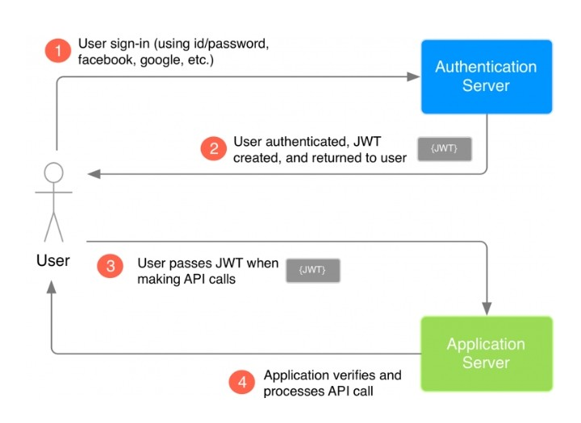
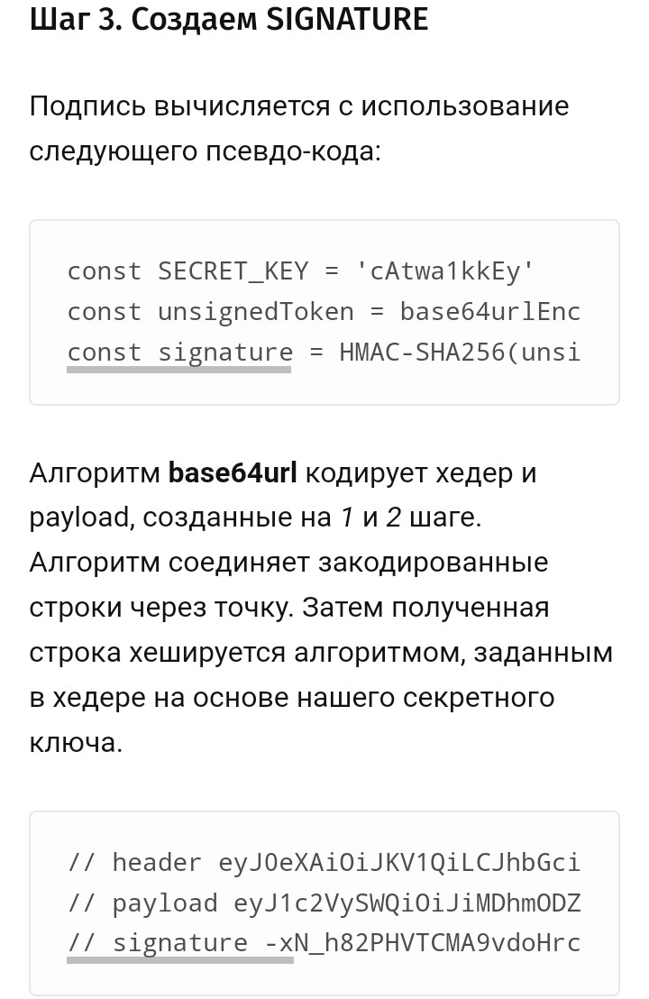

# JWT

- [Данные внутри JWT закодированы](https://gist.github.com/zmts/802dc9c3510d79fd40f9dc38a12bccfc) и подписаны, но не __зашифрованы__.
- JWT __не гарантирует никакой безопасности__ для чувствительных (sensitive) данных внутри.
- Приложение знает секретный ключ и может выполнить тот же алгоритм подписывания к JWT, проверить эту подпись, сравнивая ее со своей собственной, вычисленной хешированием.
- Преимущества использования JWT в сравнении с Классической схемой аутентификации, использующей сессии.
  - Подход с использованием токенов позволяет не хранить информацию обо всех выданных токенах, как при классической схеме. Когда пользователь обращается к приложению, он передает ему свой токен. Приложению остается только проверить подпись и извлечь необходимые поля из полезной нагрузки.
  - Приложению вообще не обязательно заниматься выдачей и валидацией токенов самостоятельно, зачастую для этих целей используется __отдельный сервис аутентификации__ ([IAM](../arch/system.class/iam.md)).
  - При использовании Отдельного сервиса аутентификации становится возможным организовать __единую точку входа__ ([SSO](../arch/pattern/system.design/sso.md)) в различные сервисы с одними и теми же учетными данными. Единожды пройдя процедуру аутентификации, пользователь сможет получить доступ со своим токеном К тем ресурсам, которые доверяют этому сервису аутентификации.

## Структура

header.payload.signature

- Header - алгоритм подписи
- Payload
- Signature

## Защита jwt

- fingerprint браузера (иной уникальный идентификатор устройства, если это не браузер)
- передача [в GET как параметр](https://stackoverflow.com/questions/32722952/is-it-safe-to-put-a-jwt-into-the-url-as-a-query-parameter-of-a-get-request) допустима
