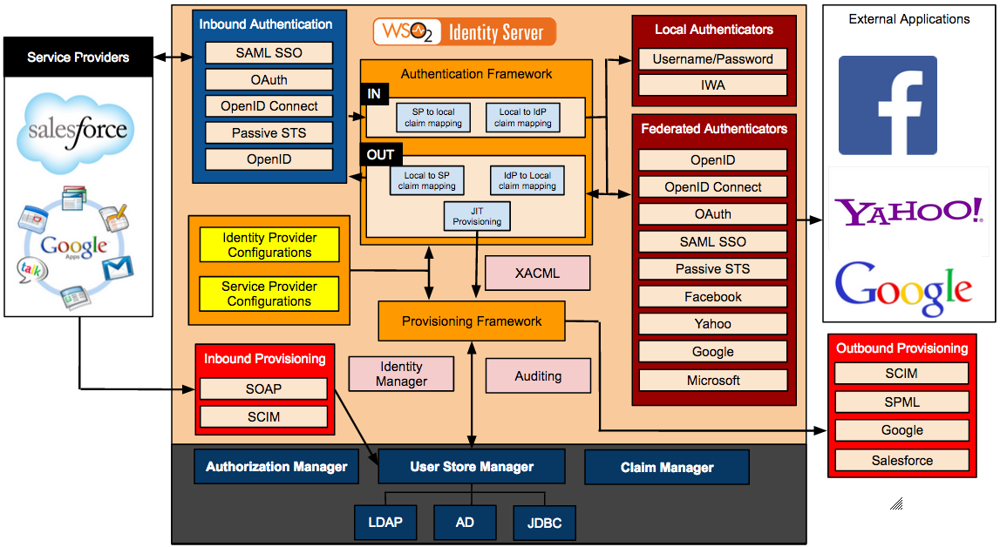

# IAM WSO2 Identity Server

Реализация функции [Identity and Access Management (IAM)](../../arch/iam.md) решений.

https://wso2.com/identity-server/

- Вендор РФ [Emdev](https://www.emdev.ru/wso2/wso2is)
[SDK](https://is.docs.wso2.com/en/latest/sdks/sdk-overview/)
- [JavaScript](https://is.docs.wso2.com/en/6.0.0/sdks/start-integrating-apps/integrate-a-js-app)
- [SPA](https://github.com/asgardeo/asgardeo-auth-spa-sdk)
- [PHP?]()
- [.NET](https://github.com/asgardeo/asgardeo-dotnet-oidc-sdk)

Плюсы
	- API Manager https://wso2.com/api-manager/

Минусы
	- Зависимость от БД - узкое место
		- Остался только Redis, который хранит сессии аутентификации и выданные в них JWT и refresh-токены. 
		- [ВТБ опыт](https://habr.com/ru/company/vtb/blog/559774/)