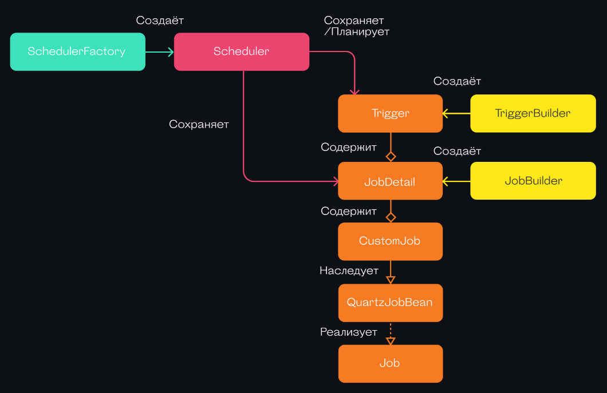

# Quartz

- [Quartz](#quartz)
	- [Зачем](#зачем)
	- [Плюсы и минусы](#плюсы-и-минусы)
	- [Паттерны](#паттерны)
		- [Кластерный режим](#кластерный-режим)
		- [Запуск задания на конкретном инстансе приложения](#запуск-задания-на-конкретном-инстансе-приложения)
	- [Версии](#версии)

## Зачем

Реализация паттерна [Job](../../../arch/pattern/development/cron.job.md), [Background Job](../../../arch/pattern/development/background.job.md).

Основные [понятия](https://habr.com/ru/companies/surfstudio/articles/685980/):

- SchedulerFactory — интерфейс фабрики для создания Scheduler.
- Scheduler — основной класс библиотеки, через который происходит управление планировщиком задач.
- Job — интерфейс для [создания задач с запланированным выполнением](https://andrewlock.net/using-quartz-net-with-asp-net-core-and-worker-services/)
- JobDetail — интерфейс для создание инстансов Job.
- Trigger — интерфейс для определения расписания выполнения задач
- JobBuilder и TriggerBuilder — вспомогательные классы для создания инстансов JobDetail и Trigger.

## Плюсы и минусы

Плюсы:

- Встроенная поддержка __многоинстансного режима__ значительно облегчает __горизонтальное масштабирование приложений__
- Есть возможность сохранять нужные для работы данные [между запусками джобы](https://habr.com/ru/companies/surfstudio/articles/685980/)
- Возможность __динамического создания джоб__
- Quartz позволяет привязывать одну и ту же джобу к разным триггерам: можно создавать комплексное расписание работы джобы

Минусы:

- Синхронизация между инстансами происходит только при помощи __реляционной БД__ (механизм __блокировок в БД__). Другие виды внешних систем не поддерживаются.
- По сравнению с аналогами Quartz требует больше усилий и строк кода для начальной настройки приложения.
- Если требуется запускать какую-либо джобу на каждом из инстансов одновременно, лучше использовать один из аналогов. В Quartz __нет встроенной возможности__ для выполнения одной и той же __джобы на разных инстансах одновременно__.

## Паттерны

- DisallowConcurrentExecution - позволяет гарантировать, что в любой момент времени будет запущено не более одного __экземпляра джобы__ (singleton)
  - Важно понимать, что аннотация относится только к джобам, запускающимся на одном инстансе приложения.
  - При работе в кластерном режиме Quartz сам контролирует срабатывание триггеров и, с помощью __блокировок в БД__, осуществляет запуск джобы __только на одном из инстансов__ приложения.

### Кластерный режим

- При работе в кластерном режиме Quartz сам контролирует срабатывание триггеров и, с помощью блокировок в БД, осуществляет запуск джобы только на одном из инстансов приложения.
- high availability and scalability to your scheduler via
  - fail-over
  - load balancing functionality
- Configuring the Instance ID - By default, the scheduler is configured with a simple instance ID generator using the machine hostname and the current timestamp, so you don’t need to worry about setting a appropriate instance-id for each node when running in clustered mode.

### Запуск задания на конкретном инстансе приложения
  
- Отключить кластерный режим. Конфиг только на одном инстансе приложения и размещать задания в отдельных автономных планировщиках.
- Указать [на каком инстансе](https://github.com/quartz-scheduler/quartz/issues/344) запускать задание (Job)
  - В настоящее время пользователям придется вписывать эту логику в свою реализацию задания, чтобы пропустить работу, если имена хостов совпадают с некоторым известным списком (VetoJobExecution).
    - you can use proper group name for triggers & jobs based on machine name in cluster (for identification) and see if the group name of triggers correspond to machine name it is firing on (attach a trigger listener and make corresponding checks in VetoJobExecution and return false if the job should not be run in that machine, else return true).
  - вариант реализации на [группах заданий Java](https://github.com/Evolveum/quartz/tree/quartz-2.3.0.e2)

### Job Store

[Варианты](https://www.quartz-scheduler.net/documentation/quartz-3.x/tutorial/job-stores.html)

- RDBMS БД (MSSQL, PGSQL)
- NOSQL (через плагины)
	- MongoDB
	- [Redis](https://github.com/icyice80/QuartzRedisJobStore) - не поддерживается кластерный режим Redis

## Версии

- 2.0
