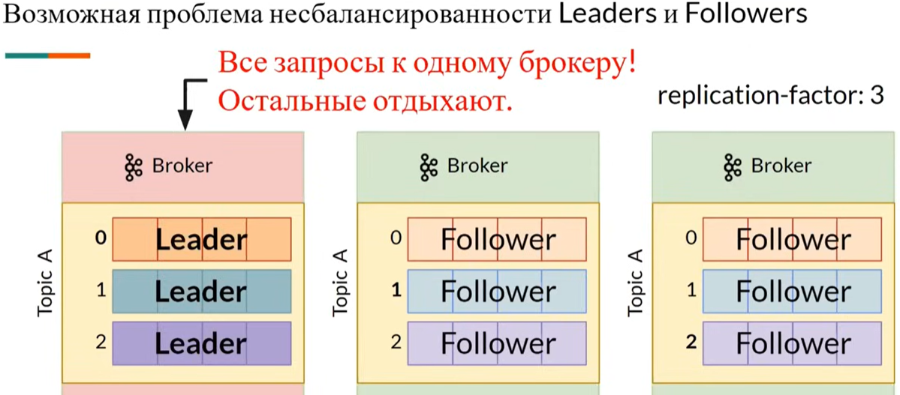
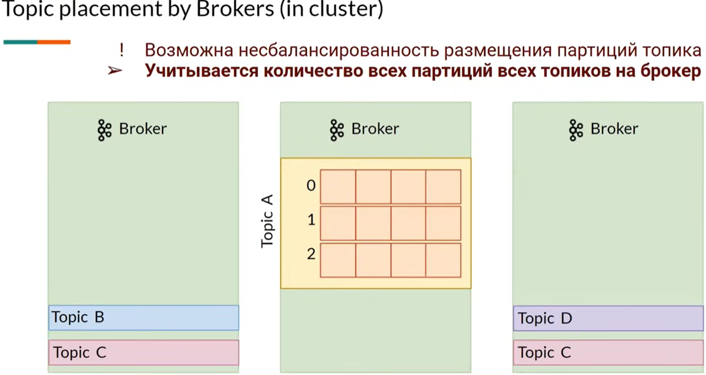
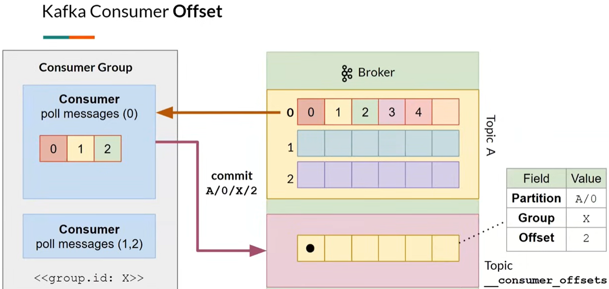
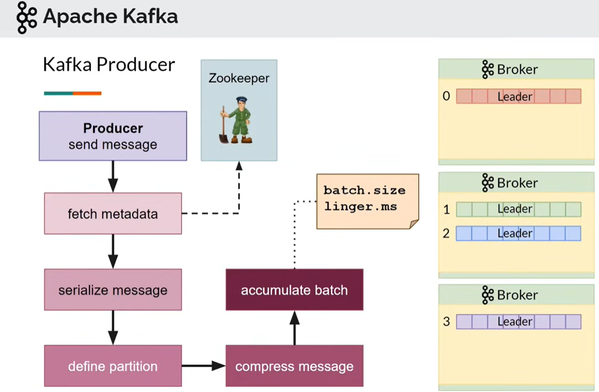

# Kafka

- [Kafka](#kafka)
  - [Зачем](#зачем)
  - [Плюсы и минусы](#плюсы-и-минусы)
  - [Функции](#функции)
  - [Паттерны](#паттерны)
  - [Модель](#модель)
  - [Deployment](#deployment)

## Зачем

Реализация [паттерна интеграции](../../../arch/pattern/integration/pattern.integration.md) [Message Broker](../../../arch/pattern/integration/pattern.messagebroker.md).

UC:

- большие данные [BigData](../../../arch/style/bigdata.md) и __потоковую обработку Streaming Data__
- Log processing and analysis
- Data streaming in recommendations
- System monitoring and alerting
- CDC (Change data capture)
- System migration

## Плюсы и минусы

Плюсы:

- __распределенный__ горизонтально __масштабируемый__
- __отказоустойчивый__ журнал коммитов
  - __кластер__ [серверов](https://www.youtube.com/watch?v=-AZOi3kP9Js)
  - __Шардинг__ из коробки
- Поток событий
- __согласованность__ данных
  - __репликация__ топиков (replication-factor) 
    - master-slave (Leader-Follower)
    - возможна задержка в данных. Запись сообщений всегда в Leader. Follower получает pull от Leader сообщения периодически
    - in-sync replicas (ISR) - синхронная запись в Follower partition, замедляют запись сообщений
- Strict __message ordering__ (FIFO) by partition
- Message retention for extended periods, including the possibility of __replaying past messages__
  - Сообщения в Kafka __не удаляются брокерами по мере их обработки консьюмерами__ — данные в Kafka могут храниться днями, неделями, годами
  - Благодаря этому одно и то же __сообщение может быть обработано сколько угодно раз__ разными консьюмерами и в разных контекстах
- Группировка сообщений в пачки
- транзакции между несколькими топиками

Минусы:

- Наиболее полно __API Kafka поддерживается только в языках Java и Scala__. В других языках поддержка не всегда полная, поэтому фреймворки Kafka Connect и Kafka Streams созданы.
- [Нет приоритета сообщений](https://blog.bytebytego.com/p/how-to-choose-a-message-queue-kafka)
- к минусам модели Pull можно отнести потенциальную __разбалансированность нагрузки__ между разными консьюмерами и __более высокую задержку__ [обработки данных](https://vc.ru/dev/869548-kafka-vs-rabbitmq-chto-nuzhno-znat-analitiku-pro-brokery-soobshenii)
- __разбалансировка партиций по брокерам кластера__, может требоваться ручная балансировка по брокерам больших партиций

## Функции

Фундаментальное [отличие Kafka от брокеров очередей](https://slurm.io/tpost/pnyjznpvr1-apache-kafka-osnovi-tehnologii) состоит в том:

- как __сообщения хранятся__ на брокере, но есть ttl 
  - Сообщения в Kafka организованы и хранятся в именованных __топиках (Topics)__, каждый топик состоит из одной и более __партиций (Partition)__, распределённых между брокерами внутри одного кластера.
- как __потребляются консьюмерами__ (consumer)
  - используется __подход pull__ (в RMQ push по умолчанию): __консьюмеры сами отправляют запросы__ в брокер раз в n миллисекунд для получения новой порции сообщений
    - позволяет __группировать сообщения в пакеты (batch)__, достигая лучшей пропускной способности
  - Консьюмеры
    - отмечают (__commit__) обработанные сообщения с помощью оффсетов. __Оффсет__ (Offset) – это номер сообщения в партиции 
      - либо об успешной обработке (offset-commit)
      - либо об ошибке (offset-reset)
    - type of commit
      - auto commit - сразу после получения сообщения, до обработки: at most once (риск miss message)
      - manual commit - после обработки сообщений: at least once (риск duplicate message)
      - custom offset managment: exactly once
    - consumer group - __параллельное чтение__ данных из partition
- __produce__ [публикация сообщений](https://www.youtube.com/watch?v=-AZOi3kP9Js) 
  - acks - гарантия доставки, ожидание подтвеждения
    - 0 нет
    - 1 only Leader
    - -1 all ISR
  - [delivery semantic](https://habr.com/ru/articles/738874/)
    - at most once (не более одного)
    - al least once (хотя бы один)
    - exactly once (idempotent)
  - serialize
  - define partition:
    - explicit partition
    - round robix
    - key
  - compress
  - accumulate batch

## Паттерны

- Один producer создается для отправки сообщений для быстродействия (fetch metadata sync тяжелая операция)

## Модель

Каждое сообщение (event или message) в Kafka состоит из:

- ключа
- значения
- таймстампа
- и опционального набора метаданных (так называемых хедеров)

[TODO](https://slurm.io/tpost/pnyjznpvr1-apache-kafka-osnovi-tehnologii)

## Deployment

- docker
  - todo [java](https://habr.com/ru/articles/738874/)
  - [.net core](https://mandur.hashnode.dev/kafka-for-aspnet-core-6)
- using Kafka via UI
  - Conduktor
  - KafkaTool
  - Kafdrop
