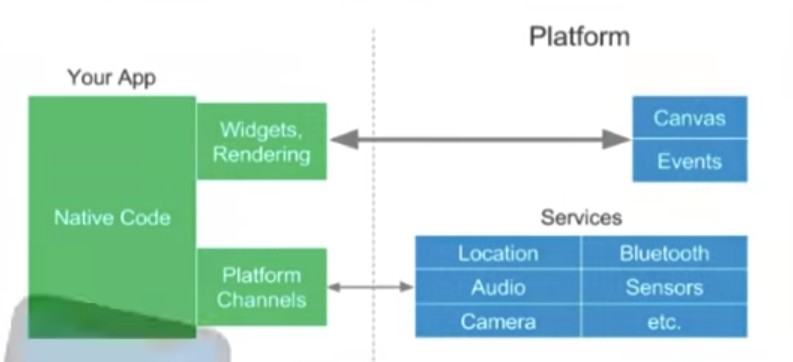

# Flutter

TODO

- Flutter+dart google+blos/redux 2018 start 12.2018 release
  - Можно писать нативные части, но нужны нативные разработчики
  - Ui, Unit, widget [tests](../../arch/pattern/test.md)
  - Проблемы: камера, шифрование aes gsm, документация мало/китайский, мало разработчиков 2019
  - Используют: АлиЭкспресс, Яндекс.такси, creatio
- Проблемы локализации

<https://blog.surf.ru/flutter-iedinstviennaia-pravilnaia-krossplatforma/> Flutter
<https://blog.surf.ru/razrabotka-mobilnogho-prilozhieniia-na-flutter-tsiena-sroki-primiery/> Flutter vs Native цена, сроки

## Плюсы-Минусы

Плюсы:

- Open Source
- Простое обучение и развитие
- Быстрая компиляция: максимум производительности
- Производительность: Приложения и анимации работают быстро
- Кросплатформенность
- Приложения выглядят нативно
- Легко интегрировать с Google Services
- Крутые инструменты
- Удобный Debug (hot reload) and Profiling
- во всех популярных кроссплатформенных фреймворках используется мост, снижающий скорость взаимодействия с нативной частью, кроме flutter

Минусы:

- Молодость проекта
- Библиотек меньше
- Необходимость изучать
- Поддержка для WEB и DeskTop BETA
- Нужен достаточно мощный ПК

## Функции

- WebView (интеграция с Yandex Forms, например, для опросов)
- [Add-To-App](https://habr.com/ru/companies/surfstudio/articles/822693/) - способ интеграции (как экран, фрагмент, модальное окно) __Flutter-модуля__ в уже __существующее нативное__ приложение (симбиоз),например: Yappy
  - [Pigeon](https://pub.dev/packages/pigeon) - __code generator__ tool to make communication between Flutter and the host platform type-safe, easier, and faster
  - Постепенная миграция по модулям на Flutter с нативного приложения

## Паттерны

- Кэширование "движка" Engine Flutter

## Архитектура

- Stream/ bloc - типа MVC без controller - [Лучший вариант](https://youtu.be/rta3850mv4A)
- MVC - вариант
  - Stream не использовал?
- MVVM не вариант
  - Binding view-viewmodel
  - Ui тред ухудшился
- Flux не вариант
  - +Stream
  - Dispatcher один, сложно расширять, несколько команд
