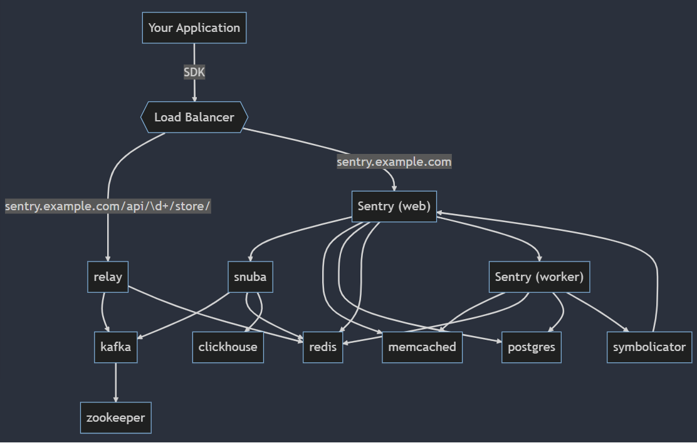

# Sentry

- [Sentry](#sentry)
	- [Зачем](#зачем)
	- [Функции](#функции)
		- [Event Model](#event-model)
	- [Плюсы-Минусы](#плюсы-минусы)
	- [Deployment](#deployment)
	- [Технологии](#технологии)

Инструмент мониторинга исключений (exception), ошибок, логов, распределенной трассировки, анализа производительности.

## Зачем

- [Observability](../../arch/ability/observability.md)
  - Traditional logging provides you with a __trail of events__. Some of those events are errors, but many times they’re simply __informational__. Sentry is fundamentally different because we __focus on exceptions__.
  - provides client libraries in every major programming language which instrument your software’s code to capture both error data and tracing telemetry
- [APM](../../arch/system.class/apm.md)
	- [Frontend](https://geekflare.com/frontend-web-monitoring/)
	- performance bottlenecks in your code
- [Security and compliance](https://logz.io/learn/complete-guide-elk-stack/?utm_source=pocket_saves#common-pitfalls:~:text=guide%40logz.io-,Use%20Cases,-The%20ELK%20Stack)
	- SIEM

## Функции

- Log
	- Error\Exception
	- [Message](https://docs.sentry.io/product/sentry-basics/integrate-backend/capturing-errors/#capture-message)
	- Level Logging
      - [PHP](https://docs.sentry.io/platforms/php/usage/set-level/)
      - [Context Params](https://docs.sentry.io/platforms/php/enriching-events/context/)
      - [JS](https://docs.sentry.io/platforms/javascript/usage/set-level/)
	- [PHP example](https://russianblogs.com/article/3659249339/)
- Stack traces
- Query
- Issue [Grouping](https://docs.sentry.io/product/data-management-settings/event-grouping/)
    - Группировка ошибок по кастомным правилам
	- Filters
		- Inbound Filters on [Server](https://docs.sentry.io/product/data-management-settings/filtering/) by: environment, browser, IP, error message
		- Client side: [PHP](https://docs.sentry.io/platforms/php/configuration/filtering/)
	- [Clean](https://help.sentry.io/product-features/configuration/how-can-i-delete-resolve-all-issues-in-a-project/)
		- [Очистка БД](https://dev.to/nixon1333/clean-sentry-database-on-premise-28b) через [Sentry CLI](https://sentry-docs-o2paie5ivq-uc.a.run.app/server/cli/cleanup/)
- Dashboard
	- [Grafana](https://sentry.io/integrations/grafana/)
- [Release](https://docs.sentry.io/product/releases/)
	- [Tracking](https://docs.sentry.io/product/releases/release-details/)
	- [GitLab](https://docs.sentry.io/product/integrations/source-code-mgmt/gitlab/)
		- [PHP](https://docs.sentry.io/platforms/php/configuration/releases/)
		- [JS](https://docs.sentry.io/platforms/javascript/configuration/releases/)
- __Breadcrumbs__ - [trace of events](https://docs.sentry.io/product/issues/issue-details/breadcrumbs/) that lead to errors
	- for logging messages, network requests, database queries
	- Reproduce Errors Without User Feedback логирование действий пользователя (клики, переходы по страницам и т.п.), предшествующих ошибке.
	- [PHP](https://blog.sentry.io/2016/05/27/php-breadcrumbs/)
		- [example](https://docs.sentry.io/platforms/php/enriching-events/breadcrumbs/)
	- model Breadcrumb
		- [type](https://develop.sentry.dev/sdk/event-payloads/breadcrumbs/#breadcrumb-types)
		- category - a logger name, and helps you understand the area in which an event took place, such as auth
		- level
- [Nginx + Sentry](https://blog.sentry.io/2019/01/31/using-nginx-sentry-trace-errors-logs)
- Data Collector
	- [From stdout from FluentD Plugin](https://www.fluentd.org/plugins/all)
	- Hardware Sentry is free to use
	- Sentry SDK
		- [GELF To Sentry Adapter](https://mnwa.medium.com/easy-swap-graylog-to-sentry-when-you-have-complexity-infrastructure-5d91c3062c99)
		- [gRPC](https://github.com/m2-oss/sentry-grpc)
	- [RSyslog и Sentry](https://adw0rd.com/2012/12/15/rsyslog-sentry-bridge/)
	- [Drupal module Raven](https://www.drupal.org/project/raven)
- [APM](../../arch/system.class/apm.md)
	- [SPA Vite](https://docs.sentry.io/platforms/javascript/sourcemaps/uploading/vite/)
	- [Web Vitals](https://docs.sentry.io/product/performance/web-vitals/)
- [Distributed Trace](https://docs.sentry.io/product/sentry-basics/tracing/distributed-tracing/)
	
	- Trace -> Transaction -> Span
	- Duration Span
	- [PHP example](https://docs.sentry.io/platforms/php/performance/)
- Alert
	- [Telegram](https://github.com/butorov/sentry-telegram)
- [SSO](https://develop.sentry.dev/self-hosted/sso/)
	- Auth user access by [KeyCloak SAML](https://yyhh.org/blog/2020/10/how-to-setup-saml2-authentication-on-sentry-with-keycloak/) 
	- Google OIDC
- RBAC
	- [Роли](https://docs.sentry.io/product/accounts/membership/)
	- [маппинг групп LDAP на роль Sentry](https://habr.com/ru/post/691140/)
	- LDAP [SAML](https://yyhh.org/blog/2020/10/how-to-setup-saml2-authentication-on-sentry-with-keycloak/) - __нет маппинга групп LDAP на роли Sentry__ 
- [Jira Task Intregration](https://forum.sentry.io/t/how-to-configure-jira-cloud-in-your-on-premise-sentry/6720)
- MTA

Сущности:

- Organization
	- Member
	- Team - рекомендуется создавать команды, которые соответствуют вашей [внутренней структуре команды](https://docs.sentry.io/product/accounts/getting-started/#2-set-up-teams) (например, #Frontend, #Ops, #SDK и так далее)
		- Member
		- [Project](https://docs.sentry.io/product/accounts/getting-started/?#-whats-in-a-project) - маппинг на проект в GIT рекомендуется
			- Issue
			- Release
			- Alert

### Event Model

- [Event Model](https://docs.sentry.io/product/sentry-basics/enrich-data/)
	- [Context](https://docs.sentry.io/platforms/android/enriching-events/context/default-context/)
	- [User](https://docs.sentry.io/platforms/android/enriching-events/identify-user/)
	- [APM metric custom](https://docs.sentry.io/platforms/python/guides/logging/performance/instrumentation/performance-metrics/)
		- tag - [response size](https://stackoverflow.com/questions/7791860/jquery-how-to-check-the-size-of-the-response-object-in-an-ajax-call)
		- [context](https://stackoverflow.com/questions/69542552/add-additional-details-to-a-sentry-error-using-python-sdk)

## Плюсы-Минусы

Плюсы:

- [Store support Clickhouse](https://blog.sentry.io/2019/05/16/introducing-snuba-sentrys-new-search-infrastructure/)
- [OpenTelemetry](https://docs.sentry.io/platforms/python/guides/logging/performance/instrumentation/opentelemetry/) support [in work](https://develop.sentry.dev/sdk/performance/opentelemetry/) 	
	- [Demo GO OTEL trace to Sentry](https://medium.com/nuances-of-programming/opentelemetry-и-sentry-недооцененные-инструменты-трассировки-распределенных-систем-на-golang-c34de3dbdff5)
	
- [дает фокусировку на ошибках](https://infostart.ru/1c/articles/1178723/)
- позволяет получить максимальный контекст в короткое сообщение
- хорошая оптимизация хранения данных. То есть, он не хранит всю подряд информацию, если произошло повторное событие – оно группируется в одно

Минусы:

- не очень хорошо справляется с большим потоком, риски задержки событий
	- узкие [места при 100 млн событий за 24ч](https://www.youtube.com/watch?v=9_IswUwFxlE&list=WL&index=8&t=589s)
		- PostgreSQL шардирование по репликам (кастом замена на NOSQL store ClickHouse)
		- Kafka размер топиков, round robin partition раскладывание событий
		- ClickHouse шардирование по репликам

## Deployment

- [docker 22.12.0](https://develop.sentry.dev/self-hosted/)
	- [demo](https://gist.github.com/denji/b801f19d95b7d7910982c22bb1478f96)
	- [demo](https://adw0rd.com/2019/02/21/sentry-on-premise-docker/)
	- [On premise docker](https://principal-engineering.ru/posts/getsentry-self-hosted/)
		- BSL __license__ - Если мы [не конкурируем с ними](https://open.sentry.io/licensing/), то [бесплатно](https://forum.sentry.io/t/re-licensing-sentry-faq-discussion/8044)
- [Системные требования](https://github.com/getsentry/self-hosted)
- [Observability Sentry](https://medium.com/@twunde/the-unofficial-guide-to-upgrading-sentry-on-premise-9-to-sentry-10-5e8b4e476349)
	- [health checks](https://docs.sentry.io/product/relay/monitoring/#health-checks)
	- [logs stdout](https://docs.sentry.io/product/relay/monitoring/#logging)
	- [metric in StatsD](https://docs.sentry.io/product/relay/monitoring/#metrics)
		- [model](https://docs.sentry.io/product/relay/monitoring/collected-metrics/)
		- rps DB PostgreSQL
- HA
	- [СберМегаМаркет опыт](https://www.youtube.com/watch?v=9_IswUwFxlE&list=WL&index=8&t=589s) 
		- PostgreSQL узкое место - Master\Replica
		- Object Storage для "сырых" Event (Minio) вместо PostgreSQL

## Технологии

- Архитектура

- Snuba
- Clickhouse - управляет Alert

- [Kafka](../middleware/kafka.md)
- [Redis](../redis.md)
- PostgreSQL
- Python
- Memcached
