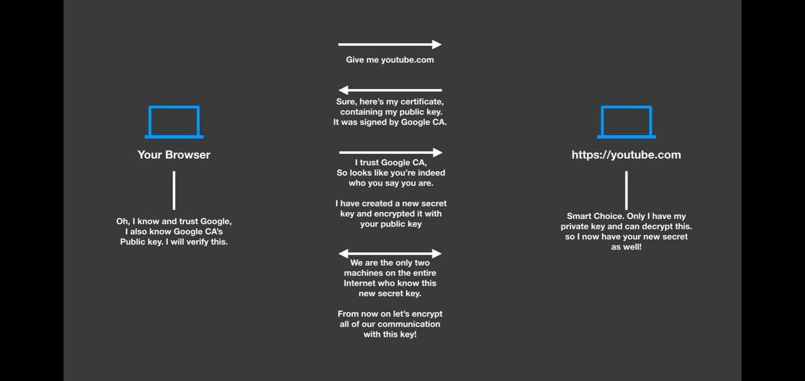
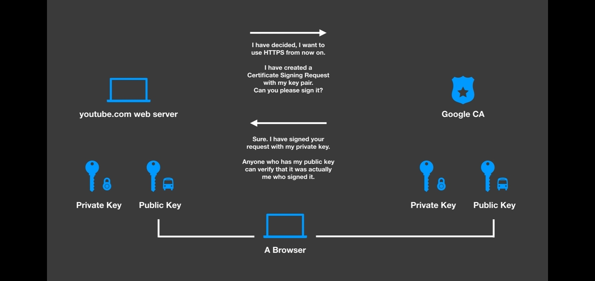

# TLS

- SSL
- [Transport Layer Security (TLS)](https://habr.com/ru/post/593507/) - обеспечение защищенной передачи данных между двумя компьютерами в сети Интернет (на базе SSL3.0).
- Асимметричное шифрование -
  - private key - алгоритмы (rsa, ГОСТ и тд) , хэш
  - public key
- CA - удостоверяющий центр подписывает сертификат сервера
  - сертификат (.pem файл) обычно содержит ряд полей: об имени сервера, которому выдан сертификат, и сроках действия этого сертификата. Если срок действия сертификата истек, он признается недействительным.
  - Корневые сертификаты распространяются публично в составе обновлений операционных систем. используется исключительно для подписи других сертификатов.
  - Запрос на подпись сертификата (CSR, Certificate Sign Request)
  - Self signed самоподписанный сертификат без CA - уровень доверия во вне низкий

[односторонняя аутентификация](https://mnorin.com/tls-ssl-neobhodimy-j-minimum-znanij.html) - проверяется только сертификат сервера

## Mutual TLS (MTLS)

Двусторонняя аутентификация или mutual authentication:

- аутентификация Client ssl certificate
- форматы: PKCS12 (файл .p12), X.509
- Установление двустороннего TLS-соединения с использованием доверенного удостоверяющего центра
- Клиентские SSL-сертификаты используются для идентификации клиента или пользователя и аутентификации клиента на сервере

