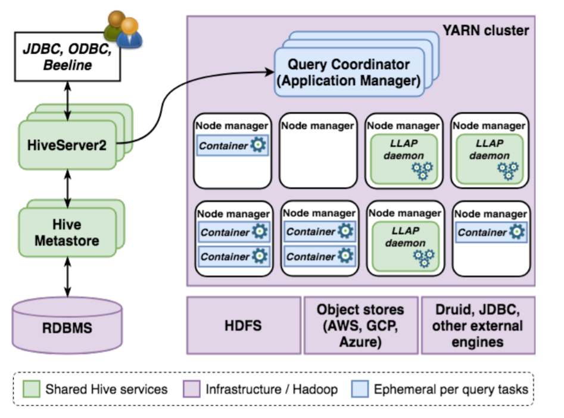

# Apache Hive

## Зачем

РСУБД решение для [хранилищ данных](../../arch/store.md) в архитектурном стиле [BigData](../../arch/style/bigdata.md).
Используется [MPP архитектура](../../arch/style/mpp.md).

- SQL-подобный интерфейс поверх [Hadoop](apache.hadoop.md) MapReduce
- [ETL](https://habr.com/ru/articles/585460/) BigData

## Функции

- ACID

## Плюсы-минусы

Плюсы:

- ТОДО

Минусы:

- ТОДО